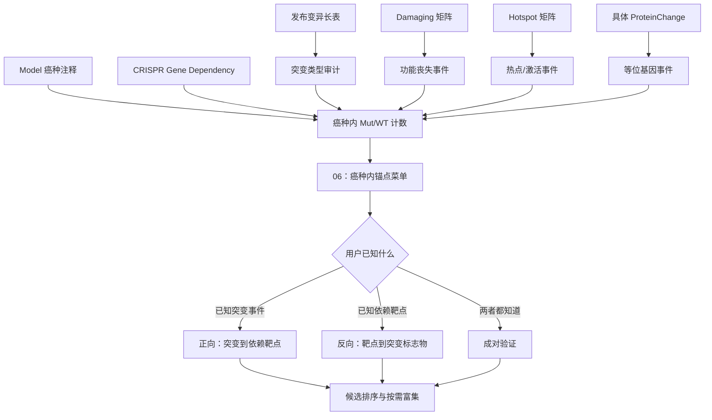

# 26Q1 突变信息分析模块总览

## 1. 模块最终要解决的问题

这个模块把“突变信息”从原始变异记录整理为可以进入 CRISPR 依赖分析的研究入口。用户不需要先知道应该运行哪一个脚本，只需要说明已知条件：癌种、突变事件或依赖靶基因。

模块回答四类问题：

1. 固定一个癌种：这个癌种有哪些突变基因和突变事件可以作为锚点？
2. 固定一个突变事件：哪些 CRISPR 敲除靶基因在突变组中表现出更强依赖？
3. 固定一个依赖靶基因：哪些突变事件可以作为该依赖的候选生物标志物？
4. 固定一个突变事件和一个依赖靶基因：这一对关系的效应、样本量和统计证据是什么？

这里的结果是细胞系中的观察性关联。它用于发现候选机制、分型标志物和实验验证方向，不能直接写成临床因果关系或已经验证的合成致死。

## 2. 模块结构



可以把整个模块理解为四层：

| 层级 | 主要任务 | 主要产物 |
|---|---|---|
| 原始证据层 | 保存每条变异、癌种注释和依赖值 | Somatic mutation、Model、Dependency 数据 |
| 事件定义层 | 将原始变异转换为 AnySelected、Damaging、Hotspot 或具体位点 | 基因级或位点级 Mut/WT |
| 锚点选择层 | 按癌种检查哪些事件有足够 Mut/WT 模型 | 候选菜单和知识卡片 |
| 依赖关联层 | 比较 Mut 与 WT 的 CRISPR 依赖差异 | 正向、反向和成对结果 |

## 3. 核心数据及其职责

| 数据 | 在模块中表示什么 | 不能被误解为什么 |
|---|---|---|
| `OmicsSomaticMutations.csv` | 发布的逐条体细胞变异；支持完整景观和具体位点分析 | 有记录不等于有功能或有害 |
| `OmicsSomaticMutationsMatrixDamaging.csv` | 官方 LikelyLoF 聚合的基因级损伤事件 | 不是所有错义突变，也不代表任意突变 |
| `OmicsSomaticMutationsMatrixHotspot.csv` | 官方热点证据聚合的基因级事件 | 不是“研究者感兴趣的热门基因” |
| `Model.csv` | ModelID、OncotreeLineage 和疾病信息 | 不能提供突变状态或依赖值 |
| `CRISPRGeneDependency.csv` | 0–1 的依赖概率，越大越可能为依赖 | 不能按 Gene Effect 的负值方向解释 |
| `CRISPRGeneEffect.csv` | 敲除效应，越负表示依赖越强 | 不能与依赖概率直接合并排名 |
| `CRISPRInferredCommonEssentials.csv` | 泛细胞系共同必需靶点提示 | 不是应从突变锚点中统一删除的基因表 |

正式比较只纳入同时具有突变状态、癌种注释和指定依赖指标的 ModelID。每一种事件矩阵分别与 Model 和 Dependency 取交集，不要求 Damaging、Hotspot 和 AnySelected 彼此取交集。

## 4. 突变事件怎么选

| 研究问题 | 推荐事件 | 使用方式 |
|---|---|---|
| 先看某癌种的全部突变概况 | `AnySelected` | 用于浏览和候选发现，不直接赋予功能含义 |
| 抑癌基因、功能丧失、截短或剪接破坏 | `Damaging` | 优先用于 TSG/LoF 假设 |
| 癌基因、复发激活或热点机制 | `Hotspot` | 优先用于 OG/GoF 假设 |
| KRAS G12D、BRAF V600E 等特定位点 | `ProteinChange` | 从长表按基因和蛋白改变重新分组并按需计算 |
| 用户只说“某基因突变” | 暂不自动决定 | 先返回现有事件类型和 Mut/WT 数量，再让机制决定口径 |

矩阵值 `>0` 定义为对应事件阳性，明确的 `0` 表示在该矩阵口径下未检出。缺失值排除，不能自动当作 WT。

癌种内标准探索门槛为 Mut≥3、WT≥5；严格候选优先 Mut≥10、WT≥5。门槛用于控制可估计性，不是突变的生物学定义。样本越少，效应值和排名越不稳定。

## 5. 两个分析方向

设 A 为突变事件，B 为 CRISPR 依赖靶基因：

```text
Δ(A, B) = mean(B dependency | A-Mut) - mean(B dependency | A-WT)
```

| 用户问题 | 固定项 | 遍历项 | 查询角色 |
|---|---|---|---|
| “ARID1A 损伤突变后更依赖哪些基因？” | A=`ARID1A Damaging` | 全部 B | `source=mutation_event` |
| “哪些突变让细胞更依赖 PARP1？” | B=`PARP1` | 全部 A | `target=dependency_gene` |
| “ARID1A 损伤突变是否影响 ARID1B 依赖？” | A 和 B | 无 | 有方向的成对验证 |

这不是两套独立计算，而是同一张 A×B 关联矩阵的行查询、列查询和单元格查询。关系有方向，不能把 A 与 B 互换。

多重检验校正也随方向变化：

- 正向 FDR：固定一个突变事件，在全部依赖靶基因内做 BH 校正。
- 反向 FDR：固定一个依赖靶基因，在全部突变事件内做 BH 校正。

使用 Gene Dependency 概率时，`Δ>0` 表示突变组更依赖；使用 Gene Effect 时，`Δ<0` 表示突变组更依赖。每个回答都必须显示指标名称和方向。

## 6. 原始脚本在流程中的位置

| 脚本 | 作用 | 是否作为正式结论入口 |
|---|---|---|
| `01_read_depmap.r` | 公共清洗和 RDS 准备 | 仅作数据准备；避免继续使用被表达交集裁剪的旧 `cellinfor.rds` |
| `06_mut_anchor_gene_selection_26Q1.R` | 固定癌种后选择可分析突变锚点 | 是，作为后续分析入口 |
| `07_mutant_dependency_26Q1.R` | 演示单对、正向和反向 Welch 检验及 BH FDR | 是，代表原始统计核心 |
| `08_mutData_updata_26Q1.R` | 比较长表、自定义蛋白改变、Damaging 和 Hotspot | 用于事件口径审计 |
| `09_batch_from_mut_to_target_26Q1.R` | 固定突变，遍历全部依赖靶点 | 教学/浏览；其启发式 Score 不能替代 P/FDR |
| `10_batch_from_mut_to_target_26Q1_add_celltype.R` | 固定突变并增加癌种分层 | 教学/浏览；正式结果仍需报告效应和 FDR |
| `11_batch_from_gene_to_mut_26Q1_add_celltype.R` | 固定依赖靶点，反查突变事件 | 教学/浏览；固定对象不是 Hotspot 突变基因 |
| `14_DCAF5_SMARCB1_Nature.R` | 特定疾病亚型的 Gene Effect 案例 | 作为案例，不代表通用突变矩阵流程 |

脚本 12/13 的拷贝数扩增和脚本 04/05 的表达相关性应保留为独立模块。

## 7. 当前已经完成的结果

| 分析资产 | 完成状态 | 当前覆盖 |
|---|---|---|
| 癌种内锚点菜单和知识卡片 | 已完成 | 1,208 个可分析模型、30 个癌种；AnySelected、Damaging、Hotspot |
| Damaging × Gene Dependency 概率 | 已完成 | 5,590 个合格突变源 × 18,531 个依赖靶基因；支持两个方向 FDR |
| Damaging × Gene Effect | 已完成 | 5,590 × 18,531 |
| Hotspot × Gene Effect | 已完成 | 58 × 18,531 |
| 自定义蛋白改变 × Gene Effect | 已完成 | 17,391 × 18,531；旧名称 `custom_missense` 不准确 |
| 癌种内 Gene Effect 结果 | 已完成 | Damaging/Hotspot/自定义事件分别覆盖达到门槛的癌种 |
| Hotspot × Gene Dependency 概率 | 待补充 | 当前不能假装与既有 Gene Effect 结果同口径 |
| 具体 ProteinChange × Dependency | 按需计算 | 先按位点检查 Mut/WT，再运行成对或小范围扫描 |

当前保留的候选证据接口支持只给突变源、只给依赖靶点或同时给二者。它返回经过保留条件筛选的观察性候选，不等于完整矩阵中的所有非显著结果。

## 8. 推荐的用户工作流

### 用户只知道癌种

1. 查询 06 生成的癌种内锚点菜单。
2. 先看 AnySelected 获取完整概况。
3. 根据 TSG/OG/具体位点机制选择 Damaging、Hotspot 或 ProteinChange。
4. 检查 Mut/WT 数量和知识卡片警示。
5. 选定锚点后再进入正向依赖扫描。

### 用户已知突变事件

1. 明确癌种和事件定义。
2. 查询突变源对应的依赖靶点排名。
3. 同时查看效应、Mut/WT、P、正向 FDR 和 Common Essential 提示。
4. 对稳定候选按需进行通路富集，不预先对所有突变源遍历富集。

### 用户已知依赖靶基因

1. 固定 CRISPR 依赖靶基因。
2. 反查哪些 Damaging、Hotspot 或具体位点事件与该依赖相关。
3. 查看反向 FDR、癌种构成和组织混杂。
4. 将候选解释为潜在预测标志物，再设计实验验证。

## 9. Common Essential 的处理

- 突变锚点侧：保留并标记。共同必需不等于没有癌症相关突变意义。
- 依赖靶点侧：用于提示普遍生存效应，可降权、过滤或做敏感性分析。
- 最终输出：同时给出保留版和排除/降权后的敏感性结论，避免把普遍毒性误写成突变特异依赖。

## 10. Agent 应如何识别用户意图

| 用户表述 | Agent 行为 |
|---|---|
| “某癌种可以选哪些突变基因？” | 返回锚点菜单，不直接启动全基因关联 |
| “A 突变后依赖哪些基因？” | `source=A`，运行正向查询 |
| “哪些突变影响 B 依赖？” | `target=B`，运行反向查询 |
| “A 突变是否影响 B？” | 同时指定 source 和 target，成对验证 |
| “做热点基因分析” | 区分 Hotspot 突变事件与用户关注的核心依赖基因 |
| “做 G12D 分析” | 解析为 ProteinChange，不能退化成整个基因的 Hotspot/Damaging |
| “对结果做通路/GO/KEGG 富集” | 在当前候选列表上按需富集，并记录筛选阈值和背景基因集 |

机器可读规则保存在 `module.intent.json`；自然语言触发、解释规则和禁止混淆项保存在 `知识库提示.md`。

## 11. 每份正式结果必须携带的信息

1. DepMap release 和输入文件。
2. 癌种或泛癌范围。
3. 突变源、事件定义和必要时的 ProteinChange。
4. CRISPR 依赖靶基因和依赖指标。
5. Mut、WT 和缺失样本数。
6. 两组均值、差值方向、P 值和对应方向的 FDR。
7. Common Essential、组织组成和小样本警示。
8. 运行脚本、参数、结果 manifest 和生成时间。

这套信息使不同脚本、不同指标和不同癌种的结果可以审查，也避免把旧 Gene Effect 结果与新的 Gene Dependency 概率结果混在一起。

