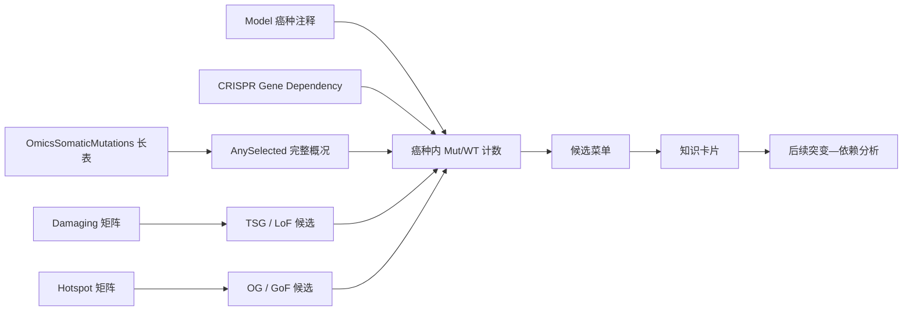

# 癌种内突变锚定基因选择：问题梳理与结论

本文汇总本模块建立过程中反复确认的问题。它说明数据表达的含义、06 脚本与当前正式模块的关系，以及结果能回答和不能回答的问题。

## 一、这个模块解决什么问题

固定一个癌种后，后续突变—依赖分析需要先指定一个突变锚定基因。原始 `06_mut_anchor_gene_selection_26Q1.R` 的作用，就是在运行 07/09 等后续脚本前回答：

1. 这个癌种里哪些基因存在足够多的突变细胞系？
2. 对这个基因应该使用 Damaging、Hotspot，还是具体位点口径？
3. Mut 组和 WT 组是否都有足够样本进入依赖差异分析？
4. 该候选是否符合 TSG/OG 机制，是否有 Common Essential、组织集中等解释风险？

当前模块将原始脚本的泛癌候选思路扩展为“基因 × 癌种 × 突变口径”的完整菜单，并限制到确实具有 CRISPR Gene Dependency 数据的模型。

## 二、数据流和脚本关系

| 文件 | 在模块中的作用 |
|---|---|
| `OmicsSomaticMutations.csv` | 发布变异长表；生成 AnySelected 概况，并支持具体位点分析 |
| `OmicsSomaticMutationsMatrixDamaging.csv` | 官方 LikelyLoF 基因级矩阵；生成 Damaging 分组 |
| `OmicsSomaticMutationsMatrixHotspot.csv` | 官方热点基因级矩阵；生成 Hotspot 分组 |
| `Model.csv` | 提供 ModelID 和 OncotreeLineage |
| `CRISPRGeneDependency.csv` | 定义后续依赖分析能够使用的细胞系全集 |
| `CRISPRInferredCommonEssentials.csv` | 标记共同必需基因，供解释和敏感性分析 |
| HGNC、OncoKB 派生快照 | 为卡片提供名称、基因类型、TSG/OG 角色参考 |

## 三、常见问题

### 1. 26Q1 中是不是有很多种突变？

是。分子后果包括错义、移码、提前终止、剪接位点、框内插入/缺失、起始丢失、终止丢失等。当前依赖队列中的发布长表共有 467,707 条记录、19,784 个基因和 16 类主要 VEP consequence。错义记录最多，但“错义”只描述氨基酸改变，不能自动推出驱动、功能获得或功能丧失。

### 2. AnySelected、Damaging 和 Hotspot 有什么区别？

- `AnySelected`：长表里至少有一条 DepMap 发布并保留的变异，用于查看完整突变景观。
- `Damaging`：`LikelyLoF=True` 聚合后的官方基因级矩阵，优先对应 TSG/LoF 假设。
- `Hotspot`：符合官方热点证据规则的基因级矩阵，优先对应 OG/GoF 或复发驱动事件。

三者不是互斥集合。当前审计中有 1,202 条记录同时属于 LikelyLoF 和 Hotspot。

### 3. `isDeleterious` 用了吗？

当前 26Q1 正式流程没有使用旧版 `isDeleterious`。当前应使用长表中的 `LikelyLoF`、`Hotspot`、`VepImpact`、`VariantInfo`、`ProteinChange` 等字段，以及官方生成的 Damaging/Hotspot 矩阵。不能把字段变化解释成一个旧字段被严格一对一拆成两个新字段；当前字段分别表达预测影响、功能丧失证据、热点证据和具体分子后果。

### 4. 有一条长表记录就代表“有突变”吗？

它代表该模型存在一条被 DepMap 发布流程保留的变异记录，因此可以用于 `AnySelected` 景观层。它不代表该变异必然有功能，也不代表它属于 Damaging 或 Hotspot。

正式 Mut/WT 分组优先使用对应官方矩阵：值 `>0` 定义为该事件口径下的 Mut，明确的 `0` 定义为该事件口径下未检出，缺失值不并入 WT。

### 5. 没有长表记录的样本怎么知道是哪些？

先用 `Model.csv`、突变矩阵默认模型行和 `CRISPRGeneDependency.csv` 建立可分析模型全集，再由矩阵中的显式 `0` 识别未检出该类型事件的模型。不能把不在测序/发布模型全集中的样本按“没有记录”直接当作 WT。

### 6. 为什么要取交集？

交集保证同一个细胞系同时具有：突变状态、癌种注释和 Gene Dependency 结果。缺少任一项都不能进行癌种内 Mut/WT 依赖比较。

Damaging、Hotspot、AnySelected 分别与 Model 和 Dependency 队列独立取交集；不会要求一个样本或基因必须同时是 Damaging 和 Hotspot。当前得到 1,208 个可分析模型，避免了旧 `cellinfor.rds` 被表达数据交集裁剪到 1,140 株的问题。

### 7. “30 株突变细胞”是怎么来的？

原始 06 脚本末尾的 `mut_n_recommended >= 30` 是泛癌 shortlist 演示门槛，用于挑选样本较多的候选，并不是 DepMap 的突变判定参数，也不是每个癌种必须达到 30 株。

当前癌种内菜单采用：

- 标准可分析门槛：`Mut ≥ 3 且 WT ≥ 5`，用于探索性分析。
- 严格推荐门槛：`Mut ≥ 10 且 WT ≥ 5`，用于较稳定的单癌种候选。

某个结果显示 Mut=30，只表示在指定“癌种 + 基因 + 事件定义”组合中有 30 个矩阵值大于 0 的可分析模型。

### 8. 为什么不直接把所有错义突变放在一起？

同一基因的不同错义位点可能分别是功能获得、功能丧失、中性乘客，甚至方向相反。研究 KRAS G12D、BRAF V600E 等具体事件时，应按 `HugoSymbol + ProteinChange` 分组并重新计算 Mut/WT，不能直接使用“该基因任意错义”的合并组。

### 9. 是否应该删除 Common Essential？

不应在突变锚点侧统一删除。Common Essential 描述敲除该基因通常会影响细胞生存，它不说明该基因不能发生有意义的癌症突变。当前完整菜单保留并标记这些基因，另输出排除版做敏感性比较。

在后续依赖靶基因排序中，Common Essential 更适合作为普遍毒性提示、降权项或过滤条件。

### 10. 当前结果使用 Dependency 还是 Gene Effect？

本模块负责选择突变锚点并统计可分析样本，本身不计算依赖差异效应。新的 Damaging 全量下游分析使用 `CRISPRGeneDependency.csv` 概率。

既有 `hotspot_mutation_dependency` 和旧 `custom_missense_mutation_dependency` 使用 Gene Effect，不能与 Dependency 概率结果直接比较或合并排序。旧 `custom_missense` 实际还包含移码、终止、剪接和框内 indel 等九类事件，并非纯错义分析。

### 11. 现在是否已经把全部损伤性突变阳性基因都做了候选统计？

是。正式菜单覆盖 Damaging 矩阵的 19,578 个基因、Hotspot 矩阵的 554 个基因，以及 AnySelected 的 19,784 个基因，并逐癌种统计 Mut/WT。是否进入候选表取决于样本门槛，不代表每个候选都具有驱动证据。

### 12. 当前有哪些可直接使用的结果？

- `gene_by_lineage_mutation_menu.csv`：全部基因 × 癌种 × 事件口径。
- `candidate_anchor_genes_by_lineage.csv`：通过标准门槛的菜单。
- `selectable_anchor_genes_by_lineage.csv`：通过严格门槛的菜单。
- `selectable_gene_counts_by_lineage.csv`：各癌种严格候选数量。
- `sensitivity_excluding_common_essential.csv`：排除共同必需基因后的敏感性结果。
- `anchor_gene_cards_all.csv/jsonl`：54,813 张完整知识卡片。
- `anchor_gene_cards_strict.csv`：145 张严格功能事件卡片。
- `anchor_gene_cards_priority.csv`：75 张角色匹配的优先卡片。

## 四、选择一个突变锚点的推荐顺序

1. 固定癌种，并只在该癌种的依赖队列模型中计数。
2. 先看 AnySelected 了解完整景观，不直接形成机制结论。
3. 根据生物学假设选择事件口径：TSG/LoF 选 Damaging，OG/GoF 选 Hotspot，具体等位基因选 ProteinChange。
4. 检查 Mut/WT 数量；探索至少 3/5，正式候选优先 10/5。
5. 查看事件是否集中于单个位点、是否为已知驱动、是否受大基因或超突变样本影响。
6. 保留 Common Essential 标记，在下游依赖靶点排序中评估普遍毒性。
7. 记录 release、事件定义、癌种、Mut/WT、依赖数据类型和脚本版本后再启动下游分析。

## 五、结果边界

候选菜单回答“数据上能不能分析”和“哪种突变口径更符合当前机制假设”。它不证明突变导致某个依赖关系，也不证明合成致死。知识卡片中的 OncoKB 派生角色来自本地快照，正式解释具体变异时仍需核对当前数据库或文献。

官方定义见 [DepMap 26Q1 Mutation Pipeline Documentation](https://storage.googleapis.com/shared-portal-files/Tools/26Q1_Mutation_Pipeline_Documentation.pdf) 和 [DepMap Current Release](https://depmap.org/portal/data_page/?tab=currentRelease)。
