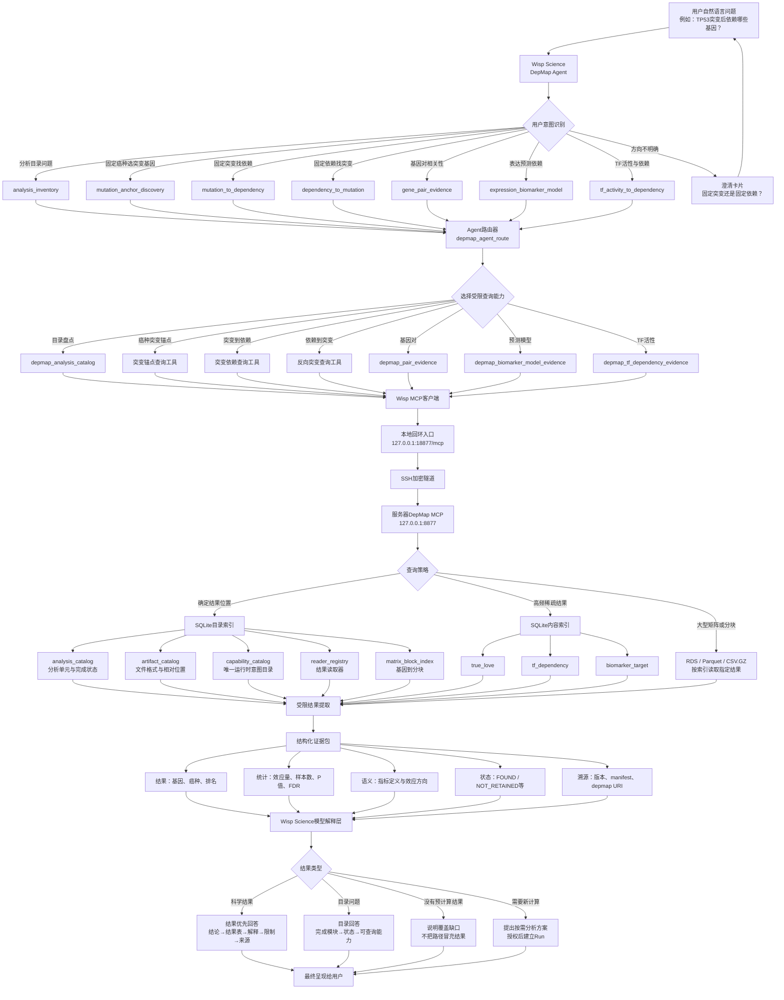

# DepMap Agent 远程数据桥接技术路线

本文描述 Wisp Science 如何把用户自然语言问题映射到服务器上的 DepMap 26Q1 预计算结果，并将结构化证据交给模型解释。目录索引用于路由和定位；科学问题的最终回答必须以实际结果为主，路径与模块状态只用于溯源。

## 完整链路

## 核心数据流

## 各层职责

| 层级 | 主要职责 | 禁止行为 |
|---|---|---|
| 用户意图层 | 判断用户要固定癌种、突变基因还是依赖靶点 | 猜测缺失的关键方向 |
| 路由层 | 选择 MCP 工具并校验必要参数 | 把路由记录当作科学证据 |
| 目录索引层 | 确定结果位置、版本、完成状态和查询入口 | 把路径当作最终科学结果 |
| 数据查询层 | 读取有限结果行或指定矩阵分块 | 遍历或载入整个知识库 |
| 结构化传输层 | 传递统计量、语义、状态与来源 | 只传文件名或模块名称 |
| 模型解释层 | 解释效应方向、显著性、生物学含义和限制 | 将相关性描述为因果关系 |
| 用户回答层 | 展示结论和结果表，最后附来源 | 要求用户自行打开服务器文件获取已有结果 |

## 当前意图目录

当前远程能力目录覆盖19类用户意图。`depmap_capabilities`返回每类意图的必填实体、可选实体、中文示例、易混淆方向和唯一 MCP 工具。

| 意图 | 目标工具 |
|---|---|
| `provider_status` | `depmap_status` |
| `lineage_resolution` | `depmap_resolve_lineage` |
| `cancer_inventory` | `depmap_lineage_catalog` |
| `cancer_direction_discovery` | `depmap_lineage_direction_discovery` |
| `analysis_inventory` | `depmap_analysis_catalog` |
| `mutation_anchor_discovery` | `depmap_mutation_anchor_evidence` |
| `mutation_to_dependency` | `depmap_synthetic_lethal_evidence` |
| `dependency_to_mutation` | `depmap_synthetic_lethal_evidence` |
| `gene_pair_evidence` | `depmap_pair_evidence` |
| `cancer_dependency_ranking` | `depmap_lineage_dependencies` |
| `tf_activity_to_dependency` | `depmap_tf_dependency_evidence` |
| `expression_biomarker_model` | `depmap_biomarker_model_evidence` |
| `true_love_gene_catalog` | `depmap_true_love_evidence` |
| `gene_evidence` | `depmap_gene_evidence` |
| `tcga_expression_survival` | `tcga_gene_expression_survival` |
| `drug_gene_evidence` | `depmap_drug_evidence` |
| `subtype_evidence` | `depmap_subtype_evidence` |
| `coamplification_evidence` | `depmap_coamplification_evidence` |
| `three_d_evidence` | `depmap_3d_evidence` |

语言模型在封闭枚举中选择主意图，并可同时提交最多三个备选意图。若固定突变与固定依赖两个方向仍同时成立，或癌种术语不能唯一解析，路由器返回澄清卡片并停止科学查询。模型置信度不被当作校准概率；系统以实体完整性、方向冲突和工具参数验证作为执行边界。

## 索引与数据边界

统一 SQLite 索引分为两类：

- **目录索引**：`analysis_catalog`、`artifact_catalog`、`capability_catalog`、`reader_registry`、`matrix_block_index` 和 `analysis_relation`，负责定位模块、分析单元、相对路径、状态、读取器、基因分块及脚本—数据—结果关系；
- **内容索引**：为高频稀疏结果提供直接检索，例如 `true_love`、`tf_dependency` 和 `biomarker_target`。

大型相关矩阵继续保留为 RDS、Parquet 或压缩表格。查询根据目录索引定位所需结果或分块，不将完整矩阵复制到 SQLite，也不把整个知识库送入模型上下文。

服务器 MCP 只监听服务器回环地址。Wisp Science 使用本机回环端口，通过 SSH 加密隧道访问服务器 MCP；远程端口不直接暴露到公网。返回的 `depmap://26Q1/...` 是知识库内的稳定溯源标识，并可由 `depmap_read_resource` 经过 artifact 索引校验后有界读取；它不是服务器绝对路径。

## 目录索引 v3 验收（2026-09-17）

- 693 个原分析单元已分类为 577 个 `COMPLETE`、33 个 `ARCHIVED`、83 个 `INCOMPLETE`，另有一个知识库公共资产根记录；`UNVERIFIED` 为 0；
- 45,322 个文件全部具有关联分析单元，原 197 个无归属文件归入 `_knowledge_root` 公共资产；
- 19 个意图由 SQLite `capability_catalog` 提供，18 种查询模式登记了 Reader；
- 146,684 条矩阵分块定位记录覆盖 19,215 个基因和 8 个分析单元；
- 1,466 个脚本、清单和文档使用内容 SHA-256，43,856 个大型或结构化数据文件使用大小与修改时间指纹；
- 服务器每小时运行新鲜度检查，源文件发生变化时通过临时库原子重建索引。

## Catalog-driven Reader执行边界

所有科学查询模式在进入原有格式读取逻辑前，统一经过
`CatalogReaderRegistry`：

1. 将API查询模式映射到`reader_registry`中的Reader族；
2. 只选择`analysis_catalog`中状态为`COMPLETE`的分析单元；
3. 从`artifact_catalog`和`analysis_relation`取得有限候选结果；
4. 对包含基因实体的查询，从`matrix_block_index`取得对应分块；
5. 执行受限格式Reader，并把Reader、analysis ID、artifact URI和分块URI写入
   `catalog_resolution`。

Reader执行时接收上述目录绑定；结果返回后，注册表再次校验实际provenance，
只有属于`COMPLETE`分析单元的已索引文件才能进入evidence。矩阵分块同时限定在
当前解析的分析单元内，最多返回32个稳定URI。

生产服务器存在索引时，缺少Reader或没有匹配完成分析会返回明确覆盖错误，
不会静默回退到代码内固定路径。`status`、癌种术语解析和能力目录属于控制面，
不读取科学结果，因此不经过科学Reader。

## 结果传输契约

除明确的目录盘点问题外，MCP 返回包使用 `scientific_result` 契约，至少包含当前查询可获得的以下内容：

1. 查询实体和规范化癌种；
2. 有限数量的结果行与排名；
3. 效应方向、效应量和指标定义；
4. 样本量、P 值和 FDR（分析产生这些字段时）；
5. `FOUND`、`NOT_RETAINED`、`INELIGIBLE`、`NOT_COMPUTED` 或 `MODULE_UNAVAILABLE` 状态；
6. DepMap 发布版本和结果溯源。

`presentation_contract` 强制解释模型遵守以下规则：

- 科学问题以实际结果为主要内容；
- 不用目录状态或路径替代结果；
- 按返回指标解释方向，不更改统计量含义；
- 区分观测关联、候选机制和因果结论；
- 将版本与 provenance 放在回答末尾。

## 标准用户回答顺序

1. 直接结论；
2. 关键结果表；
3. 效应方向与统计证据；
4. 生物学解释；
5. 分析限制和下一步；
6. DepMap 版本及结果来源。

如果目录中存在分析模块，但当前接口没有返回可解释的结果行，Agent 必须说明当前覆盖或查询接口的缺口，不得把模块名称、完成状态或文件位置包装成科学结论。
