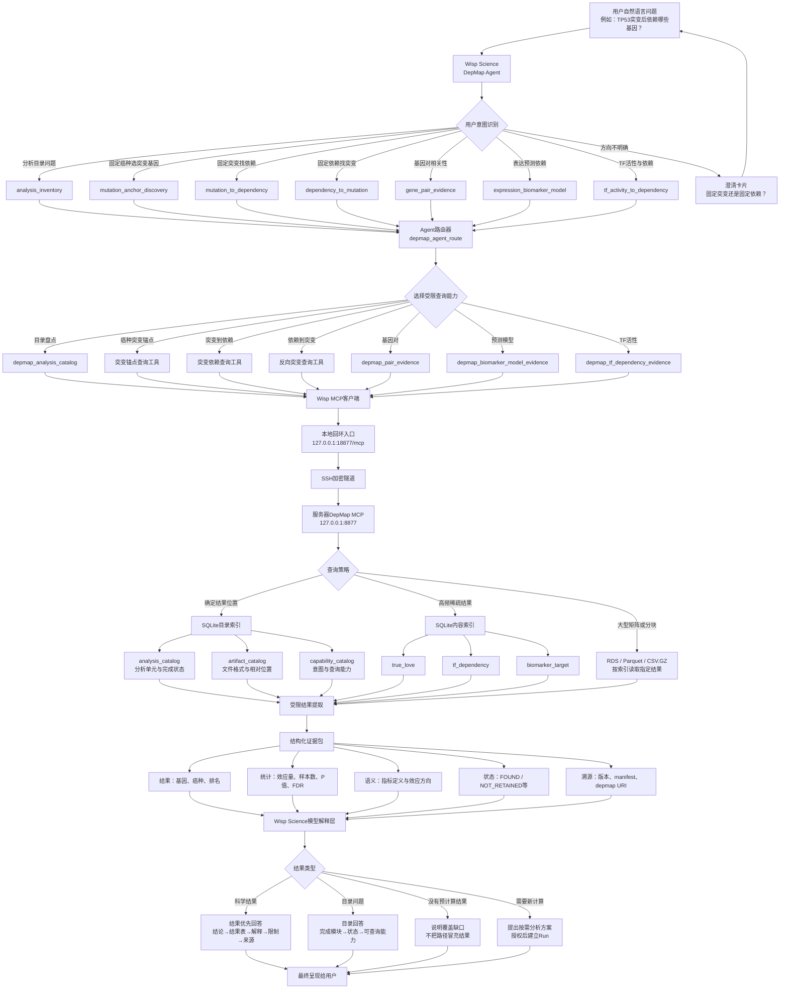

# DepMap Agent 远程数据桥接技术路线

本文描述 Wisp Science 如何把用户自然语言问题映射到服务器上的 DepMap 26Q1 预计算结果，并将结构化证据交给模型解释。目录索引用于路由和定位；科学问题的最终回答必须以实际结果为主，路径与模块状态只用于溯源。

## 完整链路

## 核心数据流

## 各层职责

| 层级 | 主要职责 | 禁止行为 |
|---|---|---|
| 用户意图层 | 判断用户要固定癌种、突变基因还是依赖靶点 | 猜测缺失的关键方向 |
| 路由层 | 选择 MCP 工具并校验必要参数 | 把路由记录当作科学证据 |
| 目录索引层 | 确定结果位置、版本、完成状态和查询入口 | 把路径当作最终科学结果 |
| 数据查询层 | 读取有限结果行或指定矩阵分块 | 遍历或载入整个知识库 |
| 结构化传输层 | 传递统计量、语义、状态与来源 | 只传文件名或模块名称 |
| 模型解释层 | 解释效应方向、显著性、生物学含义和限制 | 将相关性描述为因果关系 |
| 用户回答层 | 展示结论和结果表，最后附来源 | 要求用户自行打开服务器文件获取已有结果 |

## 索引与数据边界

统一 SQLite 索引分为两类：

- **目录索引**：`analysis_catalog`、`artifact_catalog` 和 `capability_catalog`，负责定位模块、分析单元、相对路径、状态及查询能力；
- **内容索引**：为高频稀疏结果提供直接检索，例如 `true_love`、`tf_dependency` 和 `biomarker_target`。

大型相关矩阵继续保留为 RDS、Parquet 或压缩表格。查询根据目录索引定位所需结果或分块，不将完整矩阵复制到 SQLite，也不把整个知识库送入模型上下文。

服务器 MCP 只监听服务器回环地址。Wisp Science 使用本机回环端口，通过 SSH 加密隧道访问服务器 MCP；远程端口不直接暴露到公网。返回的 `depmap://26Q1/...` 是知识库内的稳定溯源标识，不是要求用户自行访问的文件路径。

## 结果传输契约

除明确的目录盘点问题外，MCP 返回包使用 `scientific_result` 契约，至少包含当前查询可获得的以下内容：

1. 查询实体和规范化癌种；
2. 有限数量的结果行与排名；
3. 效应方向、效应量和指标定义；
4. 样本量、P 值和 FDR（分析产生这些字段时）；
5. `FOUND`、`NOT_RETAINED`、`INELIGIBLE`、`NOT_COMPUTED` 或 `MODULE_UNAVAILABLE` 状态；
6. DepMap 发布版本和结果溯源。

`presentation_contract` 强制解释模型遵守以下规则：

- 科学问题以实际结果为主要内容；
- 不用目录状态或路径替代结果；
- 按返回指标解释方向，不更改统计量含义；
- 区分观测关联、候选机制和因果结论；
- 将版本与 provenance 放在回答末尾。

## 标准用户回答顺序

1. 直接结论；
2. 关键结果表；
3. 效应方向与统计证据；
4. 生物学解释；
5. 分析限制和下一步；
6. DepMap 版本及结果来源。

如果目录中存在分析模块，但当前接口没有返回可解释的结果行，Agent 必须说明当前覆盖或查询接口的缺口，不得把模块名称、完成状态或文件位置包装成科学结论。
