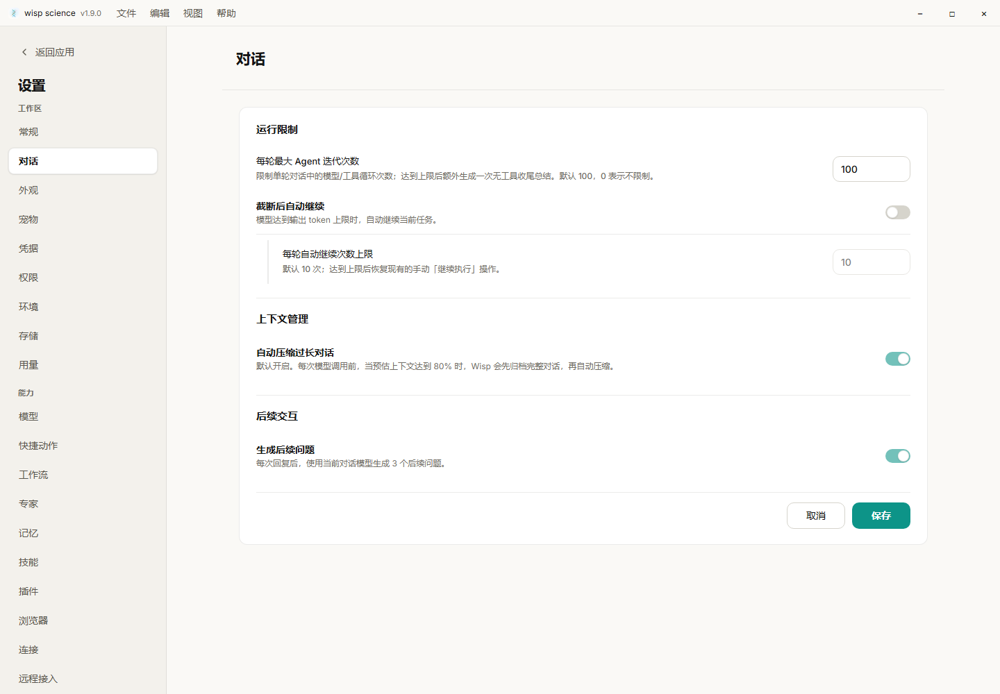
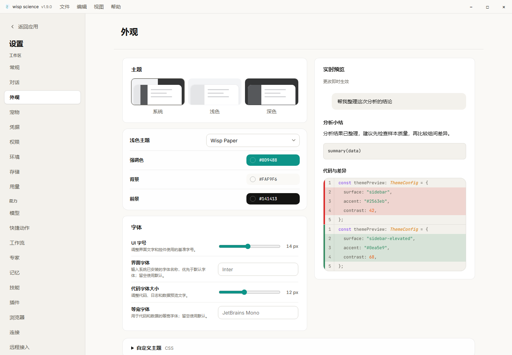
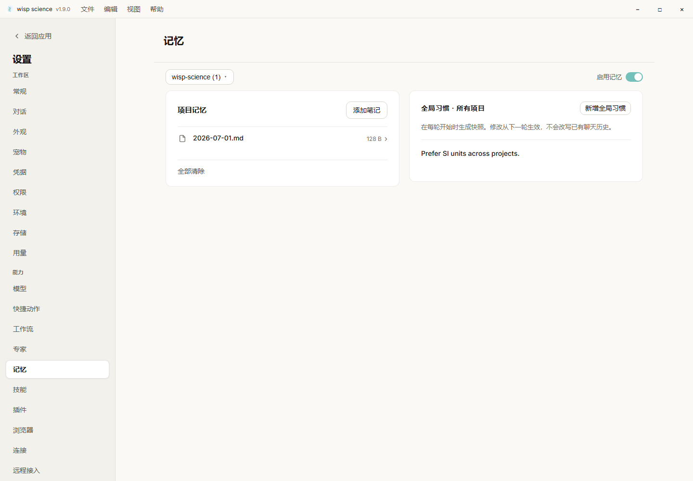
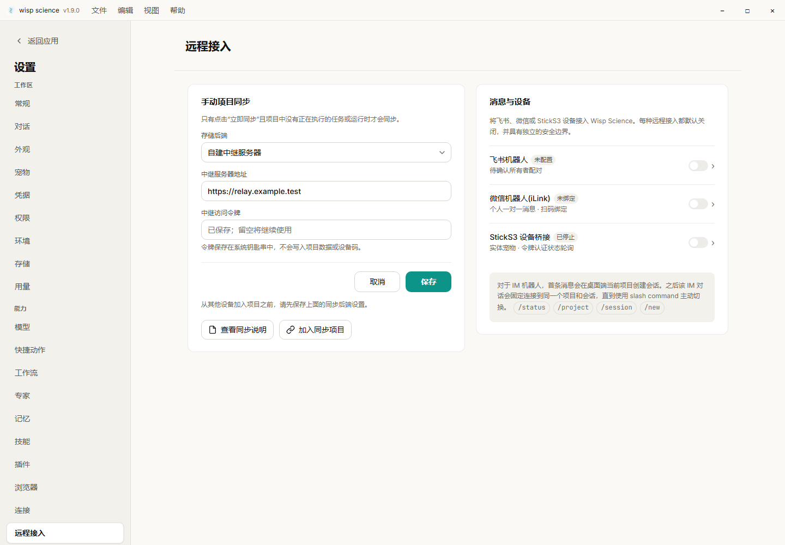

# Settings layout

Settings use a bounded content column, compact controls and content-sized cards.
Wide windows show related collections side by side; narrower windows stack them
under the same page heading. These layouts use the existing light/dark palettes.

| Page | Organization | Applying changes |
| --- | --- | --- |
| General | Workspace/interaction and notifications/updates; separate local environment and network cards | Preference Save is separate from environment and network saves |
| Session | Run limits, context management, follow-up interaction | Save applies session preferences; the automatic continuation limit is editable when automatic continuation is enabled |
| Appearance | Theme and font controls beside a live text/code preview | Changes apply immediately; expand Custom theme to paste, import or clear CSS |
| Memory | Project notes and global habits in adjacent cards | Existing note/habit actions apply individually; the project picker keeps its existing scope |
| Remote access | Project synchronization and messages/devices in adjacent cards | Synchronization owns its Save/Cancel controls; each channel retains its own configuration |
| Browser | Browser behavior followed by block/prefer list cards | Existing controls save immediately |
| Specialists | Built-in and custom lists follow their content height | Existing create/edit actions are unchanged |

Memory, browser and specialist lists no longer reserve an empty fraction of the
window when they contain only a few items. Remote access has one page scroll area,
so the synchronization footer and channel cards remain reachable. Opening a
channel hides the synchronization card; Back or Escape returns to the overview.

The appearance preview uses the selected UI and monospace fonts and font sizes.
Collapsing Custom theme does not remove or disable saved CSS. The existing CSS
sanitization rules remain in effect.
With a large UI font in a short window, the main sidebar's navigation can scroll
so its Settings footer remains reachable.

## Manual smoke checks

1. In English and Chinese, open General, Session, Appearance, Memory, Browser and
   Remote access at a wide window size, then narrow the window. Confirm the cards
   stack and fields/actions stay reachable without horizontal page scrolling.
2. In Session, turn automatic continuation on, edit its limit and save. Reopen the
   page and verify the saved values. Turn it off and confirm the limit is disabled.
3. In Appearance, change light/dark mode, palette, UI font and code font. Confirm
   the live preview changes. Expand Custom theme, paste/import CSS, collapse and
   reopen it, then clear it. Confirm persistence after reopening Settings.
4. In Memory, choose another project, open/edit a note and add/edit a global habit.
   Confirm that the project picker and Escape behavior still preserve their scopes.
5. In Remote access, edit synchronization settings and save them. Open each
   channel and press Escape immediately: return to the two-card overview without
   closing Settings. Check both a relay URL and a shared-folder path.
6. Add and remove browser block/prefer rules. Verify both lists stay close to
   their headings when empty and scroll with the page when populated.

Playwright covers the layout with a mocked Tauri bridge. This verifies rendering
and invoke contracts; it does not verify real channel connections, OS keyrings,
native folder dialogs or multi-device synchronization.

## Screenshots

The following screenshots show the implemented UI with sample data from the
mocked Tauri bridge, rather than the earlier generated design proposals.

### Session

### Appearance

### Memory

### Remote access

