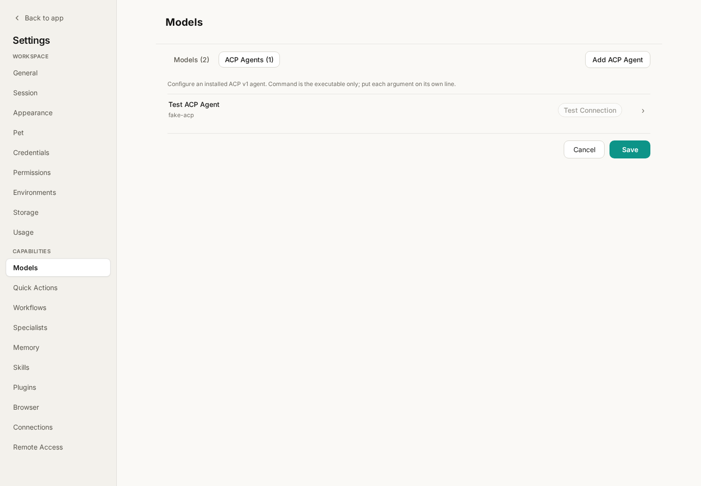
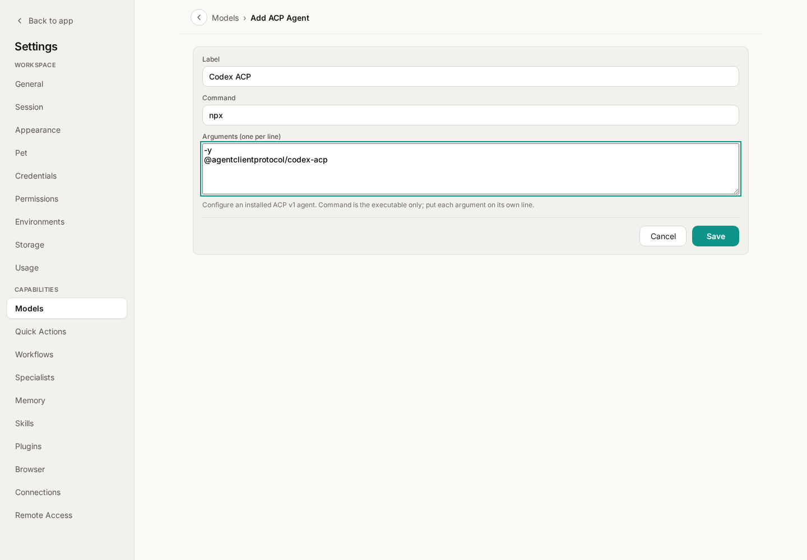

# Wisp Science Advanced: ACP Configuration

If you already use an external agent such as Codex or Claude and want to work with it inside Wisp Science's project interface, connect it through ACP. Wisp provides the project UI, messaging, and permission interactions; the external agent owns its session, tools, and authentication.

This tutorial covers preparing a local adapter, configuring it, testing the connection, and starting a conversation. For ordinary model APIs, see [Model Configuration](wisp-science-models.md).

**Distinguish HTTP models from ACP agents.**

| Method | Settings entry | Agent performing the task |
| --- | --- | --- |
| HTTP model | Settings → Models → Models → Add API access | Wisp's built-in agent, calling a model API |
| ACP agent | Settings → Models → ACP Agents → Add ACP Agent | An external process started locally |

ACP is the Agent Client Protocol. Wisp connects to an ACP v1 process over local standard input and output. Enter an adapter launch command, not an API address.

Do not put bare `codex`, `claude`, or `claude -p` commands in the ACP form. Use the appropriate ACP adapter. External-agent login and keys are separate from Wisp's HTTP model configuration.

**Prepare the runtime and adapter.**

Install the Node.js runtime required by the adapter, then install and authenticate the underlying agent according to its instructions. Available adapters include:

- [Codex ACP](https://github.com/agentclientprotocol/codex-acp): `@agentclientprotocol/codex-acp`.
- [Claude Agent ACP](https://github.com/agentclientprotocol/claude-agent-acp): `@agentclientprotocol/claude-agent-acp`.

Verify that the adapter starts in a system terminal. An ACP process may wait for protocol messages on stdin rather than show an ordinary chat prompt; that alone does not indicate a failure.

**Switch Models settings to ACP Agents.**

Open a project, go to **Settings → Models**, select **ACP Agents**, and click **Add ACP Agent**. Click an existing row to edit it.



*Figure 1: ACP agents and HTTP models are managed separately. Screenshots use the English interface; layouts may vary between versions.*

| Field | What to enter |
| --- | --- |
| Label | A recognizable name, such as `Codex ACP` |
| Command | Only an executable name or its full path |
| Arguments | One argument per line; do not paste the whole command into Command |



*Figure 2: Keep Command and Arguments separate. On Windows, use `npx.cmd` when launching through npx, or its full path if necessary.*

**Example 1: start Codex ACP through npx.**

Check in a terminal:

```bash
npx -y @agentclientprotocol/codex-acp --version
```

In Wisp, use label `Codex ACP` and command `npx`, or normally `npx.cmd` on Windows. Put these on two separate argument lines:

```text
-y
@agentclientprotocol/codex-acp
```

For a global installation:

```bash
npm install -g @agentclientprotocol/codex-acp
codex-acp --version
```

Then use `codex-acp` or its full executable path as Command and leave Arguments empty. Follow the adapter's instructions for underlying-agent authentication. See its `CODEX_PATH` documentation if you need a particular Codex executable.

**Example 2: connect Claude Agent ACP.**

Check the adapter:

```bash
npx -y @agentclientprotocol/claude-agent-acp --version
```

Use label `Claude ACP`, command `npx` or `npx.cmd` on Windows, and two argument lines:

```text
-y
@agentclientprotocol/claude-agent-acp
```

Or install it globally and use `claude-agent-acp` with empty Arguments:

```bash
npm install -g @agentclientprotocol/claude-agent-acp
claude-agent-acp --version
```

These demonstrate launch configurations, not completed installation or authentication. Configure only the agent you intend to use.

**Save, test, and authenticate.**

Save the agent, then click **Test Connection**. Success means the process started and completed ACP `initialize`; it does not verify every task permission or service quota.

If authentication buttons appear, follow the methods advertised by the agent. Some operate through the agent directly. Terminal methods open the adapter's advertised login command in Wisp's terminal dock. Complete login, then test or start the session again. Credentials remain with the agent and are not written to Wisp's SQLite database.

**Try a simple request in an empty conversation.**

Select the ACP agent in an empty conversation's model picker and send:

> Explain CSV files in two sentences and provide an example with two data rows. Do not read files or run commands.

The first message binds the conversation to that agent. Selecting ACP from an ordinary conversation that already has messages creates a new empty session and preserves the composer draft. To return to an HTTP model, start another empty session and select that model.

Permission cards display the agent's supplied choices. If it advertises session settings such as model or mode, adjust them in the ACP model menu beside Send. Stop cancels the active ACP turn.

Wisp provides its scientific MCP bridge to user-owned ACP sessions, allowing the external agent to discover and use available scientific tools in project scope. Actual capabilities and permissions depend on the current session configuration.

**Fix the ACP connection before retrying.**

| Symptom | Check first |
| --- | --- |
| Test fails immediately | Executable PATH, one argument per line, and whether Windows needs `npx.cmd` |
| Authentication fails | Underlying agent login/key and any required interactive terminal flow |
| Session selection is locked | Start a new empty session before choosing another backend |
| A changed command or project path prevents continuation | Start a new session; the old launch configuration or path may no longer match |
| Startup, disconnect, or resume failure | Original error, connection, and login; resend after fixing the cause |

ACP failure does not silently switch to an HTTP model. To use HTTP instead, explicitly start a new conversation and select it. HTTP calls may use a different account or quota.

ACP currently uses local stdio. It does not directly launch an ACP agent through WSL, SSH, or a remote URL, and there is no in-app adapter installation marketplace. Resuming after restart depends on adapter support and matching launch configuration and project path.

> See [ACP Agents](../../acp-agents.md) for full behavior and capability boundaries. This tutorial reflects the implementation when written. Screenshots and commands illustrate setup, not completed external-agent logins or calls.
