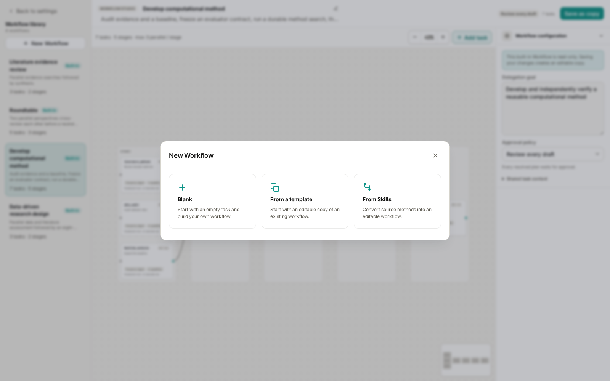
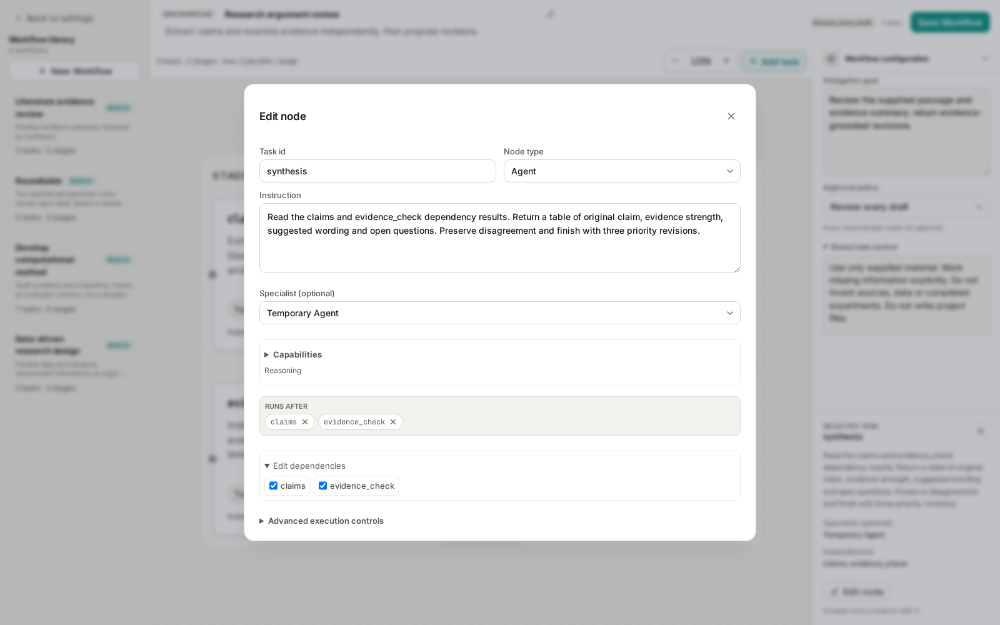
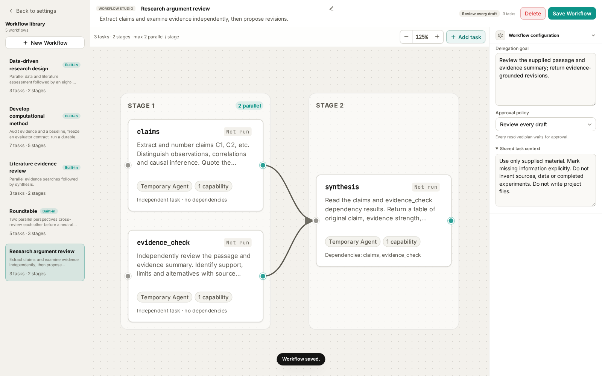
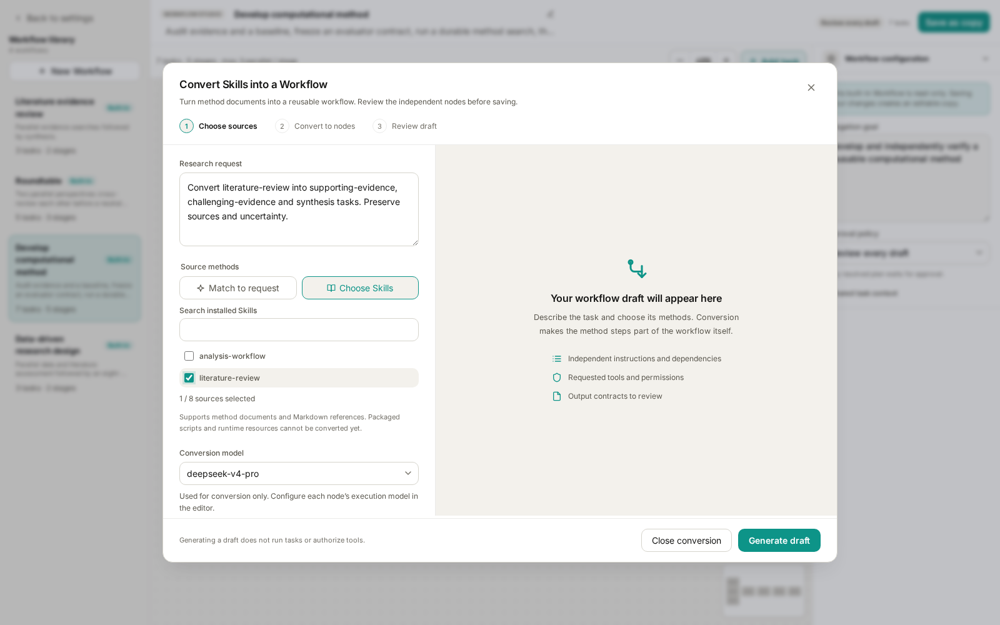

# Wisp Science Advanced: Creating an Agent Workflow

The previous [Agent Workflow tutorial](wisp-science-agent-workflow.md) introduced four built-ins. When the same division of work repeatedly helps you review research plans, examine evidence, or prepare meetings, save it as your own workflow.

This tutorial builds a complete small example: **Research argument review**. Two tasks independently extract claims and examine evidence; a third proposes revisions. It then covers copying a template and converting a Skill into a workflow.

Screenshots use the current frontend with local fixture data. No model calls, paper searches, or real research tasks were executed. The example uses only text supplied in the request, so it does not require a literature connector or code runtime.

**Define the deliverable before creating nodes.**

Make “review this argument” concrete:

> Using the supplied passage and evidence summary, return a table with original claim, evidence strength, suggested wording, and open questions, followed by three priority revisions.

Then define the division of work:

| Task ID | Responsibility | Dependencies | Capability |
| --- | --- | --- | --- |
| `claims` | Extract claims; distinguish observations, correlations, and causal inference | None | `reasoning` |
| `evidence_check` | Independently assess support, limitations, and alternatives | None | `reasoning` |
| `synthesis` | Reconcile the two results and propose revisions | `claims`, `evidence_check` | `reasoning` |

Both initial tasks receive the passage and evidence summary. The second cites source excerpts rather than waiting for claim IDs from the first. Synthesis matches their results. This makes the two reviews genuinely independent tasks in the graph.

**Open Settings → Workflows → New workflow.**



*Figure 1: All three creation routes share this entry point. Start with Blank for this example.*

| Route | When to use it |
| --- | --- |
| Blank | You already know the division of work |
| From a template | An existing workflow is close to your needs |
| From Skills | You have a method document and want a model to turn it into independent tasks |

Editing a blank workflow or template does not require model generation. Skill conversion calls the selected model when generating a draft. All routes require saving and then selecting the workflow in a conversation to execute it.

**Step 1: fill in the name, goal, and shared context.**

Choose **Blank**. One initial task appears. Fill in the workflow-level configuration:

| Field | Example |
| --- | --- |
| Name | Research argument review |
| Description | Extract claims and examine evidence independently, then propose revisions. |
| Delegation goal | Review the supplied passage and evidence summary; return evidence-grounded revisions. |
| Approval policy | Review every draft |

Expand **Shared task context** on the right and enter:

```text
Use only supplied material. Mark missing information explicitly.
Do not invent sources, data, or completed experiments. Do not write project files.
```

Name and description identify the template. Execution instructions belong in the goal, context, and nodes. Store recurring rules in the template; provide the changing passage, evidence summary, and question when sending each request.

**Step 2: turn the initial node into claims.**

Double-click the initial node, or select it and choose **Edit node**. Keep its type as **Agent**, change its ID to `claims`, and enter:

```text
Extract and number claims C1, C2, etc. from the supplied research passage.
Distinguish observations, correlations, and causal inference.
Quote the relevant passage; do not infer missing evidence.
```

Expand **Capabilities** and keep `Reasoning` (`reasoning`). This node only processes supplied text. Keep the temporary Agent role and default execution controls; creating a specialist for each task is unnecessary.

Closing task details preserves edits in the current draft. **It does not save the entire workflow.** Use the top-level save action after finishing the configuration.

**Step 3: add an independent evidence_check node.**

Open **Add task** in the graph toolbar and choose **Independent task**. Its editor opens automatically. Set its ID to `evidence_check`, keep `reasoning`, and enter:

```text
Independently review the passage and evidence summary.
Identify support, limits, and alternative explanations with source excerpts.
Flag missing sample sizes, controls, or statistics; invent no results.
```

Both nodes should have no incoming dependencies. They receive the same material but have different responsibilities. Duplicating a vague “analyze everything” instruction would usually produce redundant work.

**Step 4: add synthesis and connect both upstream tasks.**

Add another independent task with ID `synthesis` and capability `reasoning`. Enter:

```text
Read the claims and evidence_check dependency results.
Match claims to evidence and return a table of original claim, evidence strength,
suggested wording, and open questions. Preserve disagreement, add no new sources,
and finish with three priority revisions.
```

Expand **Edit dependencies** in this node's details and select both `claims` and `evidence_check`.



*Figure 2: Select dependencies explicitly. Writing “wait for previous tasks” in prose does not create graph edges.*

Alternatively, drag an upstream output handle to a downstream node. **Add after selected** creates a new task with a dependency on the selected node. Whichever method you use, this synthesis task must depend on both upstream tasks.

Close the details window. The graph should show **three tasks, two stages, and at most two parallel nodes**: `claims` and `evidence_check` on the left, `synthesis` on the right, and two arrows into synthesis.



*Figure 3: The complete example. Edges express dependencies; execution policy still controls actual concurrency.*

Use unique, short, stable task IDs. Keep dependencies acyclic: do not connect synthesis back to claims. For another revision cycle, adjust the input or template and start a new request.

**Step 5: save and try familiar material.**

Choose **Save workflow** and confirm the success message and the new library entry. If save is disabled, read the reason near the header. Common causes include missing name, goal, instructions, or capabilities.

Return to a project conversation, type `/`, and select “Research argument review.” Send:

```text
Review the following argument using the selected workflow and only this material.

Passage: Gene X has higher expression in the treatment group; therefore gene X
causes the phenotype change induced by treatment.

Evidence summary: Only an expression comparison is available. Sample size,
statistical test results, functional perturbation, and rescue experiments
have not been supplied.

Which wording can remain, which claims should become hypotheses, and what
additional evidence is needed?
```

This deliberately incomplete example is not a real experimental result. Review the resulting three-node plan and its dependencies, then choose **Approve and run**.

In **Agents**, check whether each task fulfilled its role, whether synthesis used both results, and whether missing evidence remained explicit. Familiar material makes configuration errors easier to identify than a large unfamiliar dataset.

Saving a template, approving a plan, and executing a workflow are separate actions. A saved template change applies to subsequent uses; editing the template does not rewrite an already approved execution plan.

**Add capabilities and output contracts when needed.**

All three example nodes use `reasoning` because their inputs are already in the message. For files or active retrieval, update the input description, instructions, and capabilities together.

| New requirement | Configuration direction |
| --- | --- |
| Read a project report | Add `project_read` to the relevant node and specify paths |
| Retrieve real publications | Select an available `literature_search` capability and configure its connector and verification requirements |
| Save the report | Add `project_write` to the saving node; specify path and overwrite rules |
| Execute analysis | Use `code_run` with explicit environment, inputs, and boundaries |

Capabilities determine which tools a node may request. Instructions do not automatically grant tools or install dependencies. Assigning reading, execution, and saving to explicit tasks also makes failures easier to diagnose.

For machine-readable results, configure an **output JSON Schema** and explain the fields in the instructions. For example, synthesis might return `claims` and `next_steps` arrays. Initially, keep the default output format and focus on clear content requirements.

**Advanced execution controls** cover executor, model, and budgets. Begin with defaults. Set maximum tokens, tool calls, or cost when needed. Blank budget fields mean unlimited; blank timeout uses the policy default and `0` means no timeout. Run activities have separate input and budget contracts rather than ordinary Agent controls.

**Route two: adapt an existing template.**

Choose **New workflow → From a template**, then select a suitable workflow. For example, copy `Roundtable`, rename it “Lab meeting planning,” add recurring constraints, and refine participant instructions.

You can also edit a built-in and choose **Save as copy**. The built-in remains available; select your saved copy to use the revised rules.

Check role consistency across stages. Openings establish positions, cross-reviews respond to both sides, and the chair synthesizes. When changing a participant, update both its opening and review nodes. Select an existing specialist if you need a reusable role definition.

**Route three: convert a Skill's method into a workflow.**

Choose **New workflow → From Skills**. Enter a research request and select source methods and a conversion model.



*Figure 4: literature-review is the source method. The screenshot stops before generation; no conversion model was called.*

Sources can be chosen automatically or manually through search. Manual selection allows up to eight; start with one clearly scoped method, such as `literature-review`. A request could be:

> Convert literature-review into supporting-evidence, challenging-evidence, and synthesis tasks. Preserve citation verification, sources, and uncertainty. Searches should be independent; synthesis must depend on both. Produce a reusable workflow without hard-coding the current topic or paths.

Select a configured **conversion model** and choose **Generate workflow draft**. This calls the model to convert the method; it does not execute the resulting research workflow.

Review the draft's instructions, dependencies, requested capabilities, and output contracts, then choose **Use draft and edit**. Complete its name, revise configuration, and save. Start it later through `/` in a conversation.

Conversion currently supports method text and Markdown reference documents, not bundled scripts or runtime resources. Converted nodes should contain self-contained executable instructions. The source Skill supplies method material; attaching its name alone is not sufficient configuration. Later changes to the source Skill should not be assumed to update saved templates automatically. Reconvert or edit them explicitly.

**Diagnose configuration problems at the affected node.**

| Symptom | First check |
| --- | --- |
| Save is disabled | Header reason; name, goal, IDs, instructions, and capabilities |
| Two nodes repeat each other | Distinct responsibilities and deliverables |
| Synthesis ignores a result | An actual dependency exists, not just a task name in prose |
| A node cannot read or search | Required capability, paths, connector, and environment |
| Edits appear lost | The workflow was saved and the correct copy was selected |
| Conversion cannot start | Request, valid source selection, and a configured model |
| A generated draft does not execute | Use and edit the draft, save it, then select and send it in a conversation |

Once this small workflow handles your material reliably, add retrieval, file outputs, or other roles as needed. For each new node, identify the new result it contributes and which task will use that result.

> Companion reading: [Built-in workflow usage](wisp-science-agent-workflow.md), [Agent delegation](../../agent-delegation.md), and [Quick Actions](wisp-science-quick-actions.md) for binding templates to selected-text actions.
