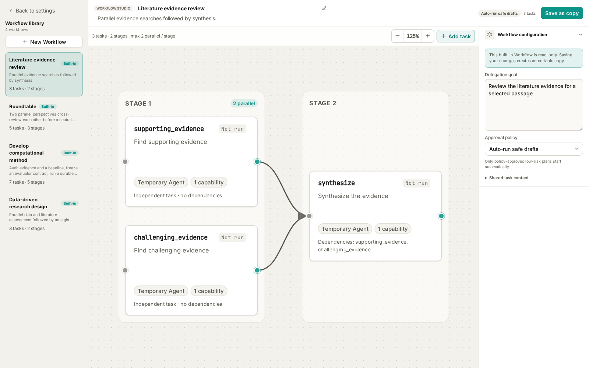
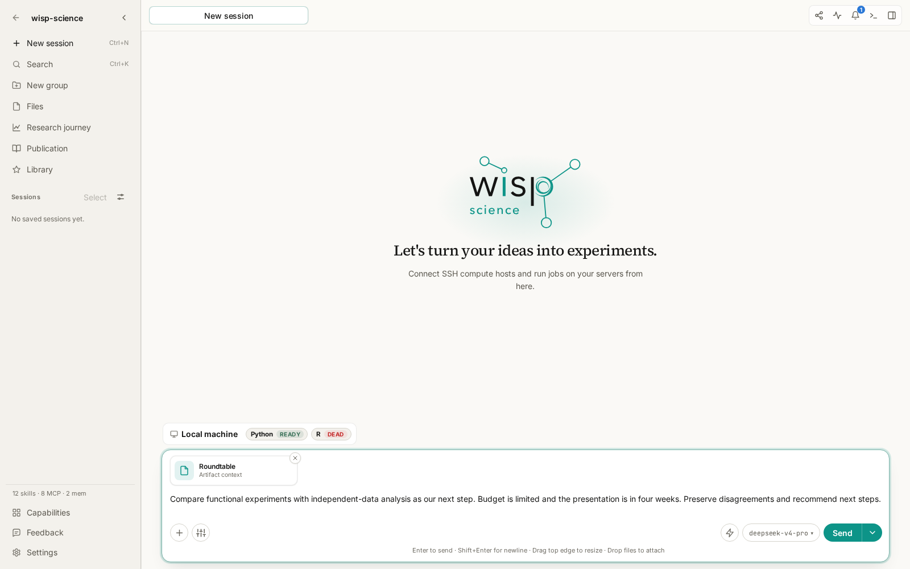
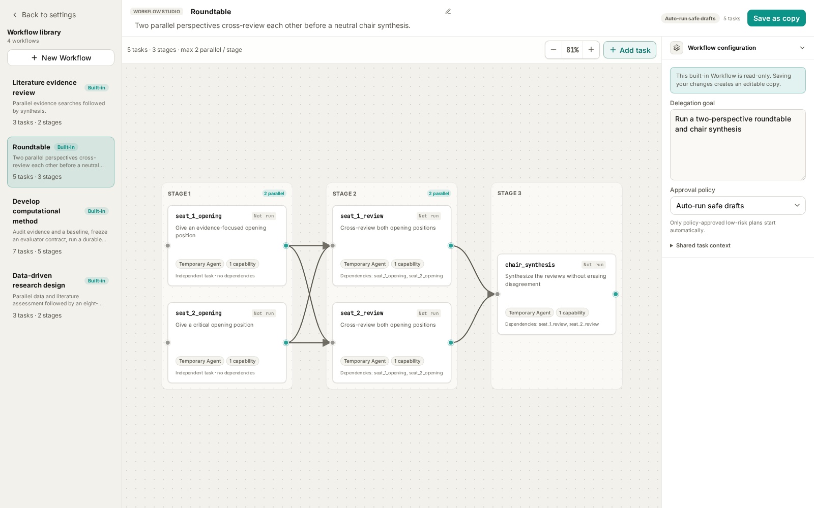
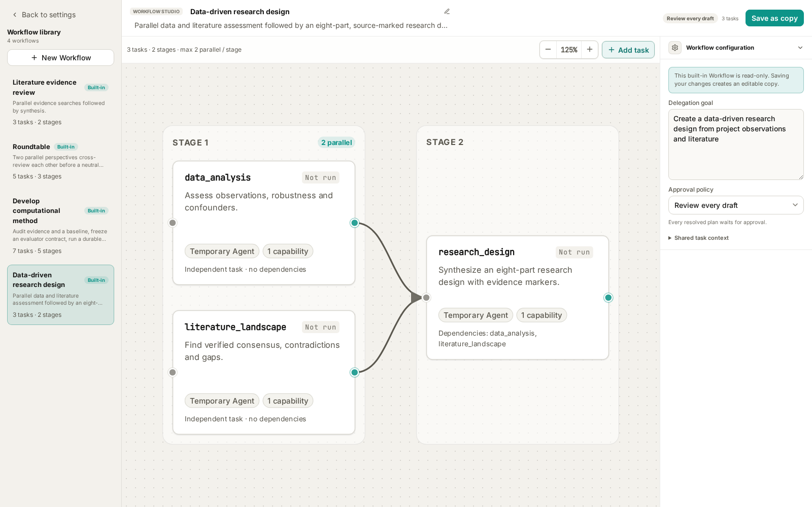
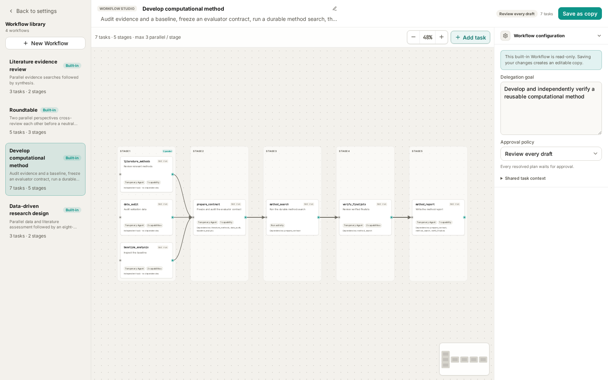

# wisp-depmap Advanced: Agent Workflow

A research question often involves several kinds of work: examining data, finding published evidence, considering alternative explanations, and deciding what to do next. An **Agent Workflow** saves that division of work as a task graph, including dependencies, capabilities, and expected outputs.

This advanced tutorial assumes you have configured a model and can use files and tools in a project. For background, see [Skills](wisp-science-skills.md), [Specialists](wisp-science-specialists.md), and [Quick Actions](wisp-science-quick-actions.md).

**A workflow makes the division of work and dependencies explicit.**

For a literature evidence review, supporting and challenging evidence can be searched independently. Synthesis waits for both results.

```text
Supporting evidence ──┐
                      ├── Synthesis, disagreements, and gaps
Challenging evidence ─┘
```

Each node is a task; an arrow declares a dependency. Independent tasks can run in parallel, subject to concurrency, executor, and write restrictions. Dependent tasks receive upstream results before proceeding.

Ordinary Agent nodes run as temporary subagents with instructions, capabilities, and optional specialist, executor, and model choices. A **Run activity** delegates sustained computation to a host-managed Run. The built-in method-development workflow uses one of these nodes.

| Component | Responsibility |
| --- | --- |
| Current message and material | The specific question, inputs, and constraints |
| Skill | A reusable method, procedure, and reference material |
| Specialist | A reusable role and working instructions |
| Agent Workflow | Task nodes, dependencies, capabilities, and outputs |
| Quick Action | A contextual entry point, such as selected text |
| Run | The record and lifecycle of a sustained computation |

Nodes may use the same model. Multiple model configurations are not a prerequisite for using workflows.

**Start with the four built-in workflows.**

Open **Settings → Workflows** to enter Workflow Studio. The library is on the left, the graph is in the center, and workflow configuration and the selected task summary are on the right.



*Figure 1: The current frontend with local fixture data. Node instructions are shortened to illustrate the structure. No searches or model calls were executed for these screenshots.*

| Built-in template | Suitable task | Default structure |
| --- | --- | --- |
| `Literature evidence review` | Examine support, contradictions, and limits of a claim | Two searches → synthesis; 3 nodes |
| `Roundtable` | Compare research plans, explanations, or resource choices | Two openings → two cross-reviews → chair synthesis; 5 nodes |
| `Data-driven research design` | Turn observations and literature into a testable research design | Data and literature assessment → research design; 3 nodes |
| `Develop computational method` | Improve a local Python method against a defined evaluator | Three audits → contract preparation → method search → review → report; 7 nodes |

Click a node for its summary. Double-click it, or choose **Edit node**, to inspect the complete instructions and configuration. Saving changes to a built-in creates a custom copy through **Save as copy**.

The library stores reusable templates. Execution records appear in the corresponding conversation's **Agents** panel.

**Select a workflow, add your request, and send.**

For a first attempt, use Wisp's native Agent:

1. Open a project and a new conversation with a working model.
2. Type `/` in the composer and search for a template, such as `Roundtable`.
3. Select it from the workflow group and confirm that its reference appears in the composer.
4. Describe the goal, material, constraints, and expected result, then send.
5. Check the conversation and **Agents** panel. Review any pending draft and choose **Approve and run**, or follow progress if it has already started.



*Figure 2: The workflow reference travels with the request. This screenshot stops before sending.*

Selecting a template attaches it; sending asks the main Agent to execute it. Wisp supplies the request as context and instructs the Agent to preserve the graph's dependencies when delegating. Sending a workflow reference enables delegation for that native conversation.

To inspect without running, browse Settings or ask the Agent to explain available workflows without starting them. Attach a workflow when you are ready to execute a concrete request.

The approval policies are **Review every draft** and **Auto-run safe drafts**. Automatic execution still depends on the resolved capabilities and policy. Literature review and Roundtable use the latter by default; research design and method development require draft review.

**Literature evidence review: search for support and challenges to a specific claim.**

Provide a testable statement with a defined organism, condition, and scope. After selecting `Literature evidence review`, you might send:

> Assess this unverified claim: “Changes in the proportion of a root cell type reflect its adaptation to drought.” Limit the scope to Arabidopsis roots and single-cell or single-nucleus transcriptomics. Find supporting evidence as well as contradictory findings, technical biases, and boundary conditions. Distinguish true proportion changes from dissociation, sampling, and annotation effects. Summarize conclusions, sources, and unresolved questions.

This is a teaching example, not an established scientific conclusion.

| Node | Work |
| --- | --- |
| `supporting_evidence` | Independently search for supporting publications and extract actual findings |
| `challenging_evidence` | Search for contradictions, boundary conditions, failed replications, and methodological critiques |
| `synthesize` | Deduplicate sources and reconcile evidence, disagreements, and gaps |

Each search keeps at most eight relevant papers and uses enabled, authorized literature connectors. Synthesis uses only the upstream results; it does not search again. The template does not ask nodes to write project files.

Configure the required connectors, credentials, and network access first. Afterwards, verify that the papers exist and support the stated findings, including contrary evidence. If you want a Markdown report, ask the main Agent to save the completed result to a specified path.

The built-in **Research literature** Quick Action instead attaches the `literature-review` Skill to the current composer. To execute this three-node graph, select the workflow through `/` or bind it to a custom Quick Action.

**Roundtable: independent positions followed by cross-review.**

Use Roundtable for decisions involving trade-offs: additional experiments versus further analysis, competing methods, or alternative explanations.

One participant focuses on evidence and another on criticism. Both present independent positions, each reviews both openings, and a neutral chair synthesizes their revised recommendations.



*Figure 3: Five nodes in three stages. Each review depends on both opening positions.*

After selecting `Roundtable`, try:

> We have preliminary transcriptome results and need to plan next month's work. Option A is functional validation of key genes; option B is analysis of an independent public dataset to assess reproducibility. We have one experimental researcher, a limited budget, and a progress presentation in four weeks. Current evidence is correlational, with no functional experiment. Compare assumptions, benefits, failure risks, and missing information. Recommend priorities while retaining unresolved disagreements.

The built-in nodes use reasoning. They do not search literature or read the entire project by default. Supply relevant facts, evidence summaries, and constraints in the request. To add active retrieval or file reading, create a copy and configure those capabilities.

Read the independent positions, then check whether the cross-reviews actually respond to each other and whether the chair preserves important dissent. Multiple perspectives still require factual verification against the source material.

For custom roles, save a copy and configure specialists and models. Keep each participant's role consistent between its opening and review nodes; the chair has a separate synthesis role.

**Data-driven research design: move from observations to testable plans.**

Use this workflow when you have preliminary omics results, observations, or a candidate mechanism and want to plan validation. Data assessment and literature assessment run independently before synthesis.



*Figure 4: Two evidence streams support the design. Draft approval is required by default.*

Prepare accessible data or result files, sample metadata, existing methods, and resource constraints. The data node requests code execution; the literature node needs search capabilities. Actual work depends on the configured tools and execution environment.

If these files exist in your project, select `Data-driven research design` and send:

> Develop a next-stage research plan from results/differential_expression.csv, metadata/samples.csv, and notes/preliminary-observations.md. Examine batch effects, sample size, and outliers, then search for supporting and opposing evidence about the candidate pathway. Separate observations from proposed mechanisms. We can perform qPCR and conventional genetic validation, but cannot add large-scale sequencing. Propose discriminating experiments, rescue approaches, and how to revise the hypothesis if experiments disagree. Do not overwrite existing results.

Replace the example paths with real files. Review the draft, particularly the tools and execution scope of the data node.

The final design has eight parts:

1. Data observations and robustness.
2. Literature consensus, conflicts, and gaps.
3. Candidate hypotheses and alternatives.
4. Deductive predictions.
5. Discriminating experiments and rescue.
6. Failure-driven hypothesis iteration.
7. Translation feasibility and risks.
8. An evidence–claim matrix and priorities.

The upstream modules carry `[workflow:data_analysis]` and `[workflow:literature_landscape]` markers, which synthesis is instructed to retain. These help trace recommendations to the appropriate assessment; verify individual claims against node results, original data, and papers.

The deliverable is a research design. Tool records show which checks were actually performed. A proposed experiment is not a completed experiment.

**Develop computational method: freeze evaluation conditions before searching.**

This template requires the most preparation. It is appropriate when a working baseline already exists, such as a Python numerical function whose runtime you want to improve within a stated error bound.



*Figure 5: Method search is a Run activity. Workflow approval is followed by a separate review of its frozen contract before search starts.*

The current scope is **local Python, one declared function or class, immutable project-local inputs, and a bounded evaluator**. It does not provide remote GPU scheduling, automatic data downloads, or multi-target source edits.

| Required material | What to specify |
| --- | --- |
| Scientific objective | The desired improvement and its purpose |
| Baseline | Source file, editable function/class, and interface |
| Evaluator or evaluation requirements | Invocation, deterministic conditions, and validity rules |
| Validation inputs | Paths, formats, splits, and permitted use |
| Primary metric | What is optimized and in which direction |
| Hard guardrails | Accuracy, output, resource, or other constraints |
| Independent final-verification data | Inputs reserved for final verification; explicitly state if absent |

After selecting `Develop computational method`, adapt this example to your project:

> Improve smooth_signal in src/smoothing.py, preserving its signature and output shape. The baseline runs successfully. Validation data is data/validation.json; independent final-verification data is data/final.json and must not be used for candidate selection. The evaluator is benchmarks/evaluate.py. Minimize median runtime on fixed inputs. Maximum absolute error against the reference output must not exceed 1e-6, and all outputs must be finite. Audit literature, data splits, and baseline before preparing the contract. Use the template's search limits and wait for my contract review before searching. Report improvement, independent verification, and limitations.

The sequence is:

```text
Literature methods ─┐
Data audit ─────────┼── Prepare contract → Search Run → Finalist review → Report
Baseline analysis ──┘
```

**There are two distinct approvals.** Approving the workflow permits preparation and auditing. Preparation produces a draft Run; candidate search has not started. Open the linked Run, inspect the method-search contract, and check its target, evaluator, baseline, noise floor, protected inputs, and budgets. Then choose the action to approve and start search.

The frozen contract binds the audited versions of code, data, and evaluation conditions. Start and resume revalidate them rather than silently substituting changed files.

The built-in limits are **20 candidates, 14,400 wall-clock seconds (four hours), 120 seconds per evaluation, and 5,000,000 cost microunits**. These are ceilings, not a runtime estimate or fixed price. Follow candidates, metrics, and progress in Run detail. Pause takes effect at a durable candidate boundary; resume and cancel are also available.

Check whether improvement exceeds baseline noise and whether the result has independent final verification or is **validation-only (`validation_only`)**. Validation-set gains alone must not be presented as independent verification.

Selected code is saved as an artifact version and is not automatically applied to project source. Inspect differences, evaluation history, and reproduction instructions before adopting it. Finding no improvement that satisfies the constraints is also a valid outcome.

**Follow the graph when reviewing results.**

Open the conversation's **Agents** panel to inspect task states and complete results. Run activities also link to their associated Run.

| State or symptom | Next step |
| --- | --- |
| Draft | Review goal, dependencies, capabilities, and approval reasons |
| Running | Inspect current node activity and any pending tool or user interaction |
| Waiting for Run | Open the Run; method search may need its second approval |
| Failed or blocked | Check upstream errors, tools, paths, and output requirements before retrying |
| Completed | Inspect evidence and outputs before relying on synthesis |
| Only an explanation, no task record | Confirm that you attached and sent the workflow; ask the Agent to create and execute its graph |

Failed upstream nodes can block dependent synthesis. Resolve the specific input, permission, or dependency problem before repeatedly rerunning the whole graph.

**Create a small custom workflow after trying the built-ins.**

Use **Settings → Workflows → New workflow** to start blank, copy a template, or convert Skills. A tried-and-tested template is a useful starting point. For example, copy Roundtable, name it “Lab meeting planning,” save recurring resource constraints as shared context, and refine the participants' instructions. Keep changing questions and file paths in each request.

Give every node a clear deliverable and the capabilities it needs. Make synthesis depend on all relevant results and keep the graph acyclic. If you configure an output JSON Schema, ensure the node can produce that contract.

Use advanced execution controls when you need explicit models, executors, or budgets. Run activities have separate input and candidate/time/cost limits; ordinary Agent controls do not apply to them.

Saving a template does not start it. Return to `/`, select the saved workflow, and try a small input. You can later bind it to a [Quick Action](wisp-science-quick-actions.md).

For a complete walkthrough of all three creation routes, see [Creating an Agent Workflow](wisp-science-agent-workflow-create.md).

Start with Roundtable for a familiar decision, then use literature review for a specific claim. Move to research design when data and constraints are available, and to method search once you have a runnable baseline and evaluator.

> Based on the current repository's templates, desktop UI, and execution implementation. Prompts, paths, and thresholds are teaching examples, not completed research. See [Agent delegation](../../agent-delegation.md) for implementation details.
