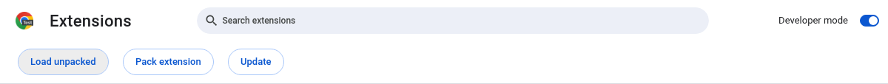
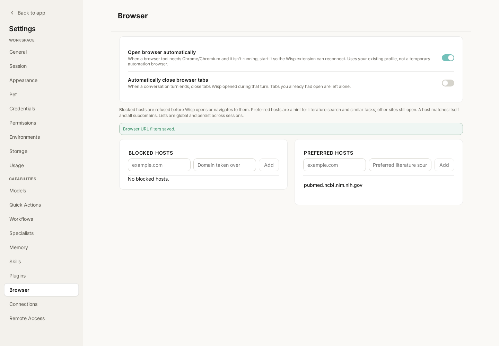
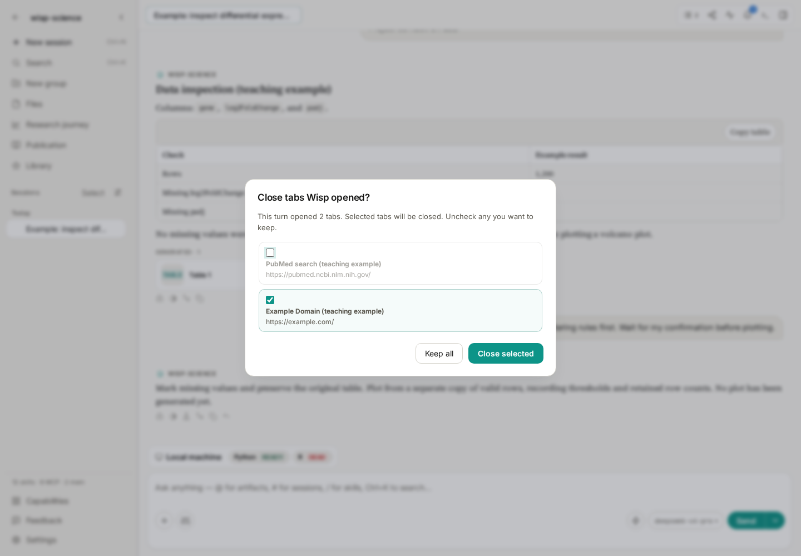
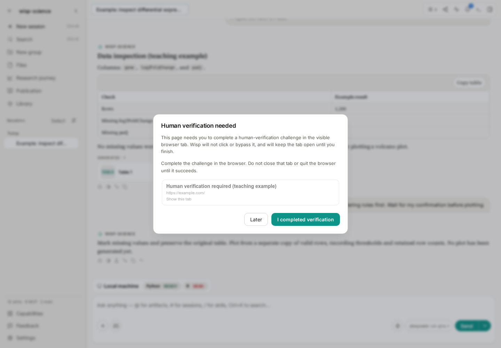

# Wisp Science Basics: Using the Browser

Database records are often only the beginning of literature research. You may need to open a journal page, locate supplementary materials, confirm a data download link, or read a site without a dedicated search tool.

Wisp Science reads and operates webpages through a browser bridge extension. It can continue work in your browser, show what it actually opened, and organize useful information in the project. This tutorial starts with a public page, then covers tabs, human verification, and downloads.

> Wisp screenshots use the real frontend with a teaching conversation and simulated browser events. They show the English interface. The extension screenshot illustrates Chrome's installation controls. Page titles and task states are examples, not evidence of completed live retrieval.

**Ground the answer in an actual page.**

Browser tools can open pages, read text, locate actionable elements, and capture screenshots or save webpage assets when required. For databases with dedicated connectors, [MCP](wisp-science-mcp.md) can retrieve structured records. Both approaches can serve the same task.

By default, Wisp connects to an existing Chrome/Chromium-family profile and can use that profile's login state. The signed-in account and open tabs affect what can be read.

A separate workspace-browser mode uses its own profile, requires signing in there, and depends on a compatible browser build. For a first attempt, connect your everyday browser. See [Browser Runtime](../../browser-runtime-architecture.md) for the distinction.

**Start by asking Wisp to configure browser control.**

Keep Wisp running and send:

> Help me configure browser control. Report the current connection status and the exact extension directory I should load on this computer.

Wisp uses `browser_setup` to report status and the correct path. In the Chrome profile you want Wisp to use:

1. Open `chrome://extensions`.
2. Enable **Developer mode** at the top right.
3. Click **Load unpacked**; wording can vary by browser version.
4. Select the entire `browser-extension` directory reported by Wisp.
5. Open the extension popup and check for **Connected to Wisp**.

*Figure 1: The English Chromium extension manager. Load the whole extension directory, not a ZIP or an individual file inside it. Use the exact path reported on your computer.*

Do not copy another person's Windows, macOS, or WSL path. Wisp prepares a stable managed directory; that is the path the browser should remember.

If the popup says connected but Wisp still reports an unusable connection, ask it to check again. An old extension, another tool occupying the same port, or an incomplete handshake may be involved. Follow the reported cause.

**Read a public page first.**

Try:

> Open https://example.com and read the page title and main paragraphs. Report the URL actually read. If reading fails, explain the failure instead of reconstructing the page from prior knowledge.

The page is simple enough to check the basic connection. Once it opens and reads successfully, try a familiar journal or database page.

For a research task, specify what to inspect, what to collect, and where to save it:

> Read the paper page I currently have open. Find the data availability statement and supplementary-material links. List identifiers, links, and descriptions actually present on the page and save them to notes/paper-links.md. Do not download large datasets or submit forms yet.

Compare the answer with the visible browser page. Use the [trajectory](wisp-science-trajectory.md) to check tools, addresses, failures, and retries.

**Review browser settings for daily use.**

Open **Settings → Browser** for automatic launching, tab cleanup, and domain lists.

*Figure 2: PubMed is added to the preferred list in this example. A preference does not block all other websites.*

| Option | Effect |
| --- | --- |
| Open browser automatically | When browser tools need a session, try to start an installed supported browser so its extension can reconnect; enabled by default |
| Automatically close browser tabs | Clean up tabs Wisp opened during the turn when that turn ends; disabled by default |
| Blocked domains | Reject applicable new-page opens or explicit navigation to a matching domain or subdomain, returning your reason |
| Preferred domains | Guide retrieval toward these sites without forbidding other domains |

These are domain-level settings, not a substitute for checking page content. Blocking a domain does not remove tabs that are already open; existing tabs can still be scanned.

**Decide which tabs to keep after a turn.**

When automatic closing is off, Wisp lists tabs it opened during the turn. Choose which to close and which to keep. Tabs you already had open are outside this cleanup scope.

*Figure 3: The PubMed page is deselected to keep it for further reading. Only selected tabs will be closed by this confirmation.*

Keep paper pages you still need to verify and close temporary searches. Escape dismisses the prompt without requiring you to close the pages to return to the conversation.

If the extension is disconnected at turn end, the pending list is retained for reconnection. Tabs awaiting human verification are protected from ordinary automatic cleanup.

**Complete login or human verification in the browser yourself.**

Some sites require login or confirmation that you are human. When Wisp detects a verification challenge, it pauses the relevant automation and asks you to take over.

*Figure 4: A simulated event demonstrates this prompt. Complete verification on the actual webpage; Wisp rechecks the page before continuing.*

Open the indicated tab, complete verification manually, leave it open, and confirm in Wisp. If the challenge remains, inspect the page instead of repeatedly asking the agent to click it.

**Be explicit about downloads and where files are saved.**

First ask for names, links, and sizes, then decide what to download:

> Find the supplementary tables for this paper and list their filenames, download links, and sizes shown on the page. Do not download anything until I confirm which files I need.

If a system Save As dialog appears, handle it yourself. The webpage bridge cannot operate native file pickers or browser-toolbar download bubbles.

For unattended downloads, you can manually turn off the browser option asking where to save every file. Configure permission for multiple automatic downloads per trusted site. Afterward, have Wisp check actual files, locations, and sizes: clicking a download link is not proof that the whole file arrived.

**Check connection, page state, and files separately.**

| Symptom | Check first |
| --- | --- |
| Browser disconnected | Is Wisp running, and is this the browser profile with the extension installed? |
| Extension update requested after upgrading Wisp | Follow the update banner; older extensions may require Reload in the extension manager |
| Connected, but content cannot be read | Is the page fully loaded? Does it need login or human verification? |
| Browser settings page cannot be controlled | Internal pages such as `chrome://settings` require manual interaction |
| Download has not completed | Native save dialog, site download permission, or a failed network request |
| Answer has no source URL | Check the trajectory for successful page reads, then ask for sources based on those results |

A first exercise can simply read a public page, verify its URL, and keep the useful tab. Once that works, combine papers, data entries, and supplementary materials in the same task.

> See [Real-browser Automation](../../real-browser-automation.md). This tutorial reflects the implementation when written; labels may vary by version. Example prompts do not represent completed browser operations.
