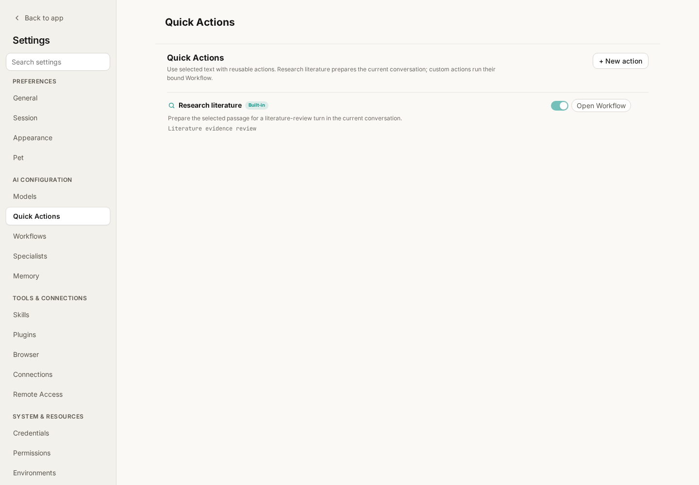
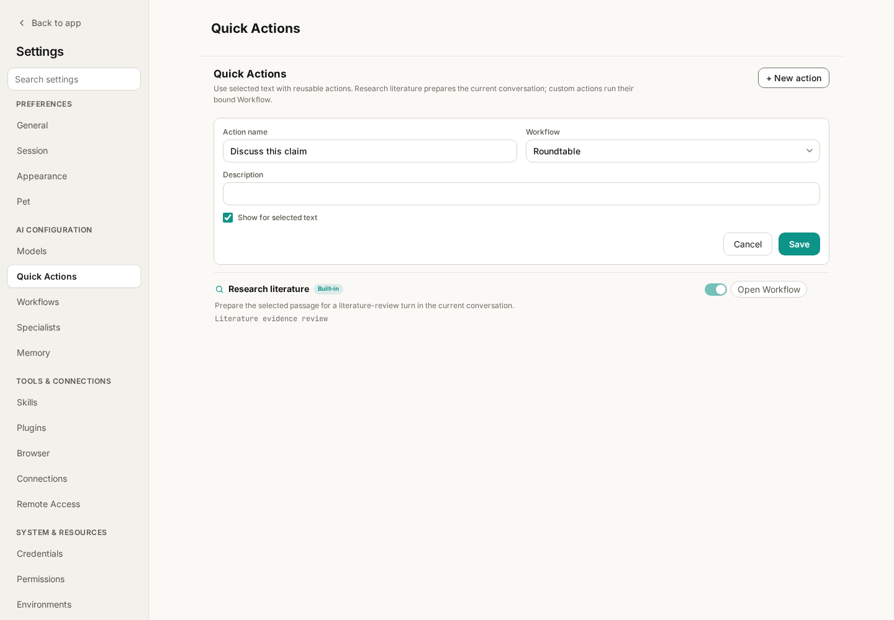

# wisp-depmap Tips: Quick Actions

While reading an analysis, you may want to find literature supporting a claim. While organizing notes, you may want to discuss one paragraph from several perspectives. Copying text and rewriting the same instructions each time adds friction.

wisp-depmap **Quick Actions** put reusable actions beside selected text. Select the material, choose an action, and carry it into the next task.

Following [Specialists](wisp-science-specialists.md), this tutorial covers selection entry points, the built-in **Research literature** action, and binding an existing Workflow to your own action.

**The Quick Action is the entry point; Skills or Workflows define the work.**

| Component | Responsibility |
| --- | --- |
| Selected text | The material to research, discuss, or process |
| Quick Action | A reusable operation available beside that material |
| Skill | Task methods for a conversation, such as literature search and verification |
| Workflow | Tasks, dependencies, capabilities, and deliverable requirements |
| Specialist | A standing role and instructions for a task |

The built-in **Research literature** action prepares the next message in the current conversation with the `literature-review` Skill. Custom actions bind a Workflow and create a dedicated conversation, where execution starts or waits for review according to the Workflow policy.

**Start with Research literature.**

Suppose a conversation contains this claim requiring verification:

> This cell type may participate in the drought response of plant roots.

This is an example claim, not an established finding. To investigate it:

1. Select the passage in the conversation body.
2. Choose **Research literature** from the floating selection toolbar or the right-click menu.
3. Inspect the current composer: it contains the selected passage as a quote, the `literature-review` Skill, and an editable research prompt.
4. Add scope and output requirements, then click **Send**.

For example, add:

> Limit the question to Arabidopsis roots. Separate direct experimental support, correlational observations, and conflicting or unsupportive evidence. Prefer original research, verify titles, years, and DOIs, and explain where the evidence cannot establish causality.

**Choosing Research literature does not start the task until you send the message.** Use that opportunity to specify species, dates, search priorities, and the desired output. After sending, tool activity, progress, and the final reply stay in the current conversation. [Trajectory](wisp-science-trajectory.md) lets you inspect the actual search process later.

Literature retrieval requires a working model, available search tools, and network access. The Skill guides the method; tool results show what was actually retrieved. Try a familiar claim first and check whether cited papers support the associated statements.

**Use selected text in file previews too.**

Quick Actions also work with selectable text in non-code file previews. Select a paragraph in research notes and start a literature review around that specific question.

R and Python source selections retain code operations such as Run, Ask AI, quote, and explain. If Research literature is absent, check whether you selected prose or code. Text inside an image must first be supplied in a selectable form.

To stop the floating toolbar appearing on every selection, adjust **Settings → General → Selection quick actions**. The corresponding operations remain available through the right-click menu.

**Manage menu entries in Settings → Quick Actions.**

*Figure 1: The actual frontend with mocked data. This screenshot demonstrates configuration without running a literature search or calling a model.*

The page shows action names, descriptions, and associated Workflows. **Show for selected text** controls availability. Existing actions can be edited; custom ones can also be deleted.

**Open Workflow** enters the standalone Workflow Studio to inspect the task graph and configuration. One detail matters: although Research literature links to the **Literature evidence review** template, invoking that built-in selection action still prepares a research request in the current composer.

Use the Workflow template itself when you explicitly want the multi-node evidence review graph. Inspecting its template and invoking the built-in Quick Action are separate entry points.

**Create a custom action by binding an existing Workflow.**

For a recurring discussion of claims in your notes, create **Discuss this claim** and bind the library’s **Roundtable** Workflow:

1. Open **Settings → Quick Actions → New action**.
2. Enter “Discuss this claim” as the **Action name**.
3. Select `Roundtable` in **Workflow**.
4. Add a description, such as “Compare interpretations of the selected claim and summarize disagreements and questions to test.”
5. Keep **Show for selected text** enabled and click **Save**.

*Figure 2: Binding a selection action to an existing Workflow. The action name labels the menu entry; the Workflow defines the task assignments.*

Return to a conversation or non-code file preview, select a complete claim, and choose **Discuss this claim** from the floating toolbar or context menu. Wisp adds the selection and available source information to the Workflow context and creates a dedicated conversation.

A custom action does not pause in the current composer waiting for Send as Research literature does. Depending on the Workflow’s approval policy and resolved capability requirements, it starts or becomes a draft awaiting review. If a draft is created, inspect the tasks before approving execution. If it starts, follow the new conversation and the Agents activity panel.

**The action description explains the entry point; write task requirements into the Workflow.**

Changing an action’s description to “Check statistical methods” does not transform Roundtable into a statistical review graph. To check sample sizes, tests, and multiple comparisons every time, write those requirements into the Workflow goal and task instructions, then bind the action to that template.

Workflow Studio exposes the goal, shared context, task nodes, dependencies, Skills and capabilities, and Specialist, executor, and model choices. Independent tasks may run in parallel; dependencies establish ordering.

Built-in Workflows are read-only templates. Saving edits to one creates a custom copy. Start by inspecting an existing template and adjusting one concrete requirement rather than designing a large graph immediately.

A small “Check research reasoning” Workflow could have three tasks:

| Task | Requirement |
| --- | --- |
| Identify claims | List the passage’s main judgments and separate factual statements from speculation |
| Check evidence | Assess support from the supplied materials and identify missing conditions |
| Synthesize revisions | Read both preceding results and recommend retaining, qualifying, or testing claims |

This is a configuration example, not another built-in template. Define inputs and outputs first, choose Skills or Specialists as needed, then save the Workflow and bind a Quick Action.

**Select enough context for the task to make sense.**

“This result is important” gives a downstream task little to work with. Select a short, complete passage identifying the subject, observation, and interpretation. For literature research, add the species, method, or relevant scope.

For Research literature, add this context in the composer before sending. For custom actions, select complete material before triggering the action or store recurring background in the Workflow. Do not assume an arbitrary action automatically reads the entire file, project, or conversation history.

| Symptom | First check |
| --- | --- |
| No floating selection toolbar | Check Selection quick actions in General; try the context menu |
| An action is missing | Check Show for selected text and whether you selected R/Python code |
| Research literature has not started | Inspect the prepared quote, Skill, and prompt, then send |
| A custom action did not reply in the original conversation | Look for its dedicated conversation or a draft awaiting review |
| New action is unavailable | Ensure the Workflow list has loaded with at least one template |
| Editing the description did not change the results | Edit the bound Workflow’s goal and task instructions |
| A Workflow, capability, or executor is unavailable | Inspect the bound template and its required configuration |

Start with selecting text, preparing a literature request, refining its scope, and sending. When a procedure becomes repetitive, turn it into a Workflow and bind your own Quick Action.

> This tutorial reflects the wisp-depmap implementation and project documentation at writing time. Screenshots use the actual frontend with mocked data. Example claims, tasks, and prompts illustrate operation and do not represent verified research conclusions.
