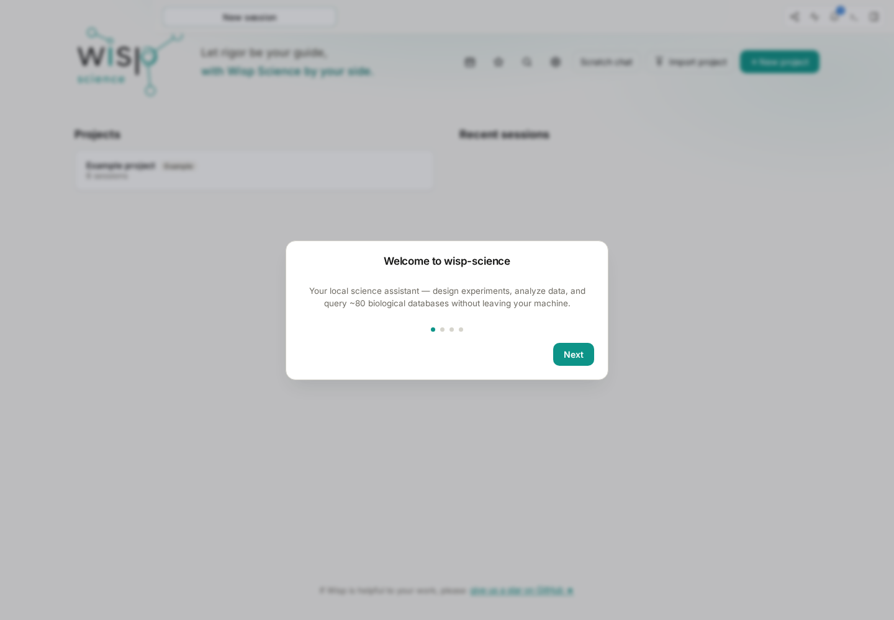
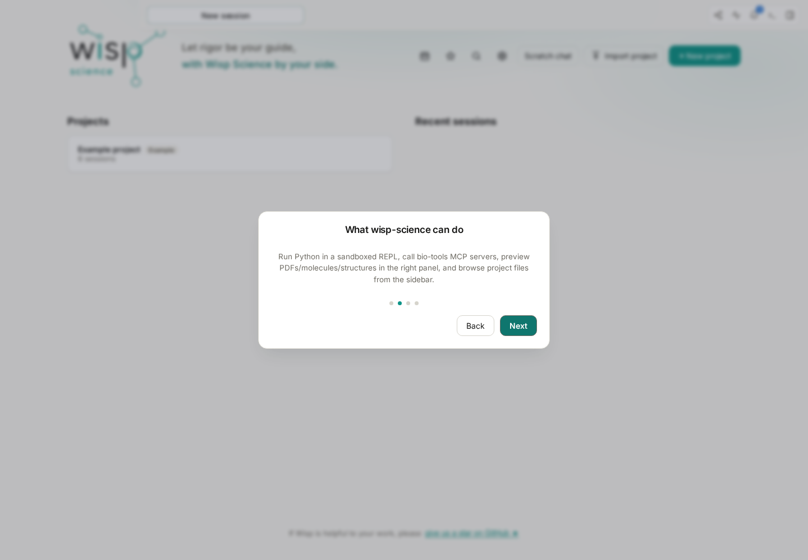
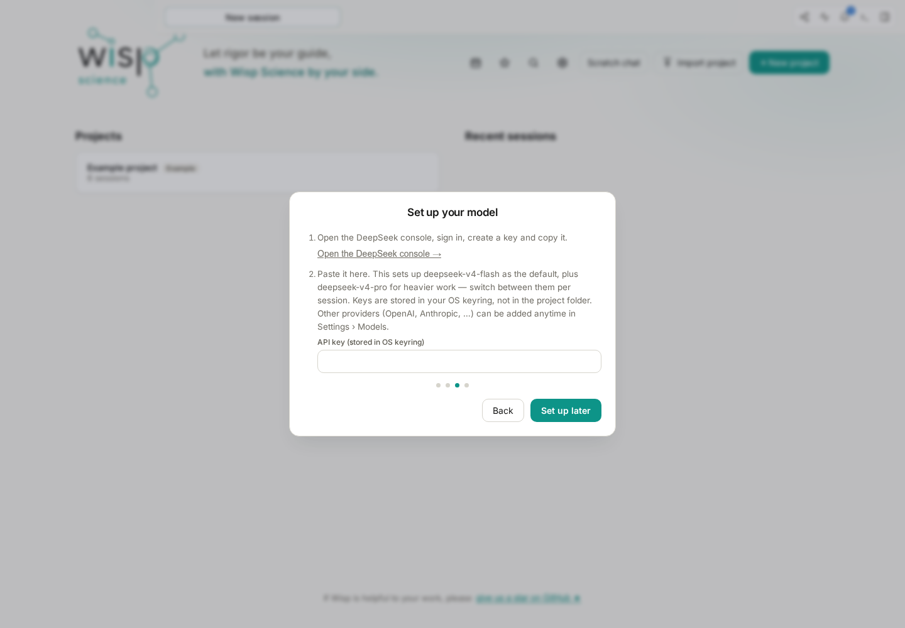
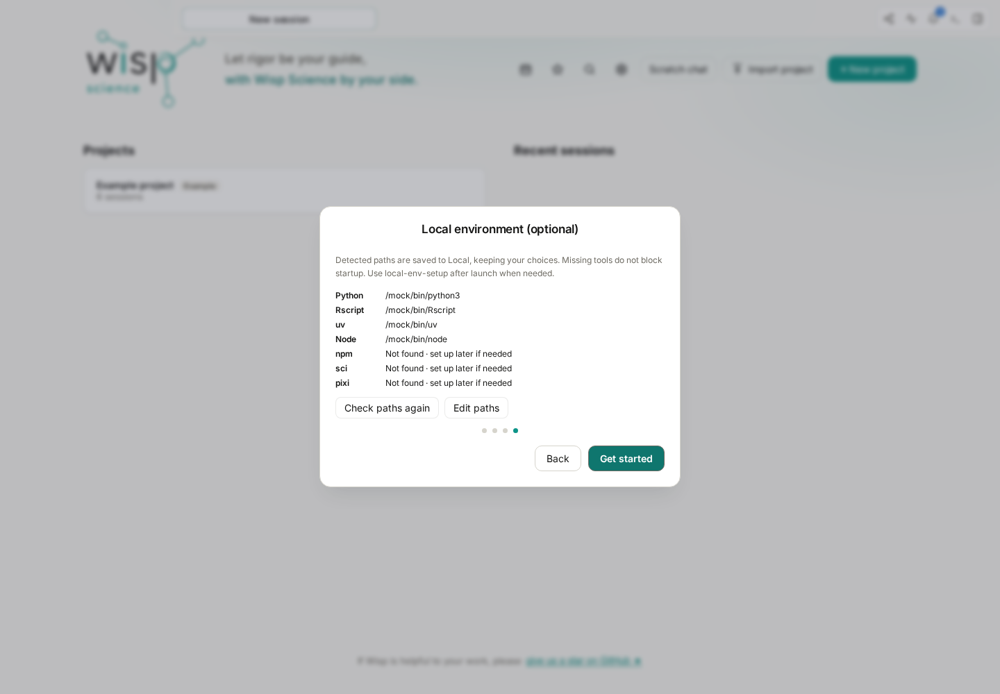
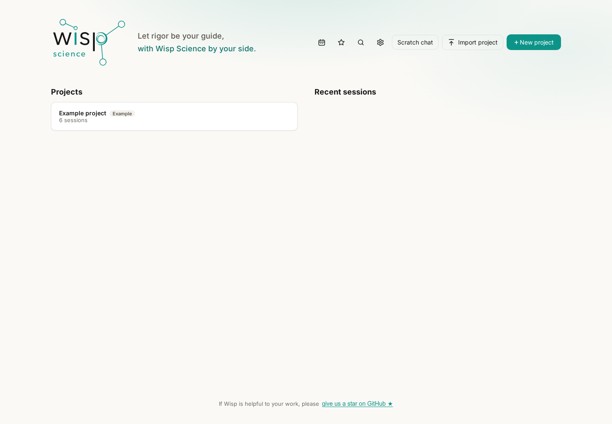
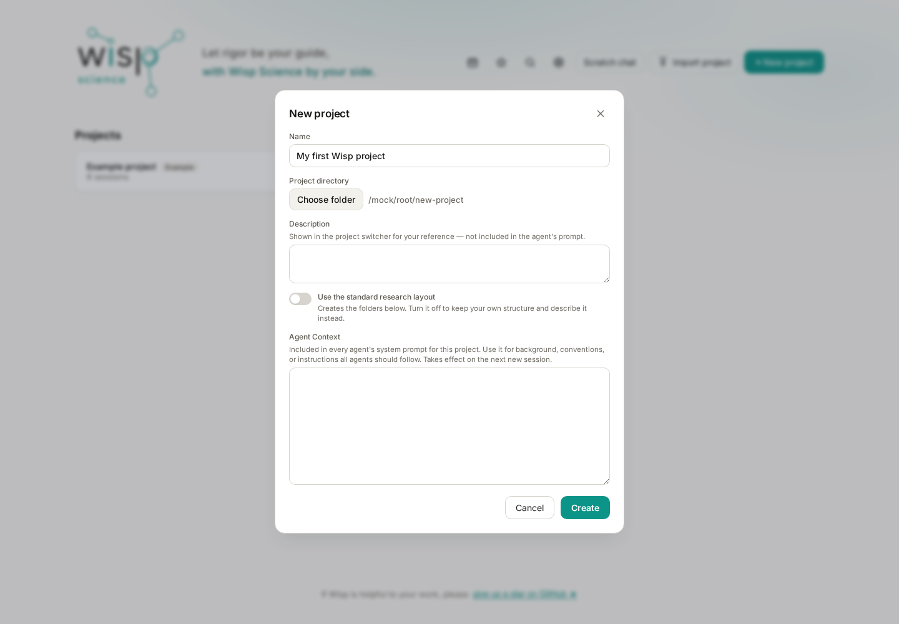
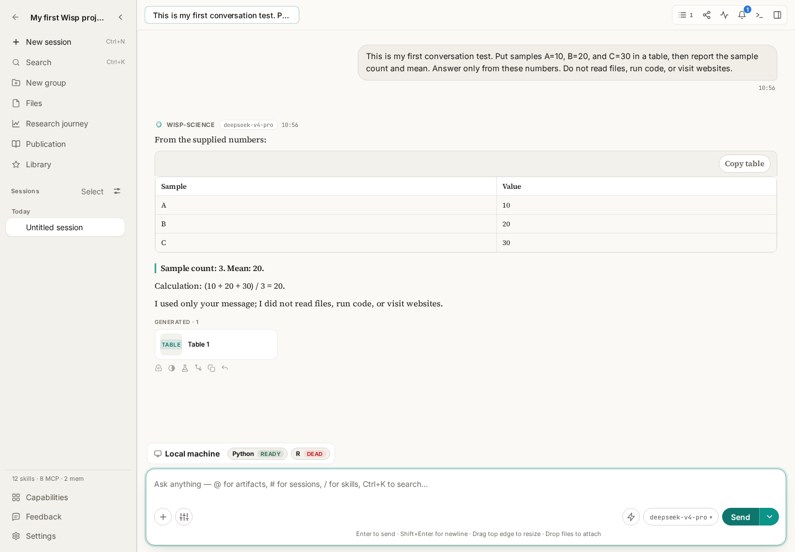

# Wisp Science Basics: Quick Start

You do not need to configure servers, browser access, and every research tool before using Wisp Science. Install the app, complete the welcome guide, create a practice project, and send a small question whose answer you can check. This establishes that the basic workflow works.

This tutorial takes you from downloading the app to your first conversation. You need a computer and access to a working model API. Without an API key, you can still install the app, explore its interface, and read the bundled demonstration.

> Screenshots show the real Wisp Science frontend with simulated settings and a teaching reply. Paths, projects, and answers illustrate the workflow; they do not demonstrate a verified live API account. The screenshots use the English interface. Labels may vary between versions.

**Step 1: Choose an installer for your computer.**

Open the [Wisp Science download page](https://wispscience.com/?lang=en#download), choose your operating system, processor and package format, then select **Download from Cloudflare**. The page shows the version, file size and installation steps. On a Mac, check **About This Mac** to choose Apple Silicon or Intel. Use the GitHub fallback if the download is unavailable.

The version number in the filename changes. Look for the architecture and file extension:

| Computer | File to find in Assets | Installation |
| --- | --- | --- |
| Windows on a 64-bit Intel or AMD processor | `…_x64-setup.exe` or `…_x64_en-US.msi` | Choose either installer, double-click it, and follow the setup wizard |
| Mac with Apple Silicon, such as an M-series chip | `…_aarch64.dmg` | Open the DMG, drag the app into Applications, then launch it from Applications |
| Mac with an Intel processor | `…_x64.dmg` | Install into Applications using the DMG |
| Linux on a 64-bit Intel or AMD processor | `…_amd64.deb` or `…_amd64.AppImage` | On Debian/Ubuntu-based distributions, open the DEB with the software installer; make an AppImage executable before running it |
| Linux on ARM64 | `…_arm64.deb` or `…_aarch64.AppImage` | Choose the package format and architecture appropriate for your distribution |

On a Mac, **About This Mac** in the Apple menu identifies the chip. On other systems, check the system architecture before choosing a file. The release page determines which builds are actually available.

For a first installation, you do not need `Source code (zip)`, `Source code (tar.gz)`, `.sig`, `latest.json`, or `.app.tar.gz`. These are source, signature, or update-related files. Choose a desktop installer from the table.

Once installed, open **Wisp Science**. This tutorial's text-only conversation does not require installing Rust, Python, or R first.

**Step 2: Follow the four onboarding pages.**

The first launch displays a welcome guide. Use the button at the bottom to continue.

*Figure 1: Start on the welcome page and click Next. The dots show your current step.*

The second page introduces project conversations, analysis, research tools, and file previews. You only need to know that these capabilities exist; you do not need to configure all of them now.

*Figure 2: The feature introduction outlines the workbench. Start with an ordinary conversation, then explore analysis and retrieval.*

The third page is **Set up your model**. The current onboarding shortcut uses DeepSeek: enter your own API key and follow the prompts to save it and continue. Obtain the key from your model provider's console; it is not your website login password.

*Figure 3: Enter a valid API key on your own computer. No key is shown in the screenshot. This onboarding shortcut is for DeepSeek; add other providers later in Settings.*

For another provider or a laboratory gateway, choose **Set up later**. Then open **Settings → Models → Add API access** and enter the address, protocol, model ID, and key. See the [model configuration tutorial](wisp-science-models.md) for field details.

**Configure at least one usable model before attempting the conversation below.** Skipping the key lets you explore the app and its demonstration, but does not give you API access. Whether a web-chat account includes API access depends on the provider.

The fourth page, **Local environment (optional)**, checks paths to tools such as Python and R.

*Figure 4: Detected tool paths appear here. These are simulated paths, not values to copy. Missing tools do not prevent this text-only test.*

Installed tools can be detected automatically. Use **Edit paths** if a path is wrong. If Python or R is not installed, click **Get started** and configure it when you need to run analysis. Onboarding does not automatically install every tool.

To reopen the guide, press **Ctrl+P**, or **Cmd+P** on macOS, and search for **Quick setup**. Reopening it does not erase existing projects.

**Step 3: Create a practice project.**

After onboarding, the Projects screen appears. A project organizes conversations, files, and results for a piece of work. Keep this first exercise in a separate practice project.

*Figure 5: This screen uses demonstration data. A new installation may have an empty project list or show the bundled example. Click New project to create your own workspace.*

Click **New project**, enter a name such as **My first Wisp project**, and choose a local folder for the exercise. A dedicated empty folder makes subsequent files easy to find.

*Figure 6: The name identifies the project in Wisp; the directory determines where files live. `/mock/root/new-project` is a simulated path. Select a folder on your own computer.*

Leave the other fields and directory-layout options at their defaults for now. Confirm the name and folder, then click **Create**. Inside the project, conversations are listed on the left, the transcript occupies the center, and the message box is at the bottom. Use **New session** on the left for a new discussion.

Without an API key, you can read the built-in example from the Projects screen. Sending your own questions still requires a usable model.

**Step 4: Select a model and send your first test message.**

Check the model picker near the message box and choose a model you configured. If none is available, finish **Settings → Models** first, then return to the conversation.

Copy this message into the input box and click **Send**:

> This is my first conversation test. Put samples A=10, B=20, and C=30 in a table, then report the sample count and mean. Answer only from these numbers. Do not read files, run code, or visit websites.

This exercise requires no extra data files or research tools. It checks message sending, model responses, and table rendering.

*Figure 7: The screenshot uses a simulated model response to show where a successful answer appears. Your reply can use different wording, but the numbers should be checkable.*

Check that:

- Your message appears in the conversation.
- The assistant completes a reply instead of remaining busy or showing an error.
- The table contains A, B, and C with values 10, 20, and 30.
- The sample count is **3** and the mean is **20**: `(10 + 20 + 30) ÷ 3`.

The response need not match the screenshot word for word. If a sample is missing or the arithmetic is wrong, ask the model to check the supplied numbers. Receiving a response and receiving a correct response are separate things to verify.

This only tests basic conversation. It does not test file access, Python/R, web retrieval, or server computation. The [trajectory tutorial](wisp-science-trajectory.md) explains how to check whether tools actually ran.

**Troubleshoot the step you are currently on.**

| Symptom | Check first |
| --- | --- |
| The downloaded file is not an installable app | Did you download source or an update file? Does the installer match your system architecture? |
| Your provider is absent from onboarding | Choose Set up later, then add it in Settings → Models |
| The model picker has no usable model | Was the configuration saved, and has the current session selected it? |
| 401 / 403 | API key, model permissions, and account status |
| 404 or an HTML page in the response | Whether the API address, protocol, and model ID match |
| Connection failure or timeout | Connectivity to the provider and the model API proxy under Settings → General → Network |
| Python/R is missing | Complete the text-only test first; configure an interpreter when you need code execution |

After the first conversation, follow the tutorials that match your task: [Models](wisp-science-models.md) for API access, [Browser](wisp-science-browser.md) for webpages, and [MCP](wisp-science-mcp.md) and [Skills](wisp-science-skills.md) for research tools and reusable methods. Read [Server Environment Setup](wisp-science-servers-cli.md) when you need another machine.

> Use the [official releases](https://github.com/xuzhougeng/wisp-science/releases/latest) for installers. See [Basic Configuration](../../basic-configuration.md) for onboarding and settings details. These examples teach the workflow; they are not evidence of a live model test or completed research analysis.
