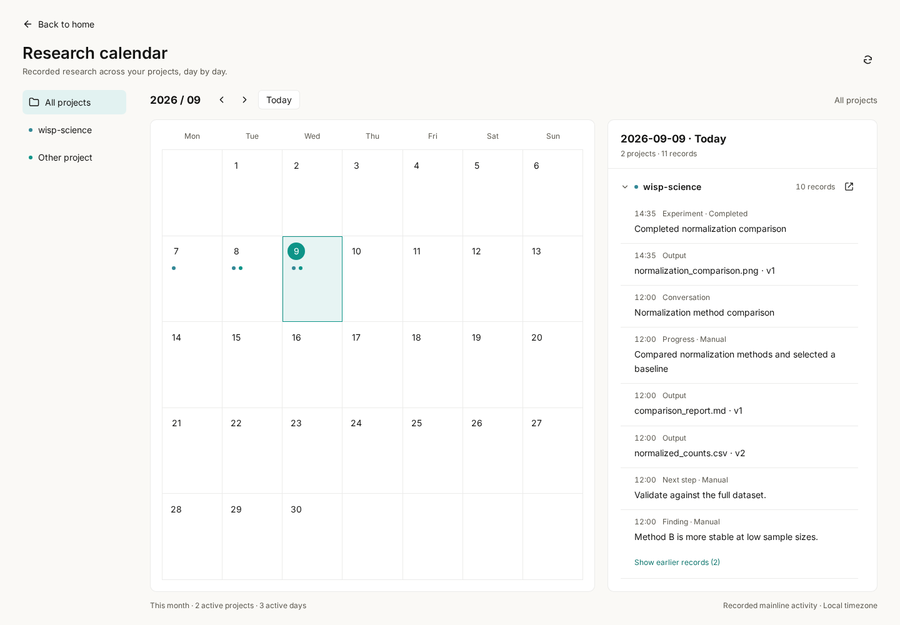
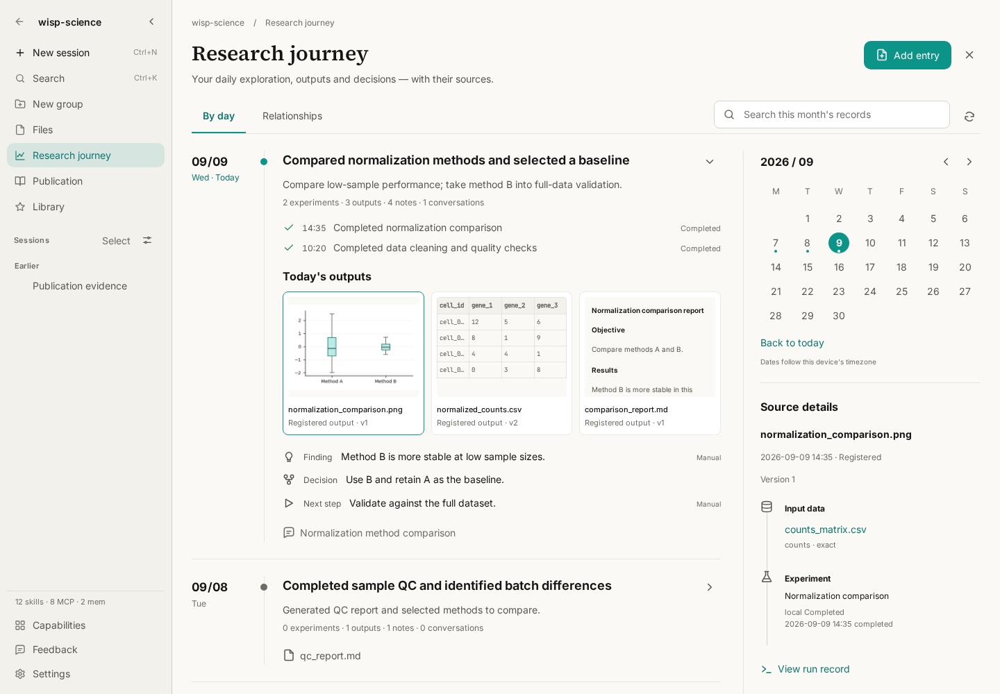
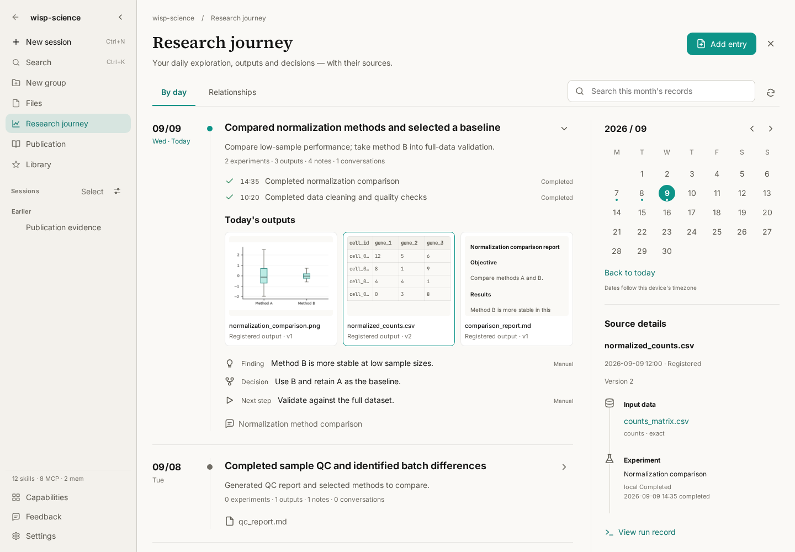
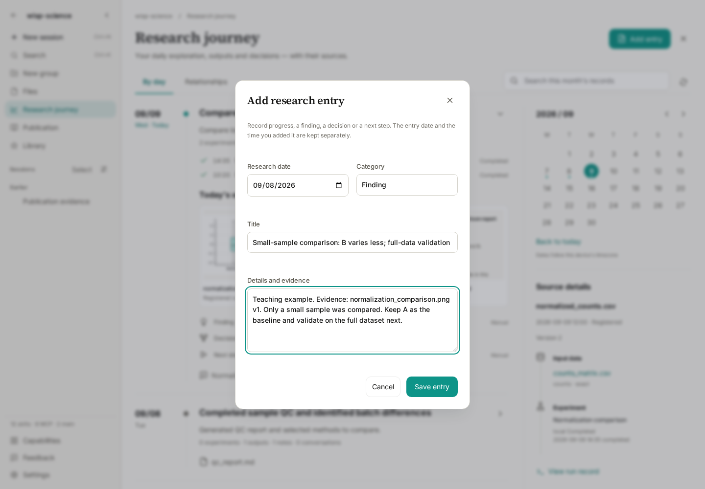
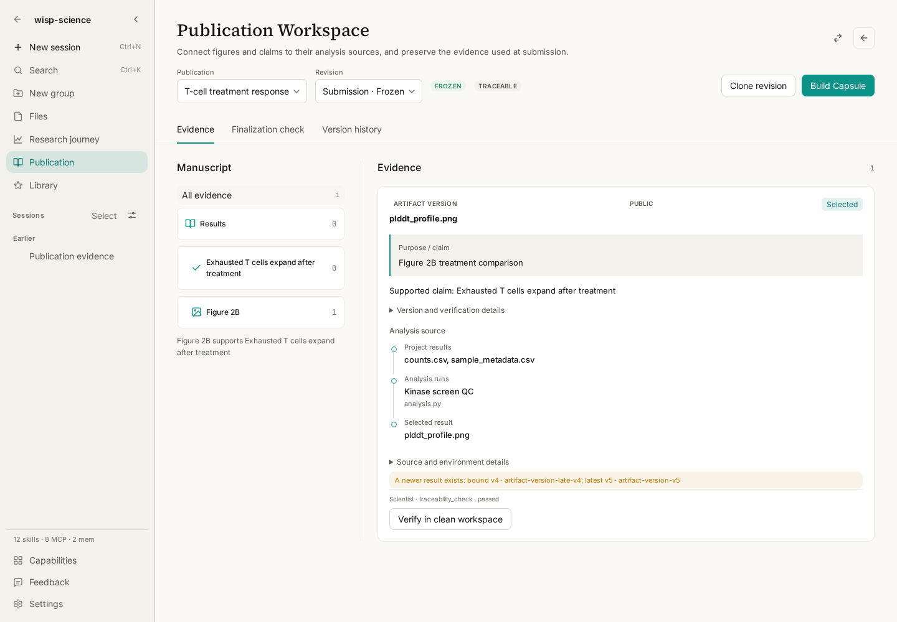

# Wisp Science Tips: Research Journey, a trace for every day of discovery

How did you produce last week's figure? Why did you choose method B? Yesterday's experiment failed; where should you pick up today?

Research often spans several conversations, runs, and file versions. Before a lab meeting or while writing a paper, you need to reconnect them: what happened on a particular day, which results it produced, what supported your decisions, and what still needs validation.

The theme of Wisp Science v1.11.0 is **Research Journey**. This tutorial starts at the home research calendar, takes you into a project's daily history, and shows how to inspect sources, add research notes, and organize selected evidence for a manuscript.

> This tutorial applies to v1.11.0. Screenshots show the actual Wisp Science frontend with a fixed date and simulated data; no model or server connection is needed. Files, experiments, and findings are teaching examples. The publication screenshot uses a separate demonstration dataset; it does not imply that the earlier results were transferred automatically.

## Three views to know

| View | The question it helps answer |
| --- | --- |
| Research calendar on the Projects home | Which projects recorded activity on this date? |
| Research journey in the project sidebar | What happened in this project, and which run produced an output? |
| A conversation's trajectory | Which tools did this conversation call, and what happened at each step? |

To inspect tool arguments or an error, see the [trajectory tutorial](wisp-science-trajectory.md). Research Journey provides the project and date view for reviewing work across conversations.

## Step 1: Find the day's work in the calendar

Open the Projects home and click the **calendar icon** at the upper right, to the left of the Library icon.

The calendar opens at the current month and today. Choose all projects or a single project on the left, inspect activity markers in the middle, and read the day's records grouped by project on the right. Narrow windows place the details below the calendar.

Try this sequence:

1. Select a date with activity markers to see which projects have records.
2. Select a project on the left to focus the view.
3. For a busy day, expand a project group and use **Show earlier records**.
4. Click the **open icon to the right of the project heading** in the day details to open that project's Research Journey at the selected date.

The month arrows show earlier or later months; **Today** returns to the current date. This calendar reflects recorded activity, rather than scheduling future tasks. Activity-day counts do not measure research completion. Projects hidden by privacy mode are excluded from the overview.

## Step 2: Read a day in your project's history

You can also open a project and choose **Research journey** in its sidebar. Sidebar entry opens the current month with the most recent active day expanded. Entry from the home calendar opens the date you selected.

In the example, three days cover importing raw data, completing quality checks, and comparing normalization methods. Each day brings experiments, outputs, manual notes, and conversations together so you can review their context.

The view draws on existing project records: conversations, runs, registered outputs, papers, data assets, decisions, and manual notes. Failed or cancelled runs can also appear; understanding an unsuccessful attempt is useful when deciding what to try next.

Select a day in the calendar or choose **Show full month** to return to the monthly view. Search covers **the currently loaded range**, not every month in the project. If an older record is missing, navigate to its month or day first. If the page reports an incomplete read, narrow the range to one day.

## Step 3: Trace an output to its source

Suppose you want to use `normalized_counts.csv` in a lab meeting. Its filename alone cannot tell you which analysis it belongs to.

Click that output in the daily card. The source panel shows its exact historical version, the producing run, and registered inputs when available.

Check three things:

- **Version:** the card refers to the specific version registered at that time. A later file update does not silently replace it with the latest version.
- **Inputs and run:** check whether the analysis used the intended data. **View run record** shows status, command, execution context, and log tails.
- **Content:** choose **Open output** to inspect that version rather than relying only on its title or description.

Source details depend on what was registered. A “Not recorded” field does not establish a complete analysis history. An old file registered today does not automatically become an output from an earlier experiment.

Escape closes the topmost output preview or run dialog before exiting Research Journey.

## Step 4: Record your judgment and next step

A run log can show what executed. Why you chose a method, or which findings remain uncertain, often needs a researcher's note.

Choose **Add entry** at the upper right, select the research date and category, and enter a title and details.

The four categories cover progress, findings, decisions, and next steps. Here is an example finding:

> **Title:** Small-sample comparison: B varies less; full-data validation pending
>
> **Details and evidence:** Teaching example. Evidence: normalization_comparison.png v1. Only a small sample was compared. Keep A as the baseline and validate on the full dataset next.

A useful note states **what you observed, where the evidence is, and what remains untested**. Saving places it under the selected research date. A backdated entry also retains the time when you actually added it.

Manual notes are not automatically scientifically verified. There is currently no entry editing or deletion control, so review the date and wording before saving.

## Step 5: Select evidence that supports your manuscript

When preparing results for a paper, close Research Journey and choose **Publication** in the project sidebar.

This workspace organizes evidence around the manuscript. Its outline contains sections, claims, or figures; evidence cards show selected results, analysis lineage, and the recorded purpose or selection rationale. The page also includes **Finalization check** and **Version history**.

For an editable draft:

1. Create or select a publication and draft revision, then add the section, claim, or figure you want to support.
2. Choose **Add evidence** and select registered results, analysis runs, or saved research conversations.
3. Record the purpose, selection state, and any needed rationale. Conversation sources support passage selection; file sources bind the exact version selected.
4. Use **Finalization check** to inspect the revision and address its findings. After a successful check, explicitly confirm and lock the evidence.

**Passing a check does not automatically lock the draft.** Locking is a separate action. Version history opens the stored revision; clone a new revision to continue editing. The calendar and notes do not automatically select manuscript evidence for you.

For revision, capsule, and verification details, see the [Publication Evidence Workspace guide](../../publication-evidence.md).

## A small daily habit

At the start of work, use the calendar to review yesterday and find the questions still awaiting validation. Before finishing, open today's Research Journey, check the versions and sources of key outputs, and add a note with evidence and a next step.

When a meeting or manuscript deadline arrives, follow the dates back to the original results, runs, and reasoning. The context available still depends on the outputs, inputs, and notes you actually registered. Wisp does not automatically generate daily scientific summaries or treat every file in a directory as a research result.

**A trace for every day of discovery.**

Project and downloads: [Wisp Science](https://github.com/xuzhougeng/wisp-science) · [v1.11.0](https://github.com/xuzhougeng/wisp-science/releases/tag/v1.11.0)

Continue reading: [Quick Start](wisp-science-quick-start.md) · [Trajectories](wisp-science-trajectory.md) · [Import, Export, and Sharing](wisp-science-transfer.md)
