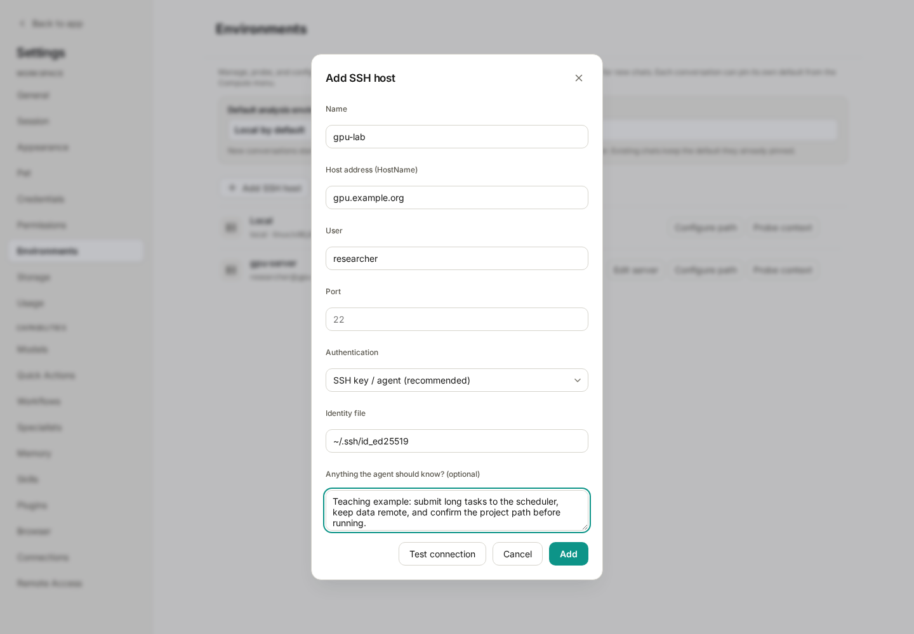
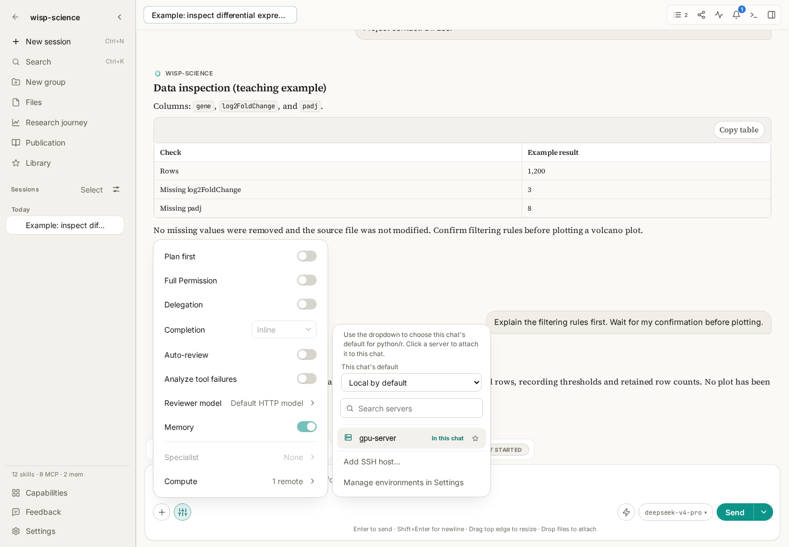
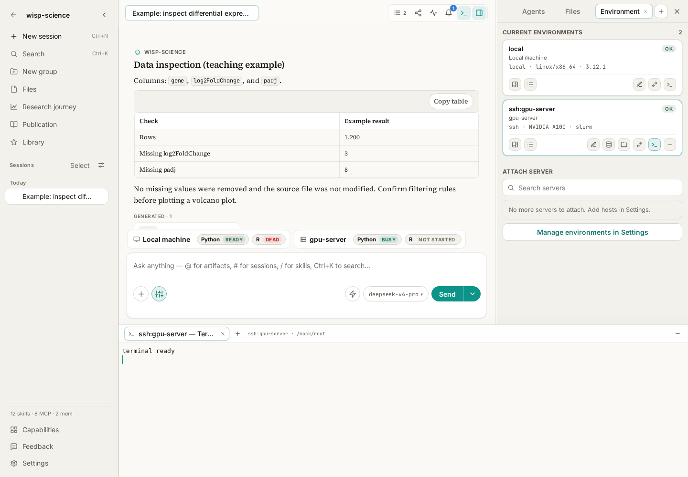

# Wisp Science Basics: Server Environment Setup

Research files and computation often live on different machines: a laptop for reading papers, a lab server for data, and a remote Python, R, or GPU environment for analysis. It is easy to lose track of which machine you are using and which filesystem a path belongs to.

Wisp Science registers servers, attaches execution environments to conversations, and opens interactive terminals for commands you run yourself. This tutorial starts with an SSH host, then covers selecting a conversation's environment and using the terminal inside the app.

> Screenshots show the real frontend in English with simulated server, GPU, and terminal information. `gpu.example.org` is a placeholder, not a server to connect to. The images do not demonstrate a real SSH connection.

**Distinguish two ways of working.**

| Entry point | Who operates it | Suitable tasks |
| --- | --- | --- |
| A conversation's execution environment | You describe the task; Wisp calls tools in the selected environment | Read remote data, run analyses, and submit structured tasks |
| Wisp's interactive terminal | You enter commands and the shell executes them | Inspect directories, debug environments, and monitor output |

Server configuration identifies which machine Wisp may use. An interactive terminal lets you type commands yourself. For using the Wisp agent directly from a system terminal, see [Wisp CLI](wisp-science-cli.md).

**Prepare connection details.**

Ask the administrator for the hostname, account, SSH port, and authentication method. Set up any required VPN, jump host, or SSH configuration according to your laboratory's instructions.

| Detail | Example | Meaning |
| --- | --- | --- |
| Name / alias | `gpu-lab` | How the server appears in Wisp |
| Hostname | `gpu.example.org` | Replace with the actual address |
| User | `researcher` | The remote account, which may differ from your local username |
| Port | `22` | Use the server's configured port |
| Identity file | `~/.ssh/id_ed25519` | A local private-key path; do not paste the private key contents |

An existing working `ssh` login in your system terminal makes these fields easier to verify. When a host-key prompt first appears, compare its fingerprint with the administrator's information. Disabling host verification should not be your routine setup procedure.

**Register the server as an environment.**

Open **Settings → Environments → Add SSH host** and enter the details. Select key/agent or password authentication according to the server's requirements.



*Figure 1: Hostnames and accounts are teaching placeholders. Agent notes should describe usage rules, not contain passwords or keys.*

Useful agent notes might say:

> This server is for the current project's analysis. Verify the remote working directory before running anything. Keep large raw data on the server. Submit lengthy computation through the required scheduler, record scripts, parameters, job IDs, and output paths, and do not run long computations on the login node.

Click **Test connection** and add the host after success. Back in the environment list, use **Probe context** to inspect operating system, Python, R, GPU, and scheduler information.

Being able to log in and having a usable analysis environment are separate checks. If the connection succeeds but Python or R is missing from the probe, check installation and the remote PATH. Use **Configure runtime interpreters** to specify a remote executable path where necessary.

If you already maintain `~/.ssh/config`, import its hosts and test and probe them individually. Private-key contents are not copied into Wisp's SQLite database; sensitive password values use the operating system keyring.

**Attach the environment to the conversation and specify the data path.**

Return to the conversation and open **Agent options → Compute** near the lower-left of the composer. Add the server to the current session. The right-side **Environment** panel also offers an attach-server entry point.



*Figure 2: `gpu-server` is a preconfigured demonstration host. Whether a server is attached and whether it is the default analysis environment are separate states.*

Defaults have two levels:

- The global default in **Settings → Environments** provides a starting point for new conversations.
- The current conversation's **Compute** menu can set its own default environment.

Changing the global default does not rewrite existing conversations. At first, naming the server and remote path explicitly makes the action easier to verify:

> On the attached gpu-lab server, check whether /data/project-a/counts.csv exists. Report its size and first five lines. Identify the execution environment actually used. Do not download the full file or modify it.

`/data/project-a/counts.csv` is a remote path. Attaching a server does not make it the same file as local `data/counts.csv`. For transfers, specify source machine, source path, and destination. Large datasets can remain remote while you retrieve small results or metadata.

**Open an interactive terminal for manual inspection.**

In the right-side **Environment** panel, click **Open terminal** on the environment's card. The terminal appears below the conversation, with its environment identified in the tab.



*Figure 3: The conversation and terminal remain in one window. “terminal ready” is mock output that demonstrates the layout, not a real SSH login result.*

For a Linux/macOS shell or a remote Linux shell, start with read-only checks:

```bash
hostname
pwd
ls -lh
```

These identify the machine, current directory, and directory contents. An SSH terminal normally starts in the remote user's home directory, not the local project directory. Change to the appropriate remote project directory before using its files.

The local terminal on Windows uses PowerShell by default:

```powershell
hostname
Get-Location
Get-ChildItem
```

You can open several terminals for one environment. Switching tabs or collapsing the dock keeps them running. Closing a terminal tab terminates its process. Tabs and scrollback do not survive an app restart and are not included in project sync.

**Keep durable records for long computations.**

An interactive terminal is useful for debugging. An analysis running for hours also needs status, cancellation, logs, and output locations. Ask Wisp to use a structured Run instead of waiting indefinitely inside an ordinary shell call:

> Check the environment on gpu-lab and prepare a plan for analysis/run_qc.py. List input paths, output directory, and resource requirements. Wait for my confirmation before submitting through a structured Run. If this machine requires a scheduler, use its required submission method and record the job ID.

Submit only when the environment and execution method match the task. Registering a GPU host does not automatically make every script use a GPU, and attaching a server does not convert arbitrary commands into scheduler jobs.

Review Run status, logs, files, and the [trajectory](wisp-science-trajectory.md) together. A terminal reporting that a command was sent does not prove the computation succeeded.

**Check the machine before the command.**

| Symptom | Check first |
| --- | --- |
| SSH connection fails | Hostname, port, account, VPN/jump host, and authentication |
| System SSH login works but Wisp's probe fails | Login startup scripts, restricted shells, and whether non-interactive commands execute |
| Wisp still uses the local machine | Session attachment, conversation default, and the task's explicit environment |
| File not found | Whether the path is local or remote and the terminal's current directory |
| Python/R package missing | Which interpreter is actually running and whether the package is installed there |

For a first exercise, test the connection, probe the environment, attach the server, and inspect one small file. Before starting real computation, make sure you can identify the machine, path, and result at every step.

> See [Basic Configuration](../../basic-configuration.md) and [Interactive Terminals](../../terminal-sessions.md). This tutorial reflects the implementation when written; labels may vary by version. Example commands and prompts do not represent completed remote operations.
