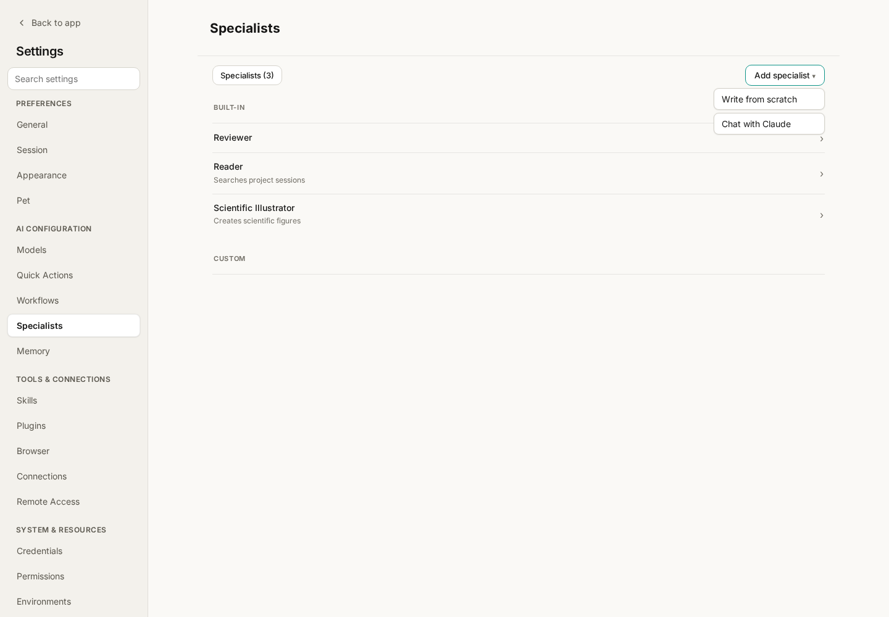

# Wisp Science Tips: Specialists

Reading papers, checking an analysis, and preparing figures call for different working habits. Wisp Science **Specialists** let you save those recurring requirements, then supply fresh materials and a concrete task each time.

Following the tutorials on [Skills](wisp-science-skills.md) and [Trajectory](wisp-science-trajectory.md), this article covers the three built-in Specialists, both creation paths, and how to use a saved Specialist in a conversation.

**A Specialist saves a role, instructions, and configuration for recurring work.**

A Specialist has a name, description, instructions, model binding, and Skill selection. A “Paper reading assistant,” for example, can consistently distinguish the authors’ findings from interpretation and identify where each finding appears in the source.

| Component | What it contributes |
| --- | --- |
| Specialist | The role and standing requirements for the work |
| Skill | Steps, templates, and resources for a particular task |
| Model | The configured model that performs the work |
| Message and attachments | This task’s materials and requested deliverable |

Specialist instructions are appended to Wisp’s base prompt. Saving a Specialist does not train a new model. Skills and tools still depend on your actual configuration and execution environment.

**Open Settings → Specialists to see the available roles.**



*Figure 1: The English interface, captured with the mocked Tauri bridge for this tutorial. It shows the same three built-in Specialists and creation menu as the user-supplied Chinese screenshot.*

The list has **Built-in** and **Custom** groups. The count indicates how many Specialists are listed. Click a row to inspect its configuration. **Add specialist** offers **Write from scratch** and **Chat with Claude**, the current English label for creating one through a conversation.

| Specialist | Purpose | Usual entry point |
| --- | --- | --- |
| Reviewer | Find fabrication, unsupported claims, and departures from the requested plan in a transcript | Send `/review` in an existing conversation |
| Reader | Retrieve relevant evidence from saved project conversations, with source references | Attach a project or historical conversation reference to a message |
| Scientific Illustrator | Create scientific figures from the request and project materials | Select it in a new conversation’s Agent menu |

Built-in instructions cannot be edited, and built-in Specialists cannot be deleted. Their details expose configurable settings such as model selection. Create a custom Specialist to use your own standing instructions.

**Reviewer checks whether reported work is supported by the conversation.**

If the assistant says it handled missing values and saved the result, send `/review` in that conversation. Reviewer checks the transcript for evidence supporting such claims and for departures from your instructions.

Use the report to identify issues worth investigating. Verify findings against [Trajectory](wisp-science-trajectory.md), source files, and actual outputs; passing a review does not establish scientific validity.

In **Settings → Specialists → Reviewer**, choose the review model or backend. Reviewer also supports following the conversation and using a configured ACP Agent. **Test Reviewer** makes a real model call to check whether the configuration returns a valid review result.

**Reader brings relevant historical conversations into the current task.**

Suppose a project already contains discussions of sample exclusion criteria and analysis thresholds. Type `@` in the composer, select the relevant project or historical conversation, and send:

> From the referenced discussions, summarize the sample exclusion criteria we confirmed. Give the source for each criterion and list unconfirmed suggestions separately.

Reader searches the referenced saved conversations and supplies relevant evidence to the main Agent. Its scope is those conversation records. To read a new paper, provide the PDF, text, or other accessible material.

**Reviewer and Reader are absent from the ordinary conversation Specialist picker.** They operate through their review and reference flows; you do not switch the conversation persona to either one first.

**Scientific Illustrator works best with a clear purpose, source, and output format.**

Create a conversation and choose **Agent menu → Specialist → Scientific Illustrator** before the first message. For example:

> Create an editable SVG workflow diagram for a lab meeting, saved to figures/sample-workflow.svg. Show sample collection, RNA extraction, library preparation, sequencing, and data analysis in a horizontal layout. This is a methods illustration: add no sample counts or experimental conclusions. Inspect the preview for readable labels and arrows.

This Specialist includes `figure-style` and `figure-composer` in its initial Skill selection. An explicit request for SVG, vector output, or an editable figure uses direct SVG creation with a PNG preview for visual checking. An explicit PNG or image-model request requires a configured image-generation model.

Without an explicit format, it prefers PNG image-model generation when that tool is available and otherwise uses SVG. Ask for “editable SVG” when you need to revise labels and layout later. For data plots, also provide real data, column names, units, groups, and statistical requirements.

**Create a custom Specialist with Write from scratch.**

Open **Settings → Specialists → Add specialist → Write from scratch**. A simple example is:

| Field | Example |
| --- | --- |
| Name | Paper reading assistant |
| Description | Prepare reading notes from supplied papers, retaining evidence locations |
| Model | Start with Follow active model, or bind a configured chat model |
| Skills | Initially keep Inherit project settings; narrow the selection when needed |

The name is required. Instructions are optional, but concrete requirements make the role easier to reuse and evaluate. Paste this into **Instructions**:

```text
You are my paper reading assistant, preparing verifiable notes for lab meetings.

First establish whether I supplied the full paper, an abstract, or excerpts,
and state that scope in the notes.
Organize the notes into research question, materials and methods, key results,
limitations, and implications for our project.
Locate key results by page, section, or figure when available; otherwise say
that the supplied material lacks location information.
Separate the authors' findings from your interpretations. Do not invent data
or conclusions. Mark missing conditions, sample counts, or statistical methods
as "not provided in the material."
Save to my requested location, or a new file under notes/papers/ if unspecified.
Finish with questions requiring source verification and the saved file path.
```

Click **Save**. The Specialist appears under **Custom**. Click its name to edit it later; custom Specialists can also be deleted from the list.

**After turning off Skill inheritance, explicitly select the Skills you need.**

With **Inherit project settings** checked, the Specialist follows the project’s Skill configuration. Uncheck it to search for and select particular Skills. Selected Skills appear above the search results and can be removed.

**Turning inheritance off and selecting nothing means no Skills.** It does not select every Skill automatically.

If you created and imported `lab-paper-note` from the [Skills tutorial](wisp-science-skills.md), search for it and select it to pair that template with the reading assistant. Skills must already be installed and discoverable; writing Specialist instructions does not install dependencies.

**Create through a conversation when you want help defining the role.**

**Add specialist → Chat with Claude** opens a new conversation and automatically sends an interview request about purpose, tone, working style, Skills, data sources, and model tier. This uses a model, so configure one first.

You could answer:

> Create a “Lab meeting assistant” that prepares outlines from the papers and experiment records I provide. Keep the writing concise. First ask about presentation length and the audience, then organize the research question, methods, main results, and discussion points. Cite the supplied material for data and claims, and never invent missing data. Inherit project Skills and follow the active model for now. Save these requirements as a Specialist.

The flow asks the Agent to call `save_specialist`. Afterwards, return to **Settings → Specialists → Custom**, confirm the new entry exists, and inspect its instructions, model, and Skills.

If the conversation produced only a role description, ask it to save the configuration as a Specialist. Use a separate new conversation to try the saved role.

**Select the saved Specialist before the first message.**

1. Return to the project and create a new conversation.
2. Before sending anything, open **Agent menu → Specialist** in the composer.
3. Select “Paper reading assistant” and check that its name appears at the top of the conversation.
4. Attach a paper or excerpt and describe the task.

For example:

> Prepare reading notes from the attached abstract, focusing on the research question and key results. Use only information supported by this abstract and save the notes under notes/papers/.

**The Specialist choice locks after the first message.** Start another conversation to choose a different Specialist or **None**. Saving a role in Settings does not switch an existing conversation to it.

Ordinary Specialist personas run in Wisp’s native Agent. Reviewer’s separate ACP backend support does not imply that every custom persona’s instructions and Skills are passed to external ACP Agents.

**Validate the role with material you already know.**

Try a familiar abstract and check the requested structure, evidence locations, and treatment of missing information. Add concrete corrections to the instructions and test again in a new conversation.

| Symptom | First check |
| --- | --- |
| A saved Specialist is not being used | Did you select it in a new conversation before its first message? |
| The Specialist menu is disabled | Has the conversation already received a message? |
| Reviewer or Reader is missing from the picker | Use review or project/conversation references instead |
| Expected Skills are absent | Check inheritance, selections, installation, and discovery |
| Chat creation produced no list entry | Verify that saving completed; ask the Agent to save if necessary |
| A figure has the wrong format | Explicitly request SVG or PNG and configure image generation when needed |

Start with one role you use every week. Save stable requirements in the Specialist, keep changing materials and goals in each message, and refine the instructions from actual results.

> This tutorial reflects the Wisp Science implementation at writing time. Prompts and file paths are teaching examples, not completed research tasks. Interface labels may differ between versions.
