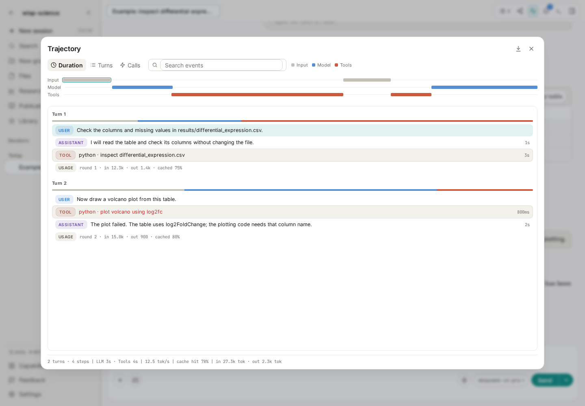
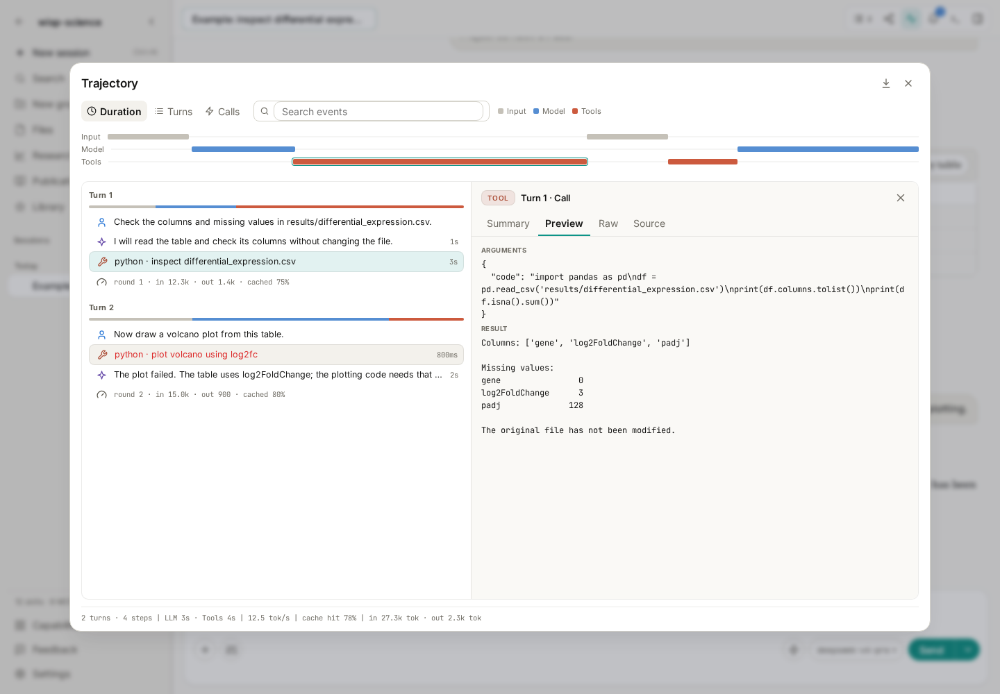
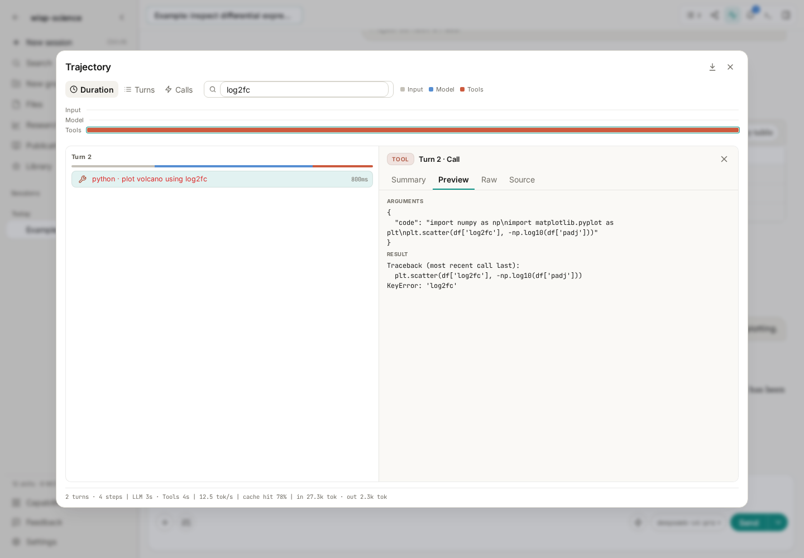
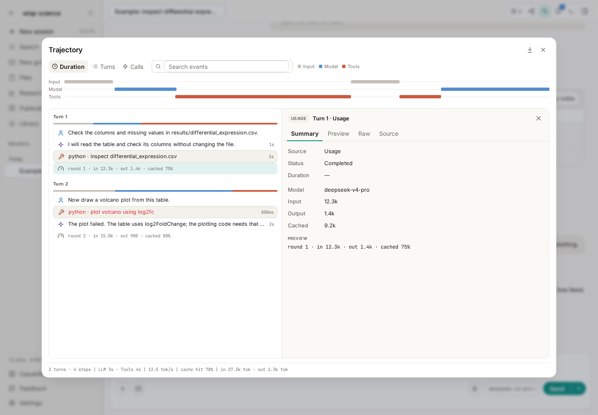

# Wisp Science Tips: Trajectories

When an AI finishes an analysis, “Done” is often not enough. Which file did it read? What code did it execute? Where did plotting fail? Can you return to the process a few days later?

Wisp Science's **Trajectory** view shows that process. It organizes user inputs, assistant replies, tool calls, and model usage so you can work backward from a result to the steps that produced it.

The previous tutorials covered [MCP](wisp-science-mcp.md) and [Skills](wisp-science-skills.md). Here we explain how to open a trajectory, read its records, verify an analysis, and investigate failures.

> Screenshots show the real frontend in English with a demonstration conversation that checks a differential-expression table and attempts a plot. Filenames, code, errors, and usage are teaching examples, not completed scientific analysis.

**Expand the execution process of a task.**

Suppose you ask Wisp to inspect differential-expression results and draw a volcano plot. It may read the table, check column names, handle missing values, and run plotting code. A failure may lead to further checks and retries.

The trajectory groups these records by **turn**. Your message starts a turn containing the records produced while Wisp responds.

*Figure 1: The demonstration has two turns: inspect the table, then try plotting. Closing the details panel provides more room for the event list.*

| Record | Meaning | What to verify |
| --- | --- | --- |
| USER | Your request | Named files and conditions |
| ASSISTANT | Model responses | Interpretation and proposed next steps |
| TOOL | A call and its returned result | Actual parameters, code, output, and errors |
| USAGE | Usage for a model call | Input, output, and cached tokens |

A model can call several tools and make several requests within one turn. Multiple tool and usage rows are normal. Narrow lists use compact icons; wider lists also show text labels.

**Open a trajectory without extra setup.**

Inside a conversation, click **Trajectory** in the top toolbar, between Share and the inbox bell. You can also send `/trajectory` in the message box.

For a first inspection, wait for a small task to finish so the request and execution are easier to match. An empty session shows an empty-trajectory state.

The window has four main areas:

- **Top timeline:** input, model, and tool activity, with duration, turn, or call scales.
- **Left event list:** steps grouped by turn, durations for completed calls, and failures highlighted in red.
- **Right details:** content of the selected record.
- **Bottom statistics:** conversation totals for turns, steps, model/tool time, and token usage.

Selecting a timeline segment locates its event in the list. Close the right details panel for a wider list, then select a record to reopen it. Escape or the window's top-right close button returns to the conversation.

**First use: verify files and parameters.**

The demonstration begins with:

> Check the column names and missing values in results/differential_expression.csv.

Wisp calls Python to read the table. Select that tool record and open **Preview** to inspect parameters and results.

*Figure 2: Select a Python call on the left and inspect its submitted code and returned content on the right. Longer details can be scrolled.*

Compare the request with the operation: correct file path, chosen columns, any filtering, and whether the output supports the assistant's description.

The sample table has `gene`, `log2FoldChange`, and `padj`; `padj` contains 128 missing values. Later, check that plotting code handles them and uses the correct effect-size column.

The same approach works for literature searches: compare actual query terms and returned records with the assistant's paper list. For a Skill, look for calls showing that its instructions were read.

| Details tab | Contents |
| --- | --- |
| Summary | Origin, status, duration, and a short preview; usage events also show model and token information |
| Preview | Full message or complete tool parameters and results |
| Raw | Event JSON for checking individual fields |
| Source | Original message, tool arguments, or usage-source content |

For common checks, Summary followed by Preview is usually sufficient.

**Second use: locate a failure.**

The second demonstration turn requests a volcano plot, but the code uses `log2fc` where the table has `log2FoldChange`. The tool returns `KeyError: 'log2fc'`.

Select the red tool record to see the failing code and result together. Search events for `log2fc` to narrow a long list.

*Figure 3: Search matches both summaries and detailed content. Here, the code referenced a column that did not exist.*

Return to the conversation with a specific correction:

> The plotting call used log2fc, but the table has log2FoldChange. Confirm the column names, correct the code, rerun it, and explain how missing and zero values are handled. If successful, report the figure and script locations.

After retrying, inspect the new calls to confirm success, implementation of the correction, and expected output.

Use actual errors for other troubleshooting too: check paths for missing files, environments for dependencies, and returned messages for retrieval failures. Searching a filename, tool name, or error keyword is usually easier than rereading the whole conversation.

**Third use: understand time and usage.**

A task may take a long time without failing. The timeline and statistics help distinguish model-response time from tool execution and locate individual calls.

*Figure 4: The right side shows usage for the selected model call; the bottom summarizes the session. Numbers are for demonstration.*

Tokens are a unit used to measure model input and output. Usage records include input, output, and cache information. Summary statistics include model/tool time, output speed, and cache-hit measures.

These help review the effects of long documents, retries, or repeated calls. Actual cost depends on provider pricing and cannot be inferred from one token total alone.

An active trajectory shows live records, then refreshes from saved records after the task ends. Older conversations may lack timing or usage fields. Missing data does not mean zero time or zero usage.

**Export HTML for records or collaborative review.**

Click the download icon, **Export HTML**, at the top right and choose a destination. The result is a standalone HTML file readable in a browser.

It includes the session identifier, model, summary statistics, timeline, user inputs, replies, tool parameters/results, states, durations, and usage. Archive it with analysis notes or give a colleague context for a result or error.

Two details matter:

- **Search does not narrow the export.** Filtering the view to `log2fc` still exports the entire saved trajectory.
- **Exports use saved records.** Live, unsaved content may be absent while a task is running. Wait for completion when you need a full record.

A trajectory supports inspection and traceability. Reproducing an analysis also needs input data or sources, scripts, parameters, and the environment. HTML does not bundle all those files or automatically rerun the task. Review complete inputs, paths, and tool results before sharing them.

**Practice with a familiar small table.**

Prepare a CSV in your project and replace the path below with its location:

> Check data/example.csv and report the row count, column names, and missing values per column. Do not change the original file. If reading fails, report the actual error.

Open the trajectory afterward, find the read operation, and compare its parameters and results with the final answer in Preview. Try searching the filename and exporting HTML.

This can become part of daily analysis: verify evidence behind results, inspect errors, retain the process, and return later with a usable record.

> See [Trajectory View](../../trajectory-view.md) for details. This tutorial reflects the implementation when written; interface labels may vary by version.
