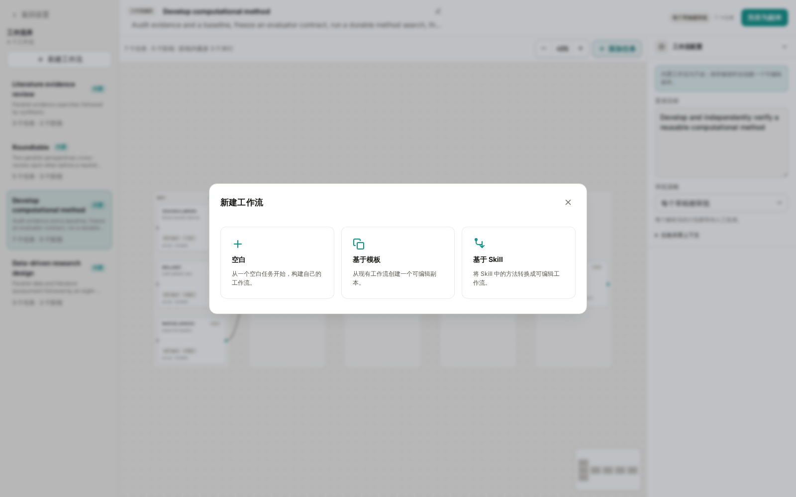
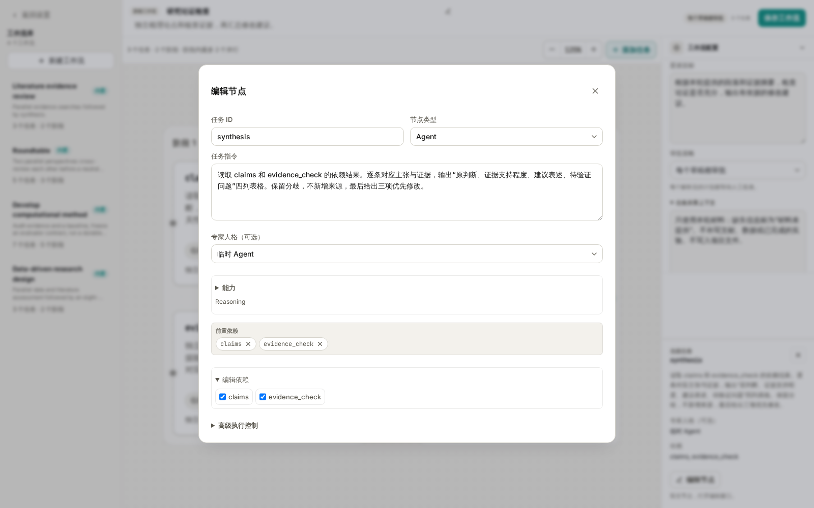
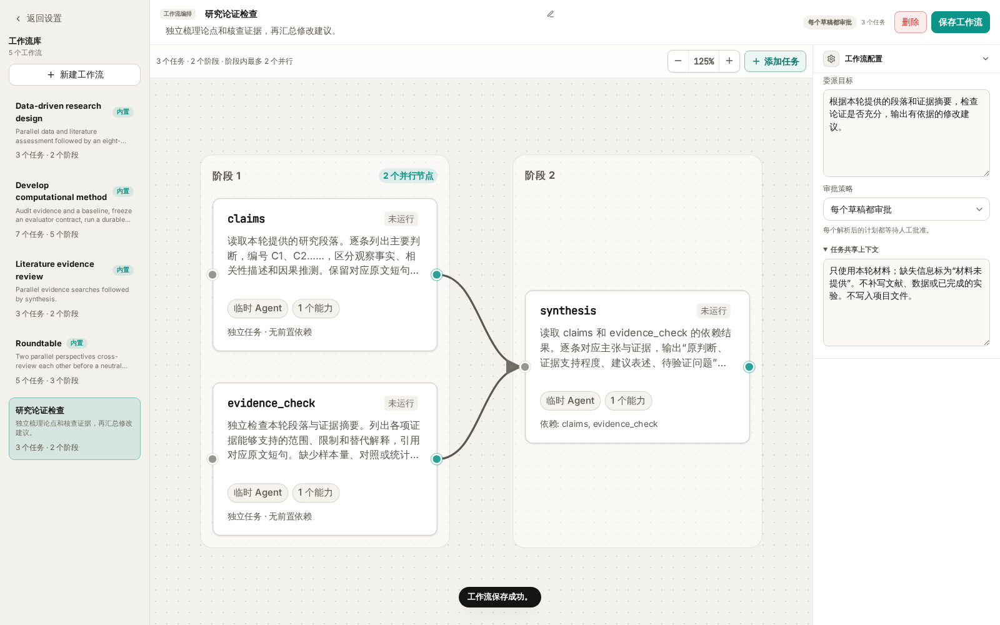
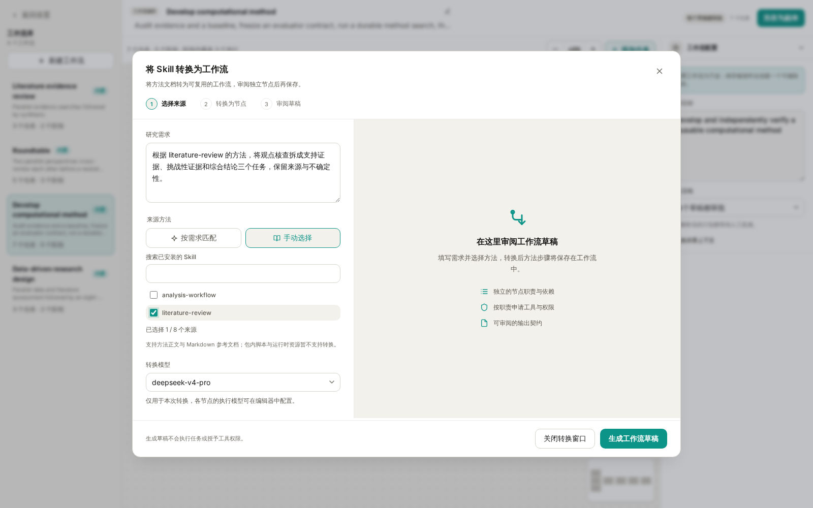

# Wisp Science高级用法：创建 Agent Workflow

上一篇 [Agent Workflow](wisp-science-agent-workflow.md) 介绍了四个内置工作流。当你反复用同一套分工检查研究方案、整理证据或准备组会时，可以把这套安排保存成自己的工作流。

这一篇从一个完整的小例子开始：创建“研究论证检查”，让两个任务独立梳理论点和检查证据，最后由第三个任务给出修改建议。先掌握目标、节点、能力、依赖和保存，再介绍从已有模板修改，以及从 Skill 转换。

本文配图使用当前实际前端与本地示例数据，展示配置操作；没有调用模型、检索论文或执行真实科研任务。示例只处理消息中提供的文字，完成初次练习不需要配置文献数据库或代码运行环境。

**先决定交付什么，再把任务拆成节点。**

“检查一下这段研究论证”仍然太宽泛。可以先把最终交付写成一句话：

> 根据我提供的研究段落和证据摘要，输出“原判断、证据支持程度、建议表述、待验证问题”四列表格，并给出三项优先修改。

再倒推需要的分工：

| 任务 ID | 负责什么 | 依赖谁 | 能力 |
| --- | --- | --- | --- |
| `claims` | 提取主要判断，区分事实、相关性与因果推测 | 无 | `reasoning` |
| `evidence_check` | 独立检查证据范围、限制和替代解释 | 无 | `reasoning` |
| `synthesis` | 对照两路结果，生成修改建议 | `claims`、`evidence_check` | `reasoning` |

前两个任务都读取本轮提供的段落与证据摘要，可以独立进行。第二个任务不需要等待第一个任务的编号，而是引用原文短句；汇总任务再负责对应两路结果。这样才能真正形成“两路独立检查 → 汇总”的结构。

**进入“设置 → 工作流 → 新建工作流”，选择创建方式。**



*图 1：三条创建路径都在同一个入口。本文先选择“空白”。*

| 创建方式 | 适合什么时候使用 |
| --- | --- |
| 空白 | 已经想清楚分工，希望逐项填写 |
| 基于模板 | 内置或已保存的工作流与需求接近，只需局部修改 |
| 基于 Skill | 已有方法文档，希望模型帮忙拆成独立任务图 |

前两种方式编辑配置本身不需要模型生成；“基于 Skill”在生成草稿时会调用所选模型。无论哪条路径，保存之后都需要回到会话中选中工作流并发送任务，才会开始执行。

**第一步：填写名称、委派目标和共享上下文。**

选择 **空白** 后，画布会出现一个初始任务。先填写工作流级别的配置：

| 字段 | 本例内容 |
| --- | --- |
| 工作流名称 | 研究论证检查 |
| 描述 | 独立梳理论点和核查证据，再汇总修改建议。 |
| 委派目标 | 根据本轮提供的段落和证据摘要，检查论证是否充分，输出有依据的修改建议。 |
| 审批策略 | 每个草稿都审批 |

展开右侧的 **任务共享上下文**，填入所有任务都应遵循的要求：

```text
只使用本轮材料；缺失信息标为“材料未提供”。
不补写文献、数据或已完成的实验。不写入项目文件。
```

名称和描述帮助你在工作流库中识别模板，实际执行要求应写进目标、共享上下文和节点指令。固定规范放在模板里，每次变化的研究段落、证据摘要和问题留在发送时的消息中。

**第二步：把初始节点改成 claims。**

双击画布中的初始节点，或单击后选择 **编辑节点**，打开任务详情。保持节点类型为 **Agent**，把任务 ID 改为 `claims`，填写：

```text
读取本轮提供的研究段落。逐条列出主要判断，编号 C1、C2……，
区分观察事实、相关性描述和因果推测。
保留对应原文短句；不判断未提供的证据。
```

展开 **能力**，保留 `Reasoning`（`reasoning`）。这个任务只需要处理已提供的文字。专家人格可以保持“临时 Agent”，高级执行控制先使用默认值，不需要为每个节点创建一个专家。

关闭任务详情后，修改会保留在当前编辑草稿中。**关闭节点窗口并不等于保存整个工作流**，最后仍要点击顶部的“保存工作流”。

**第三步：添加独立的 evidence_check 节点。**

打开画布工具栏的 **添加任务**，选择 **独立任务**，会自动打开新节点的编辑窗口。将 ID 改为 `evidence_check`，同样使用 `reasoning`，填写：

```text
独立检查本轮段落与证据摘要。
列出各项证据能够支持的范围、限制和替代解释，引用对应原文短句。
缺少样本量、对照或统计信息时明确标注，不补造结果。
```

这两个节点都应显示为无前置依赖。它们收到相同材料，但承担不同任务。不要仅把同一条“全面分析”指令复制两次，否则容易得到重复内容。

**第四步：添加 synthesis，并连接两个上游任务。**

再添加一个独立任务，ID 填 `synthesis`，能力仍为 `reasoning`，指令填写：

```text
读取 claims 和 evidence_check 的依赖结果。
逐条对应主张与证据，输出“原判断、证据支持程度、建议表述、待验证问题”
四列表格。保留分歧，不新增来源，最后给出三项优先修改。
```

在这个节点的详情里展开 **编辑依赖**，勾选 `claims` 和 `evidence_check`。



*图 2：依赖要在配置中明确选中。只在指令里写“等前面完成”不会自动建立连线。*

也可以在画布中，从上游节点的输出端点拖到下游节点建立连线；使用“接在选中节点后”则会创建一个依赖所选节点的新任务。无论用哪种方式，本例的汇总节点都必须同时依赖两个上游。

关闭详情后，画布应显示 **3 个任务、2 个阶段、最多 2 个并行节点**：左侧是 `claims` 与 `evidence_check`，右侧是 `synthesis`，两条箭头都指向汇总节点。



*图 3：完整示例。连线表达执行依赖；实际并发仍受执行策略限制。*

任务 ID 应唯一，建议使用简短、稳定的英文名称。依赖必须保持无环，不能再从 `synthesis` 连回 `claims`。需要返工时，先根据本轮结果调整输入或模板，再发起下一次任务。

**第五步：保存，并用一段熟悉的材料试运行。**

点击顶部 **保存工作流**，确认出现保存成功提示，左侧库中能看到“研究论证检查”。如果保存按钮不可用，查看顶部附近的原因提示，通常是名称、目标、任务指令或能力尚未填写完整。

回到项目会话，在输入框输入 `/`，搜索并选中“研究论证检查”，再发送一段包含原文和证据范围的消息。例如：

```text
请按所选工作流检查下面这段论证，只使用本条消息的材料。

研究段落：处理组中基因 X 的表达较高，因此基因 X 是该处理引起表型变化的原因。
证据摘要：目前只有表达量比较，未提供样本量、统计检验结果、功能扰动或救援实验。

请指出哪些表达可以保留，哪些应改为假设，以及还需补充什么证据。
```

这是一段刻意保留证据缺口的练习材料，不代表真实实验结果。出现工作流草稿后，审阅三个节点及其依赖，点击 **批准并运行**。

在 **Agents** 面板中检查：两个独立任务是否各自完成了职责，汇总是否读到了双方结果，最终建议是否保留材料缺口。先用熟悉的材料检查输出，比一开始就接入大量数据更容易判断配置是否有效。

保存模板、批准一次计划、执行一次工作流是三个不同动作。修改模板后，下一次使用时采用保存后的版本；不要把编辑模板当作修改已经批准的运行计划。

**需要扩展时，再按任务增加能力和输出约束。**

本例只使用消息里的材料，所以三个节点都用 `reasoning`。如果改成检查项目文件或主动检索文献，应同时调整输入说明、节点指令与能力。

| 新需求 | 配置方向 |
| --- | --- |
| 读取项目中的报告 | 为相应节点添加 `project_read`，明确文件路径 |
| 查找真实文献 | 为检索节点选择可用的 `literature_search`，配置连接器并规定核验方式 |
| 保存整理后的报告 | 为负责保存的节点添加 `project_write`，规定输出路径与覆盖规则 |
| 实际运行分析代码 | 使用 `code_run`，写清环境、输入和执行边界 |

能力决定节点可以申请哪些工具，填写指令不会自动开放工具或安装依赖。把读取、计算、保存等要求交给明确的节点，也更容易定位失败原因。

需要机器可读的交付时，可以配置 **输出 JSON Schema**。例如，汇总节点输出 `claims` 数组和 `next_steps` 数组，就应在指令里同步说明字段含义。第一次使用先保留默认输出格式，把内容要求写清楚即可。

**高级执行控制** 可以选择执行器、模型和预算。初次创建先用默认执行器与模型；需要成本上限时再填写最大 Token 数、工具调用数或费用。预算留空表示不限制；最长运行时间留空使用策略默认值，填 `0` 表示不限时。运行活动有单独的输入和预算规则，不能直接套用 Agent 节点配置。

**第二条创建路径：基于已有模板做局部修改。**

打开 **新建工作流 → 基于模板**，选择一个接近需求的模板。例如，选 `Roundtable`，把新工作流命名为“组会方案讨论”，填写实验室共享约束，再调整对应席位的指令。

也可以直接打开内置模板进行修改，再点击 **另存为副本**。内置模板会保留，后续需要选择你保存的副本才能使用新规则。

复制后先核对每个阶段的角色：开场负责提出立场，交叉审阅负责回应双方观点，主席负责综合。修改同一席位的角色时，要同步检查它的开场和审阅节点。需要固定的角色规范，再选择已经配置好的专家。

**第三条创建路径：把 Skill 中的方法转换成工作流。**

如果已经有可用的 Skill，进入 **新建工作流 → 基于 Skill**。在“将 Skill 转换为工作流”窗口中填写研究需求，选择来源方法和转换模型。



*图 4：示例选择 literature-review 作为来源方法。截图停在生成前，没有调用转换模型。*

来源方法可以自动选择，也可以切换为手动选择并搜索技能；手动最多选择 8 个。第一次选一个范围明确的方法即可，例如 `literature-review`，研究需求可以写：

> 根据 literature-review 的方法，将观点核查拆成支持证据、挑战性证据和综合结论三个任务。保留文献核验、来源和不确定性要求。两路检索可独立进行，综合必须依赖双方结果。请生成可复用工作流，不把本次主题或路径固定在模板中。

选择已配置的 **转换模型** 后，点击 **生成工作流草稿**。这一步会产生模型调用，用于读取和转换方法，尚未执行生成的科研工作流。

草稿返回后，先读节点指令、依赖、申请的权限和输出要求，再点击 **使用草稿并编辑**。进入编辑器后补齐名称，按需要调整配置并保存；之后仍通过会话中的 `/` 入口启动。

当前转换支持方法正文和 Markdown 参考文档，包内脚本、运行时等资源暂不支持转换。转换得到的节点应包含独立、可执行的工作说明。来源 Skill 用于提供方法材料，并不是把 Skill 名称挂在节点上就能完成配置。以后修改源 Skill，也不要假定已经保存的模板会自动同步；需要重新转换或手动更新。

**排查配置问题时，先从具体节点开始。**

| 现象 | 优先检查 |
| --- | --- |
| 保存按钮不可用 | 顶部原因提示；名称、目标、ID、指令和能力是否齐全 |
| 两个节点总在重复回答 | 是否承担不同职责，是否写清各自的交付内容 |
| 汇总没有使用某一路结果 | 是否真的配置了依赖，而不只是提到了任务名称 |
| 节点无法读取文件或检索 | 是否选择相应能力；路径、连接器和环境是否可用 |
| 改完节点，重新打开却没有变化 | 是否点击了“保存工作流”；运行时是否选择正确副本 |
| Skill 转换按钮不可用 | 是否填写需求、选择有效来源和已配置的转换模型 |
| 生成草稿后没有自动执行 | 先使用草稿并编辑、保存，再回到会话选择并发送 |

当“研究论证检查”已经能稳定处理你的材料，再考虑增加检索、文件输出或其他角色。每增加一个节点，都应能说清它提供了什么新结果，以及谁会使用这个结果。

> 本文与 [内置工作流用法](wisp-science-agent-workflow.md) 配套。更底层的执行与审批机制见 [Agent delegation](../agent-delegation.md)；需要将模板绑定到选中文字入口时，参见 [快捷动作](wisp-science-quick-actions.md)。
