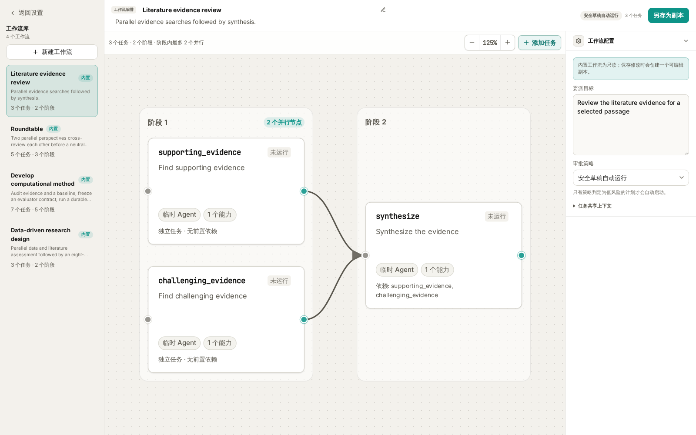
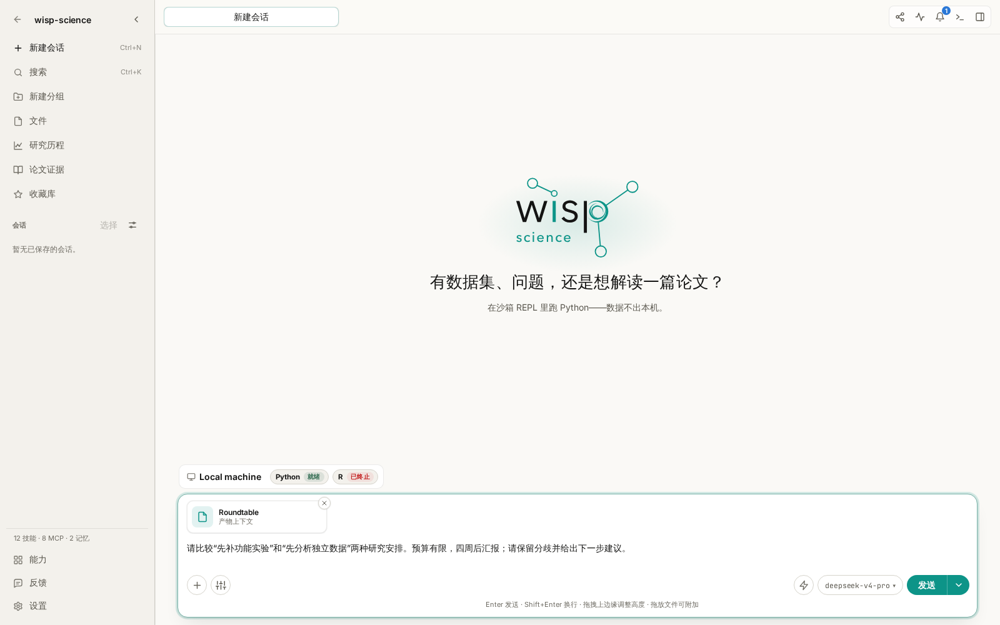
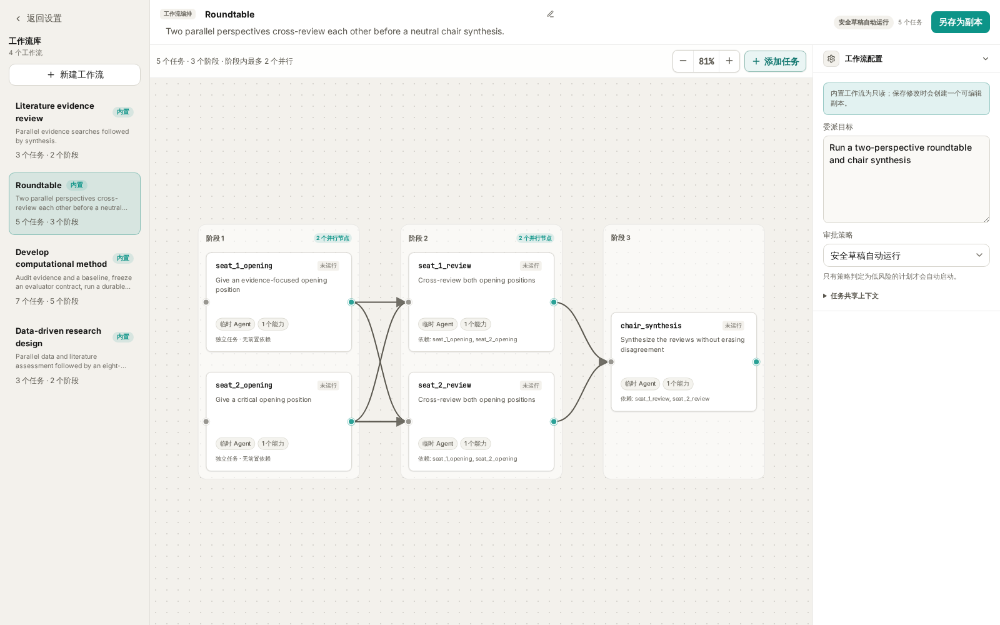
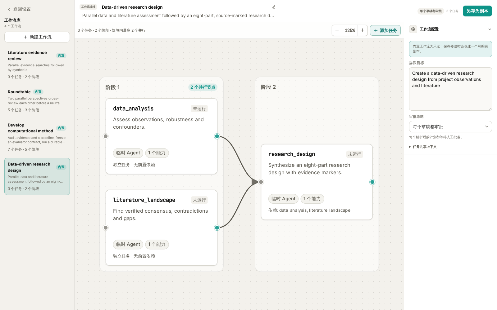
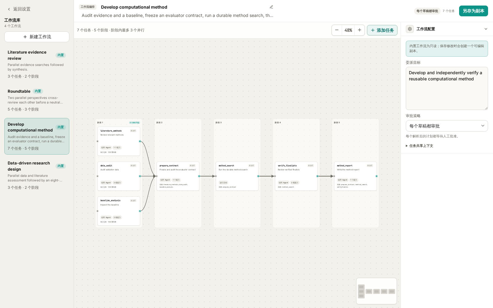

# Wisp Science高级用法：Agent Workflow

面对一个研究问题，我们经常需要同时做几件事：检查已有数据、寻找文献证据、提出不同解释，再把这些材料整理成下一步方案。如果每一步都在同一段对话里临时安排，任务之间的分工、先后顺序和交付要求就容易变得模糊。

Wisp Science 的 **Agent Workflow（Agent 工作流）** 可以把这些安排保存为一张任务图：哪些任务独立开展，哪些任务需要等待上游结果，每一步允许使用什么能力，以及最后交付什么。

这篇属于高级用法，适合已经完成模型配置、能够在项目中使用文件和工具的读者。可以先阅读 [Skills](wisp-science-skills.md)、[专家](wisp-science-specialists.md) 和 [快捷动作](wisp-science-quick-actions.md)，再从一个小工作流开始尝试。

**先理解工作流：把分工和依赖关系写清楚。**

以文献证据审查为例，支持性证据和挑战性证据可以分别检索，等两边都完成后，再交给综合任务整理。

```text
检索支持性证据 ──┐
                 ├── 综合证据、分歧与缺口
检索挑战性证据 ──┘
```

图中的每个节点是一项任务，箭头表示依赖关系。没有前置依赖的任务可以并行；后续任务取得所依赖任务的结果后再执行。实际并行程度还受执行器、并发限制和写入约束影响。

普通 Agent 节点由临时子代理执行，可以配置指令、能力、专家角色、执行器和模型。部分工作流还包含 **运行活动** 节点，把持续计算交给 Wisp 管理的 Run。当前内置的方法搜索就使用了这种节点。

| 组成部分 | 在任务中负责什么 |
| --- | --- |
| 本轮消息与材料 | 这次研究什么，输入在哪里，有哪些约束 |
| Skill | 提供一项工作的步骤、规范和参考材料 |
| 专家 | 提供可复用的角色与工作要求 |
| Agent Workflow | 组织任务节点、依赖关系、能力和交付要求 |
| 快捷动作 | 从选中文字等场景进入相应任务 |
| Run | 记录和管理一次持续运行的计算任务 |

例如，圆桌工作流可以让不同节点承担不同视角；需要固定实验室的审查规范时，再为节点配置自己的专家。多个节点也可以使用同一个模型，不必为了使用工作流先配置多个模型。

**先看当前自带的四个工作流。**

进入 **设置 → 工作流**，打开 Workflow Studio。左侧是工作流库，中间是任务图，右侧是工作流配置与选中任务的摘要。模板名称目前使用英文，可以按下表查找。



*图 1：当前实际前端配合本地示例数据。配图中的节点说明经过简化，用于展示任务结构；没有执行检索或调用模型。*

| 内置模板 | 适合的任务 | 默认结构 |
| --- | --- | --- |
| `Literature evidence review` | 核查一个观点的支持证据、反证与适用边界 | 两路检索 → 综合，共 3 个节点 |
| `Roundtable` | 比较研究方案、分析解释或资源投入选择 | 两个独立立场 → 两个交叉审阅 → 主席综合，共 5 个节点 |
| `Data-driven research design` | 从已有数据现象和文献形成可检验的研究设计 | 数据评估与文献评估 → 研究设计，共 3 个节点 |
| `Develop computational method` | 在明确评测条件下改进一个本地 Python 方法 | 三路审计 → 准备评测合约 → 方法搜索 → 审阅 → 报告，共 7 个节点 |

单击节点可以看摘要；双击节点，或点击摘要中的 **编辑节点**，可以查看完整指令和配置。内置模板的修改需要 **另存为副本**，不会覆盖原来的内置版本。

工作流库保存的是可重复使用的模板。每次发送任务后产生的执行记录，则在对应会话的 **Agents** 活动面板中查看。

**启动一个工作流：选择模板，补充任务，再发送。**

第一次建议使用 Wisp 内置 Agent，并按下面的步骤操作：

1. 打开项目，新建一段会话，确认模型可正常使用。
2. 在输入框输入 `/`，在“命令、技能与工作流”选择器中输入模板名称，例如 `Roundtable`。
3. 选中“工作流”分组里的目标，确认输入框出现对应的工作流引用。
4. 填写本次目标、材料、约束和期望结果，再点击 **发送**。
5. 查看对话和右侧 **Agents** 面板。若出现待审批草稿，检查后点击 **批准并运行**；若已启动，直接查看节点进度。



*图 2：工作流引用与本轮请求一起发送。截图停在发送前。*

选择模板只是把工作流附加到消息，发送后才会交给主 Agent 执行。Wisp 会把当前请求作为工作流上下文，并要求主 Agent 保留模板中的依赖关系，通过委派工具创建任务图。发送工作流引用时，会为这段内置 Agent 会话启用子代理委派。

如果只想了解模板，可以先在设置里查看，也可以询问“请介绍当前有哪些工作流及其用途，暂不运行”。要执行时再附加工作流，并给出具体任务。

模板有两种审批策略：**每个草稿都审批**，以及 **安全草稿自动运行**。后者仍由实际解析出的能力和策略决定是否需要确认，并不表示所有任务都直接开始。文献证据审查和圆桌默认采用后一种策略；研究设计和方法开发默认要求审阅草稿。

**Literature evidence review：围绕一个明确观点，分别寻找支持与挑战。**

适合的输入是一段可检验的判断，最好同时写清研究对象、条件和关注范围。过于宽泛的“帮我调研单细胞”很难让两路检索围绕同一个问题工作。

选中 `Literature evidence review` 后，可以发送：

> 请核查这个待验证的观点：“植物根系中某类细胞的比例变化，能够反映其对干旱胁迫的适应。”研究对象限定为拟南芥根系，重点关注单细胞或单核转录组研究。请分别寻找支持证据，以及相反结果、技术偏差和适用边界；区分细胞真实比例变化与解离、取样或注释造成的差异。最后用中文整理结论、文献来源与仍需验证的问题。

这里的观点是教学示例，不是已经确认的科研结论。工作流会按三个节点处理：

| 节点 | 具体工作 |
| --- | --- |
| `supporting_evidence` | 独立检索支持主要判断的文献，提取实际发现和相关性 |
| `challenging_evidence` | 独立查找反例、边界条件、重复失败和方法学质疑 |
| `synthesize` | 读取两路结果，去重文献，整理支持程度、分歧和缺口 |

两路检索各保留最多 8 篇最相关文献，使用已启用且获授权的文献连接器。综合节点只使用上游结果，不会再开展一轮检索；模板也不要求向项目写入文件。因此，它适合针对具体观点开展一轮有边界的证据审查。

使用前要确认文献检索工具、凭据和网络可用。完成后，重点检查论文是否真实、原文是否支持所述判断，以及综述有没有保留反面证据。需要保存 Markdown 时，可以在工作流完成后继续要求主 Agent 将结果整理到指定路径。

此前教程中的内置快捷动作 **文献调研**，会向当前输入框附加 `literature-review` 技能。要运行这里的三节点工作流，应从 `/` 选择 `Literature evidence review`，或为它创建自定义快捷动作。

**Roundtable：让不同视角先独立思考，再相互审阅。**

圆桌适合有取舍的研究决策，例如先补实验还是先扩展分析、两个分析方案各有什么前提、一个现象可能存在哪些替代解释。

它默认安排两个视角：一个侧重证据，一个侧重批判性检查。两者先独立提出观点，再各自读取双方的开场意见并修订建议，最后由中立主席综合。



*图 3：圆桌的五个节点分为三个阶段，审阅节点都依赖双方开场意见。*

```text
证据视角开场 ──┬── 证据视角交叉审阅 ──┐
              │                        ├── 主席综合
批判视角开场 ──┴── 批判视角交叉审阅 ──┘
              （每个审阅节点都读取双方开场意见）
```

选中 `Roundtable` 后，可以发送：

> 我们正在为一个已有初步转录组结果的课题安排下个月工作。方案 A 是补做关键基因的功能验证，方案 B 是先分析独立公开数据，检查结果能否重复。现有条件：只有一名实验人员，预算有限，四周后要做阶段汇报；目前结果主要是相关性，还没有功能实验。请围绕这两种安排开展圆桌讨论，说明各自的前提、收益、失败风险和需要补充的信息。最后给出优先顺序，同时保留无法消除的分歧。

这个内置模板的节点使用推理能力，默认不开展文献检索，也不读取整个项目。需要讨论的事实、证据摘要和约束，应在本次请求中提供；如果希望节点主动检索或读取文件，需要复制模板并配置相应能力。

阅读结果时，可以先看双方的独立意见，再看交叉审阅是否真正回应了对方，最后检查主席有没有保留重要分歧。多个视角并不保证事实正确，事实依据仍应回到材料核对。

想调整角色时，可以另存一份圆桌模板，为对应节点配置专家和模型。同一个参与者在开场与审阅阶段应保持一致的角色，主席则承担综合职责。

**Data-driven research design：把观察结果推进到可检验的研究方案。**

当你已经有初步组学结果、现象描述或候选机制，希望进一步规划验证，这个模板更合适。它并行开展数据评估与文献评估，再把两路材料综合成研究设计。



*图 4：数据与文献两路结果共同支持后续研究设计，模板默认要求审批草稿。*

使用前，准备好可读取的数据或结果文件、样本信息、已有分析方法，以及实验条件和资源限制。数据节点具有代码执行能力，文献节点需要检索能力；实际处理依赖所选执行环境和工具配置。

假设项目中已经存在下列文件，选中 `Data-driven research design` 后，可以发送：

> 请根据 results/differential_expression.csv、metadata/samples.csv 和 notes/preliminary-observations.md 制定下一阶段研究方案。先检查差异表达结果是否可能受到批次、样本量和离群值影响，再检索候选通路相关机制的支持与反对证据。把“我们观察到了什么”和“我们推测的机制”分开。实验条件是可做 qPCR 和常规遗传学验证，暂时不能增加大规模测序。请提出能区分替代解释的实验、救援思路，以及实验不支持假设时如何调整方向。不要覆盖已有结果。

请把示例路径换成实际存在的项目文件。运行前审阅草稿，尤其留意数据节点获准使用的工具和执行范围。

最终设计按八个部分组织：

1. 数据观察与稳健性。
2. 文献共识、冲突与缺口。
3. 候选假设与替代解释。
4. 从假设推导出的可检验预测。
5. 能区分解释的实验与救援设计。
6. 验证失败后的假设迭代。
7. 转化可行性与风险。
8. 证据—主张对应关系与优先级。

数据和文献模块分别带有 `[workflow:data_analysis]`、`[workflow:literature_landscape]` 来源标记，综合节点被要求保留这些标记。它们有助于追踪一条建议来自哪一路评估；具体结论仍需结合上游结果、原始数据和论文核验。

这个工作流交付的是研究设计。实际完成哪些数据检查，应以节点工具记录和输出为准；提出一项实验也不表示它已执行。

**Develop computational method：先固定评测条件，再开展方法搜索。**

这是四个模板中准备要求最高的一个，适合已经有可运行基线、希望改进某个计算方法的任务。例如，在输出误差不超过指定阈值的前提下，优化一个 Python 数值计算函数的运行时间。



*图 5：方法搜索是图中的运行活动。审批整个工作流后，仍需审阅关联 Run 的冻结合约，再开始搜索。*

当前方法搜索的范围是 **本地 Python、一个声明的函数或类、项目内的固定输入，以及有明确边界的评测器**。它不负责远程 GPU 调度、自动下载数据或同时修改多个代码目标。

启动前，至少准备这些信息：

| 材料 | 应说明什么 |
| --- | --- |
| 科学目标 | 希望改进哪种能力，为什么有研究价值 |
| 基线代码 | 项目内源文件、允许修改的函数或类，以及调用接口 |
| 评测器或评测要求 | 怎样运行，怎样固定随机性，怎样判断候选有效 |
| 验证输入 | 项目内数据路径、格式、划分方式和使用范围 |
| 主指标 | 优化什么，数值越大还是越小越好 |
| 硬性约束 | 精度、输出格式、资源使用或其他不能突破的条件 |
| 独立最终验证数据 | 与搜索阶段区分开的数据及验证要求；没有时明确说明 |

选中 `Develop computational method` 后，可以参考下面的写法；路径和数值都需要按自己的项目替换：

> 请改进本项目 src/smoothing.py 中的 smooth_signal 函数，保持现有函数签名和返回数组形状。基线代码已经可运行。验证数据为 data/validation.json，独立最终验证数据为 data/final.json；后者只能用于最终验证，不能用于候选选择。评测器为 benchmarks/evaluate.py。主指标为固定输入上的中位运行时间，越低越好；硬性约束为相对参考输出的最大绝对误差不超过 1e-6，所有结果必须为有限值。请先审计文献、数据划分和基线，再准备评测合约；使用模板的搜索预算，等待我审阅后开始搜索。最终报告改进幅度、独立验证结果和局限。

它的执行顺序是：

```text
文献方法检索 ──┐
数据审计 ──────┼── 准备评测合约 ── 方法搜索 Run ── 审阅入选方法 ── 方法报告
基线分析 ──────┘
```

**这里有两次不同的审批。** 第一次是批准工作流计划，允许准备和审计。准备完成后，方法搜索会创建一个草稿 Run，此时还没有开始候选搜索。需要进入关联的 Run 详情，打开 **审核方法搜索**，核对 **冻结评测合约** 中的目标、评测器、基线、噪声下限、受保护输入和预算，再点击 **批准并开始搜索**。

“冻结”表示搜索使用已经审计并绑定的那一份代码、数据和评测条件。启动或恢复时会重新检查，不能把修改后的文件悄悄当成原来的输入。

内置模板的搜索上限为 **20 个候选、总时长 14,400 秒（4 小时）、单次评测 120 秒、费用预算 5,000,000 微单位**。这些是上限，不是预计耗时或固定收费。运行时可在 Run 详情查看候选、指标和进度，并使用暂停、继续或取消；暂停在候选检查点生效。

完成后，重点检查改进是否超过基线噪声，以及结果属于 **独立最终验证** 还是 **仅验证集（`validation_only`）**。缺少独立最终验证时，不能把验证集上的提升写成已经通过独立验证。

搜索不会把选中的候选代码自动应用到项目源文件，入选代码以产物版本保存。先检查候选差异、评测记录和复现要求，再决定是否采用。方法报告也可能得出“没有找到满足约束的改进”，这同样是有效结果。

**查看结果时，沿着任务图检查依据。**

运行后打开对应会话的 **Agents** 面板，可以查看各节点的状态和结果。完成的节点可通过 **查看完整结果** 检查交付内容；带运行活动的节点还需要查看关联 Run。

| 状态或现象 | 下一步 |
| --- | --- |
| 草稿 | 核对目标、依赖、能力和需要审批的原因，再批准或撤销 |
| 运行中 | 查看当前节点活动，确认是否在等待工具调用或用户操作 |
| 等待运行完成 | 打开关联 Run；方法搜索可能仍在等待第二次审批 |
| 失败或已阻塞 | 先检查上游错误、工具配置、输入路径与输出要求，再考虑重试 |
| 已完成 | 核对每个节点的证据和交付内容，再阅读最终综合 |
| 只有模板介绍，没有任务记录 | 确认已从 `/` 附加工作流并发送；继续要求按所选模板实际创建和执行工作流 |

下游任务依赖上游结果。某个节点失败时，后续综合可能无法继续，先解决输入、权限或依赖问题，比反复重跑整个工作流更有帮助。

**熟悉内置模板后，再保存自己的小工作流。**

进入 **设置 → 工作流 → 新建工作流**，可以选择空白、从模板创建，或从 Skills 转换。第一次自定义，建议从已经试用过的模板创建副本。

例如，把圆桌副本命名为“组会方案讨论”，在共享上下文里写入实验室固定的时间与资源约束，再调整参与者的审阅要求。每次变化的研究问题、结果和文件路径，仍放在发送时的消息中。

编辑时，先写清节点要交付什么，再选择实际需要的能力。让汇总节点依赖它要使用的所有上游结果；连线必须保持无环。如果为 Agent 节点配置了输出 JSON Schema，上游应确实能交付符合格式的结果。

需要调整模型、执行器、Token 或工具调用预算时，再展开 **高级执行控制**。运行活动节点有自己的输入和候选数、时长、费用限制，不能直接套用普通 Agent 节点的控制项。

保存模板只完成配置，不会启动任务。回到输入框，通过 `/` 选中保存后的工作流，用一份小材料试运行。确认结果符合预期后，也可以按 [快捷动作教程](wisp-science-quick-actions.md) 将它绑定到选中文本菜单。

完整的逐步配置示例，以及“空白、基于模板、基于 Skill”三种创建方式，见下一篇 [创建 Agent Workflow](wisp-science-agent-workflow-create.md)。

可以先用 `Roundtable` 讨论一个熟悉的研究选择，检查分工与交叉审阅；再使用 `Literature evidence review` 核查一条具体判断。已有数据与研究条件时尝试研究设计，具备可运行基线和评测条件后再尝试方法搜索。

> 本文依据当前仓库的内置模板、桌面界面与执行实现整理。提示词、路径和阈值用于教学，不代表已经执行的科研任务。进一步的机制说明见 [Agent delegation](../agent-delegation.md)。
