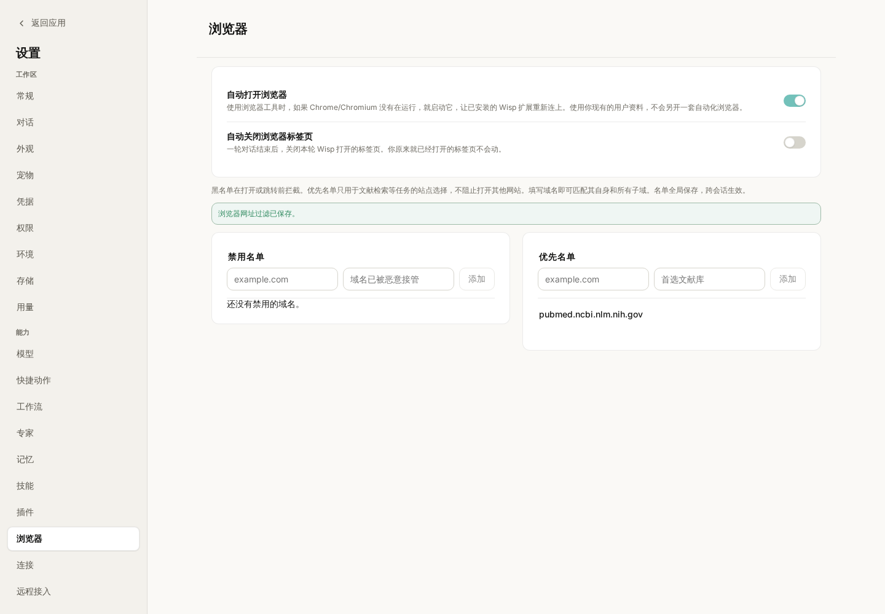
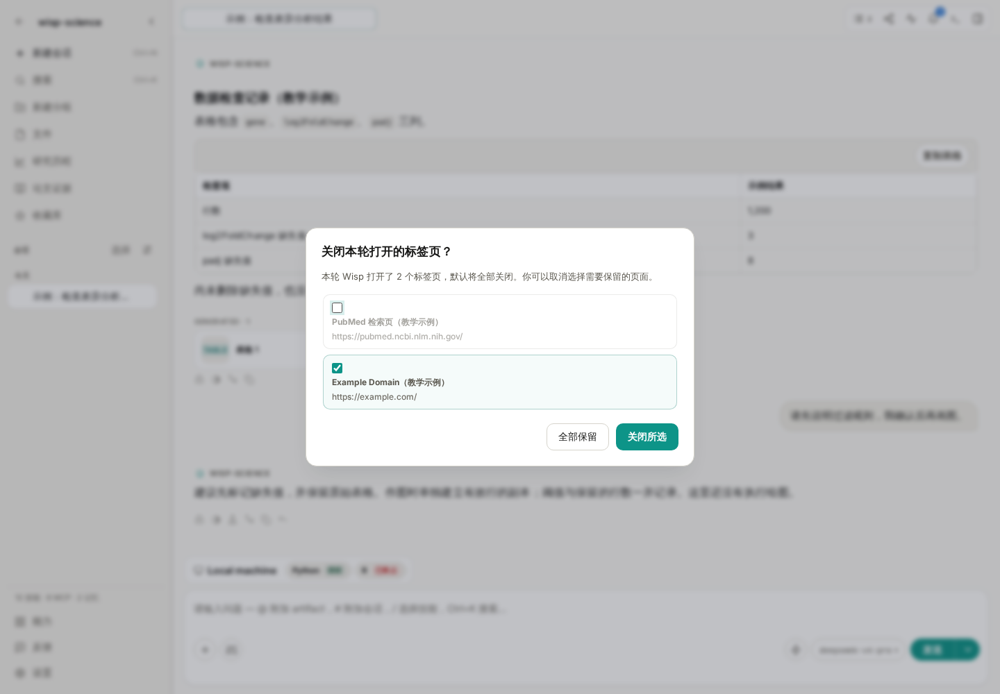
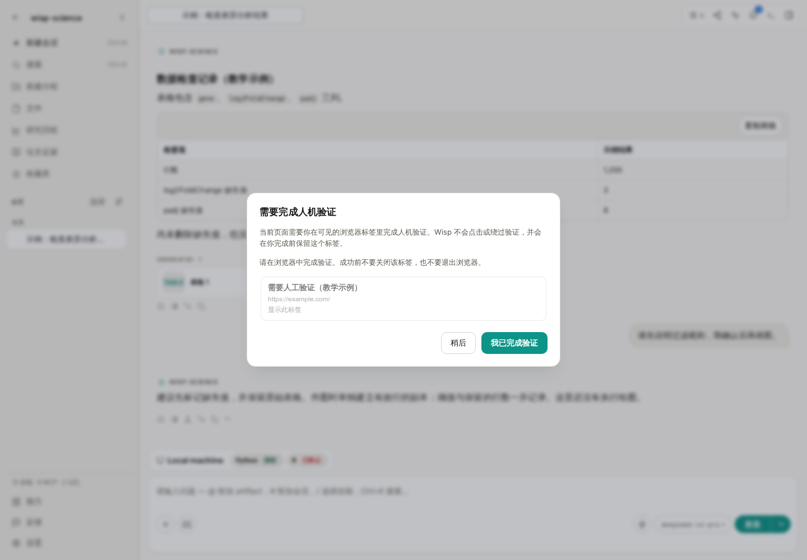

# Wisp Science基础入门：浏览器使用

查文献时，数据库记录往往只是起点。我们还需要打开期刊网页，看看补充材料放在哪里，确认数据下载入口，或者阅读一个没有专用检索工具的网站。

Wisp Science 可以通过浏览器桥接扩展读取和操作网页。你可以让它在已有浏览器页面上继续工作，查看它实际打开了什么，再把需要的内容整理进项目。这篇文章先完成一次公开网页读取，再介绍标签管理、人工验证和下载。

> 本文的 Wisp 配图来自实际前端，使用教学会话和模拟浏览器事件；扩展安装图展示 Chrome 的操作入口。图中的网页标题与任务状态用于说明界面，不代表已经执行了联网检索。

**先认识浏览器控制：模型的回答，需要有实际页面作为依据。**

浏览器控制可以帮助 Wisp 打开网页、读取页面文字、查找可操作元素，以及在任务需要时截图或保存网页资源。对于有专门连接器的数据库，也可以使用 [MCP](wisp-science-mcp.md) 取得结构化记录；两种方式可以用于同一个科研任务。

日常使用时，Wisp 默认连接你已有的 Chrome/Chromium 类浏览器资料，因此可以沿用该资料中的登录状态。登录了哪个账号、当前打开了哪些标签，会影响可读取的内容。

Wisp 也有单独的工作浏览器模式，使用独立资料，需要在其中另行登录，并且依赖支持该启动方式的浏览器版本。第一次使用，先把日常浏览器的连接跑通即可；独立模式的区别见[浏览器运行时说明](../browser-runtime-architecture.md)。

**第一次连接，从“配置浏览器控制”开始。**

先保持 Wisp 运行，在会话中发送：

> 请帮我配置浏览器控制，告诉我当前连接状态和这台电脑上应该加载的扩展目录。

Wisp 会通过 `browser_setup` 返回状态和准确路径。接着在准备交给 Wisp 使用的 Chrome 资料中操作：

1. 打开 `chrome://extensions`。
2. 开启右上角 **开发者模式**。
3. 点击 **加载已解压的扩展程序**；不同版本也可能显示“加载未打包的扩展程序”。
4. 选择 Wisp 返回的整个 `browser-extension` 文件夹。
5. 打开扩展弹窗，确认出现 **Connected to Wisp**。

*图 1：加载的是整个扩展目录，不是 ZIP，也不是目录中的某个文件。路径以自己电脑上的 Wisp 返回值为准。*

不要照抄别人的 Windows、macOS 或 WSL 路径。Wisp 会准备稳定的受管目录，浏览器需要记住的就是这个实际路径。

如果扩展弹窗显示已连接，但 Wisp 仍报告不可用，再次要求它检查浏览器状态。可能存在旧扩展版本、连接到了其他占用相同端口的工具，或握手未完成等情况，应该依据返回的具体原因处理。

**先读一个公开页面，确认回答来自实际访问。**

可以发送下面这条任务：

> 请打开 https://example.com ，读取网页标题和主要段落。告诉我实际读取的网址；如果没有成功读取，请说明失败原因，不要用已有知识补写网页内容。

这个页面内容简单，适合检查基本连接。确认能打开和读取后，再换成你熟悉的期刊或数据库页面。

科研任务可以进一步写清楚“看什么、取什么、存在哪里”：

> 请阅读我当前打开的论文页面，找出数据可用性声明和补充材料入口。列出页面上实际出现的数据编号、链接和对应说明，保存为 notes/paper-links.md。暂时不要下载大型数据，也不要提交任何表单。

检查结果时，把 Wisp 的回答与浏览器页面对照。需要追查执行过程时，打开[轨迹](wisp-science-trajectory.md)，查看调用了什么工具、读取了哪个地址，以及有没有失败后重试。

**浏览器设置里，有两类与日常使用直接相关的选项。**

进入 **设置 → 浏览器**，可以管理自动打开浏览器、标签清理和网址名单。

*图 2：演示中把 PubMed 加入优先名单。优先名单提供站点偏好，不会把其他网站全部禁止。*

| 选项 | 有什么作用 |
| --- | --- |
| 自动打开浏览器 | 需要使用浏览器工具时，尝试启动已安装的受支持浏览器，让扩展重新连接；默认开启 |
| 自动关闭浏览器标签页 | 一轮结束后清理本轮 Wisp 新开的标签；默认关闭 |
| 禁用名单 | 对命中的域名及其子域，阻止相应的新开页面或明确跳转，并返回填写的原因 |
| 优先名单 | 指导检索优先使用这些站点，名单外站点仍可访问 |

名单按域名设置，不能代替检查具体网页内容。禁用一个域名也不等于清除了浏览器里已经打开的页面；已打开标签仍可能被扫描读取。

**一轮结束后，决定哪些标签值得留下。**

未开启自动关闭时，Wisp 会列出本轮自己打开的标签，让你选择关闭哪些、保留哪些。已经由你打开的标签不在这次清理范围中。

*图 3：示例中取消勾选 PubMed 页面，表示希望保留它继续查看。勾选的标签才会被这次确认关闭。*

可以保留还要核对的论文页面，把临时检索页清理掉。按 Escape 可以先关闭提示，不必为了返回会话而把页面一起关掉。

如果一轮结束时扩展断开，待处理的标签列表会保留，重新连接后再处理。需要人工验证的标签会受到保护，不会被当作普通任务标签自动清理。

**遇到登录或真人验证，回到浏览器亲自完成。**

某些网站需要登录，或者会显示“确认你是真人”。Wisp 检测到人工验证时，会暂停相应自动化并提示你处理。

*图 4：这张图使用模拟事件展示提醒。验证需要你在实际网页中完成；Wisp 会重新检查页面状态后再继续。*

处理顺序是：打开提示指向的标签，手动完成验证，保持页面打开，再回到 Wisp 确认。若验证还没通过，先查看浏览器页面，不要反复要求 Agent 点击验证码。

**下载材料时，把网页操作和文件保存位置说清楚。**

可以先让 Wisp 列出文件名称、链接和大小，再决定是否下载。例如：

> 请先找出这篇论文的补充表格，列出文件名、下载链接和页面标注的大小。先不下载，等我确认需要哪些文件。

如果浏览器弹出系统“另存为”窗口，需要你处理。网页桥接不能操作系统文件选择器，也不能代替你点击浏览器工具栏中的下载气泡。

确实需要无人值守下载时，可以手动调整浏览器的下载设置，关闭“下载前询问每个文件的保存位置”。多文件自动下载的权限应按具体站点设置。下载完成后，再让 Wisp 检查实际落盘的文件位置与大小；不要把“点击了下载链接”当作“已经取得完整文件”。

**遇到问题，可以按连接、页面和文件三个位置检查。**

| 现象 | 优先检查 |
| --- | --- |
| 提示浏览器未连接 | Wisp 是否运行、是否打开了安装扩展的那份浏览器资料 |
| 升级 Wisp 后要求更新扩展 | 按更新横幅刷新扩展；旧版本可能需要在扩展管理页手动重新加载 |
| 浏览器已连接，却读不到内容 | 页面是否加载完成、是否需要登录或人工验证 |
| 无法操作浏览器设置页 | `chrome://settings` 等内部页面需要手动操作 |
| 下载没有结束 | 是否停在系统保存窗口、站点下载许可或失败的网络请求 |
| 回答没有来源网址 | 查看轨迹，确认是否发生了成功的页面读取，再要求按实际结果补充来源 |

第一次练习，完成“读一个公开页面、核对网址、保留需要的标签”就够了。熟悉连接和检查方式后，再把论文、数据入口和补充材料逐步放进同一条任务中。

> 功能细节参见 [Wisp 真实浏览器自动化文档](../real-browser-automation.md)。本文依据撰写时的项目实现整理，不同版本的界面文字可能略有差异；示例提示词不代表已经执行的网页操作。
