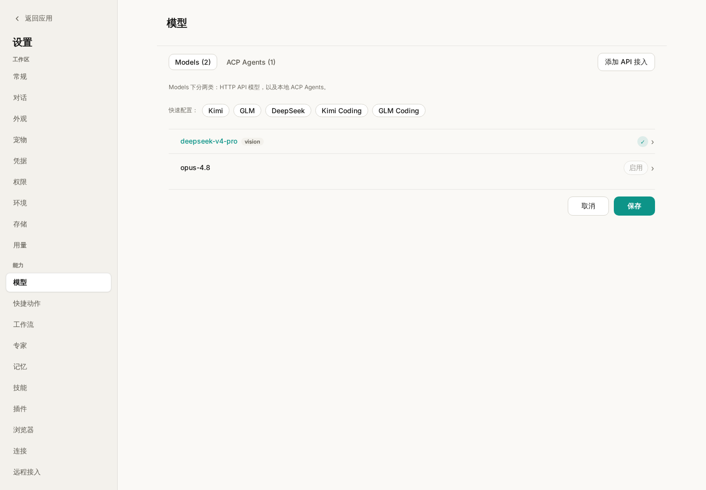
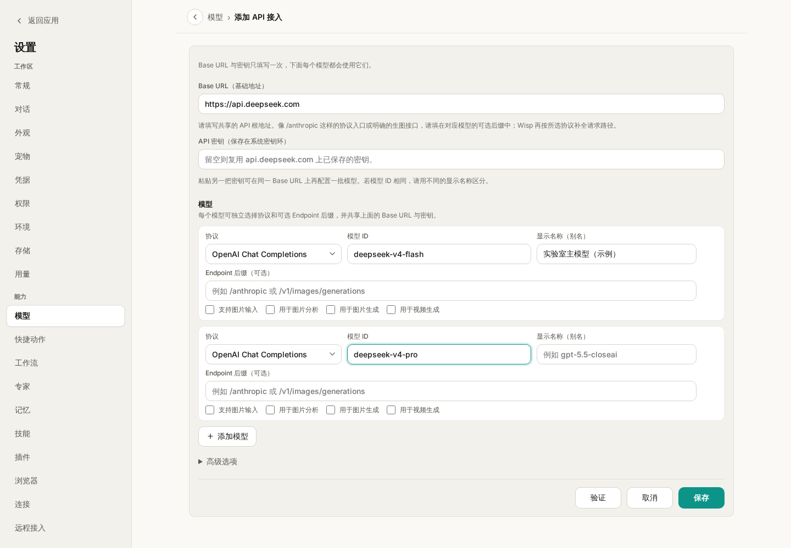
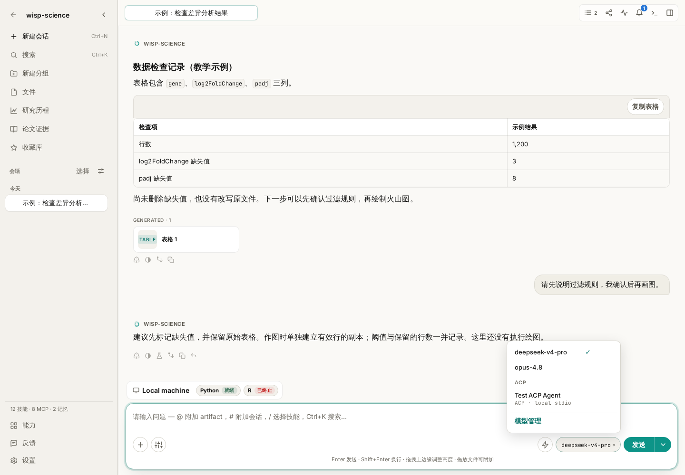

# Wisp Science基础入门：模型配置

第一次打开 Wisp Science，很多人会停在同一个地方：我已经有一个 AI 账号了，为什么还要填写 API 地址和密钥？模型名称该填什么？保存后，又怎样知道这次对话真的用上了它？

Wisp Science 把科研工作区与模型接入分开管理。你可以保留同一个项目中的文件和分析记录，再按需要选择能够访问的模型。这篇文章从第一次接入讲起，先完成一个能正常回答的小任务，再认识图片能力和会话切换。

> 本文配图来自 Wisp Science 实际前端，使用演示配置和教学会话。图中的模型列表不代表推荐顺序，也不表示已经验证了某个账号的访问权限；请以自己的服务商提供的配置为准。

**先分清三件事：Wisp、模型服务和 API 密钥。**

| 组成部分 | 负责什么 | 你需要准备什么 |
| --- | --- | --- |
| Wisp Science | 管理项目、组织对话与工具调用、保存工作记录 | 安装应用并打开一个项目 |
| 模型服务 | 接收请求，生成回答或工具调用 | 可访问的服务地址、支持的协议和模型 ID |
| API 密钥 | 让服务商识别这次请求使用的账号或额度 | 服务商控制台提供的 API Key |

网页登录账号、聊天订阅和 API 使用权限可能采用不同的开通方式。能在某个网站聊天，并不一定意味着已经有可供 Wisp 使用的 API 密钥。开始前，先确认你拿到的是 API 接入信息。

如果实验室提供统一网关，也可以使用管理员给出的地址、模型 ID 和密钥。不要把网页聊天地址填进 API 地址栏。

**打开模型设置，先看自己是否已有可用配置。**

进入 **设置 → 模型**。这里可以查看已有模型，也可以点击 **添加 API 接入**。首次引导中的模型配置是另一个起点；跳过引导后，仍可以随时回到这里补充。

*图 1：先检查已有模型。显示名称便于自己区分用途，实际调用仍依赖模型 ID、协议和地址。*

这个页面也有 **ACP Agents** 分类，用来接入外部 Agent 进程。本文先介绍 Wisp 内置 Agent 使用的 HTTP API 模型。手里拿到的是命令行启动命令时，应查看 [ACP 配置说明](wisp-science-acp.md)。

**添加 API 接入，先填写共用信息，再添加模型。**

点击 **添加 API 接入**，先填写服务商给出的 **Base URL** 和 **API 密钥**，然后在下方填写这把密钥可以调用的模型。一组接入可以添加多个模型，每个模型分别选择协议、模型 ID 和能力。

*图 2：同一次添加中的模型共用地址和密钥。截图仅演示字段位置，密钥没有填写。自动建议的模型也要与自己的账号权限核对。*

首次接入时，优先把下面几项填准确：

| 字段 | 怎样填写 | 容易混淆的地方 |
| --- | --- | --- |
| Base URL | 服务商提供的 API 基础地址 | 通常不要自行追加 `/v1/chat/completions` 等完整接口路径 |
| API 密钥 | 服务商控制台生成的密钥 | 不要填写网页登录密码 |
| 协议 | 按服务商说明选择 OpenAI 兼容、OpenAI Responses 或 Anthropic | “OpenAI 兼容”是一种接口格式，也可由其他服务商提供 |
| 模型 ID | 服务实际接受的精确名称 | 显示名称可以自定义，模型 ID 不能随意起名 |
| 显示名称 | 便于识别的名称，例如“实验室主模型” | 不会改变实际调用的模型 |
| 端点后缀 | 服务商明确要求的额外路径 | 一般先留空，不要把完整接口路径反复拼接 |

如果不确定协议和地址是否配套，把这两个字段一起与服务商文档核对。不要一遇到报错就轮流追加 `/v1`、`/responses` 和 `/messages`。

首次使用这组地址时，需要提供有效密钥。已经为相同 Base URL 保存过密钥时，留空可以复用已有密钥；粘贴另一把密钥，可以为新的模型组建立独立接入。同一个模型使用不同账号时，建议设置不同显示名称，便于在对话中识别。

Wisp 把 API 密钥放在操作系统密钥环中。截图、项目笔记和发给同事的配置说明里，只保留地址、协议和模型 ID，不要附上真实密钥。

填写完成后，点击 **验证**，再按结果核对配置；验证成功后仍需点击 **保存**。以后也可以打开已保存模型的编辑页重新验证。验证通过说明对应检查成功，具体的工具调用或图片任务仍需要各自试用。

**输出长度和上下文窗口，先使用有依据的数值。**

接入保存后，点击模型列表中的具体模型，可以在编辑页调整输出长度、上下文窗口和推理等设置。

“最大输出 tokens”约束一次回答最多生成多少内容；“上下文窗口”描述模型能够处理的输入与输出总范围。它们不是填得越大，模型能力就越强。

Wisp 对内置模型目录能够精确识别的模型，会带出已记录的上限。目录没有识别到自定义别名或网关模型时，需要按服务商说明填写。最大输出超出已知上限时，保存会提示错误；上下文窗口超过已知上限时会被收回上限。

推理强度、Fast 模式等选项也依赖模型和服务商支持。第一次接入可以保留默认，先确认普通对话成功，再根据实际任务调整。Fast 模式可能影响额度消耗，开启前查看所用服务的说明。

**回到对话，明确选择这次要用的模型。**

打开一个新会话，在输入框附近的模型选择器中选择刚保存的模型。

*图 3：这里决定当前会话使用的模型。已有消息的会话切换模型时，会出现确认提示；设置中的默认模型用于新会话。*

先发送一条不依赖网络和科研工具的小问题：

> 请用三句话解释 CSV 文件是什么，再给出一个两行数据的 CSV 示例。此次不需要读取文件或访问网页。

这样比较容易区分“模型是否能回答”和“外部工具是否配置成功”。收到正常回答后，再尝试读取自己项目中的一个小文件。

不要只问“你是什么模型”来验证配置。模型在自然语言中的自我描述不能替代实际配置记录；应检查选择器显示的模型，并结合该轮的[轨迹与用量记录](wisp-science-trajectory.md)核对。

已有内容的会话切换模型，会影响这个会话后续的请求；一轮已经发出的请求仍使用启动时的配置，新配置从后续轮次生效。

**需要读图时，再检查图片输入和图片分析角色。**

科研任务经常包含显微图片、截图或统计图。模型能回答文字，不代表它能接收图片。

- 使用支持视觉输入的聊天模型时，勾选 **支持图片输入**。
- 希望它也为非视觉主模型解释图片时，再指定 **用于图片分析**。
- “用于图片生成”是另一个角色，负责产出图像，不能代替图片分析配置。

可以上传一张没有敏感信息、标注清晰的简单图，发送：

> 请只描述这张图中能看见的坐标轴、图例和变化趋势。看不清的文字请明确说明，不要补写实验条件，也不要推断因果关系。

先验证可见信息，再进入具体科研判断。如果选择的主模型不能读图，也没有可用的图片分析模型，先补齐配置，再重试。

**遇到报错，先从出错的位置排查。**

| 现象 | 优先检查 |
| --- | --- |
| 401 / 403 | 密钥是否有效、API 权限是否开通、账号能否访问该模型 |
| 404 或返回网页内容 | Base URL、协议与模型 ID 是否正确；是否误填了服务首页 |
| 超时或连接失败 | 网络连通性，以及 **设置 → 常规 → 网络** 中的模型 API 代理 |
| 验证通过，某个任务仍失败 | 该模型是否支持任务所需的工具调用、图片输入或输出长度 |
| 上下文超限 | 尝试 `/compact`，或开新会话并说明需要延续的任务 |
| 回答中途截断 | 核对最大输出设置，必要时使用“继续执行”或缩小本次任务 |

第一次配置的目标可以很小：保存一组接入，在新会话中选择它，得到一条完整回答。这个环节跑通后，再接着学习 [MCP](wisp-science-mcp.md)、[Skills](wisp-science-skills.md) 和[浏览器使用](wisp-science-browser.md)，就更容易判断后续问题出现在哪一层。

> 功能细节参见 [Wisp 模型配置文档](../model-configuration.md)。本文依据撰写时的项目实现整理，不同版本的界面文字可能略有差异；示例提示词不代表已经执行的模型请求。
