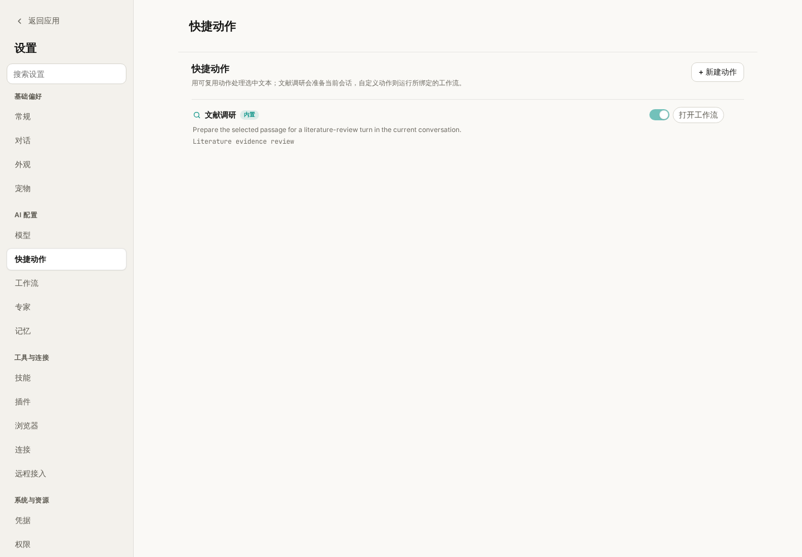
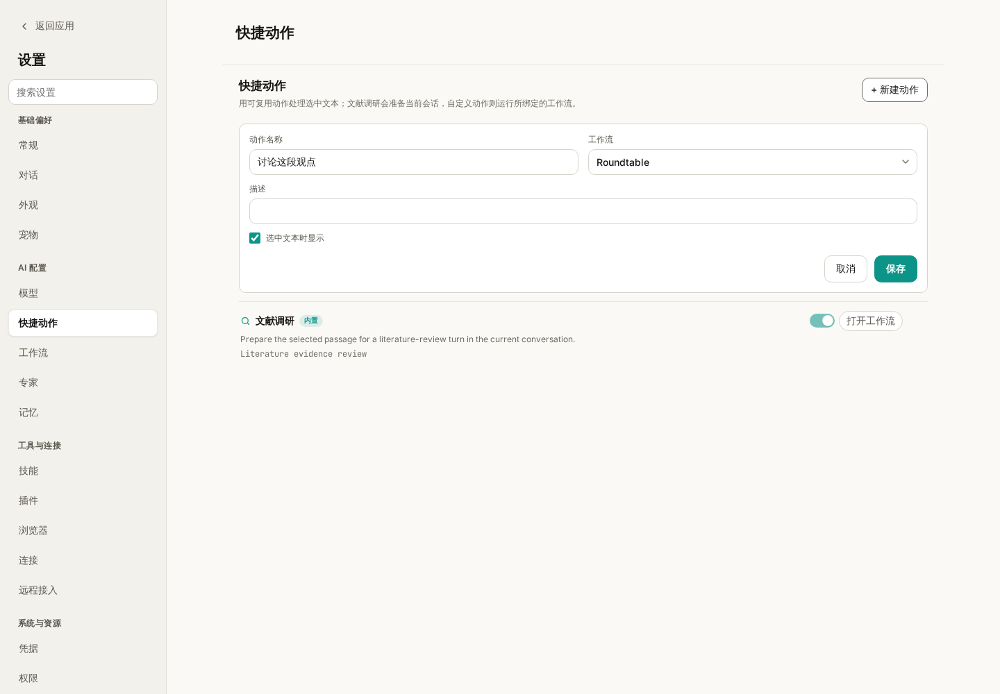

# wisp-depmap使用技巧：快捷动作

阅读一段分析结论时，想查一查有没有文献支持；整理研究笔记时，想围绕某个观点做一次讨论。通常要先复制文字，再切到输入框，补上“请针对这段内容……”和一长串要求。

wisp-depmap 的 **快捷动作** 把这种重复操作放到了选中文本旁边：先选中需要处理的内容，再点击相应动作，让这段材料进入后续任务。

上一篇介绍了 [专家](wisp-science-specialists.md)，这一篇介绍快捷动作的入口、内置“文献调研”的用法，以及怎样把已有工作流变成自己的选中文本动作。

**先分清楚：快捷动作是入口，具体工作由技能或工作流完成。**

| 组成部分 | 负责什么 |
| --- | --- |
| 选中的文本 | 这次要研究、讨论或处理的材料 |
| 快捷动作 | 在文本旁提供一个可重复使用的操作入口 |
| Skill | 为当前对话提供任务方法，例如文献检索与证据核验 |
| 工作流 | 定义多个任务及其依赖、能力和交付要求 |
| 专家 | 为任务提供固定角色与工作指令 |

当前内置的 **文献调研** 会准备当前会话的下一条消息，并附上 `literature-review` 技能。自定义快捷动作则绑定一个工作流，点击后为它创建专门的会话，并按工作流策略运行或等待审阅。

**第一次使用，从“文献调研”开始。**

假设对话里出现了这样一句需要进一步核验的判断：

> 这种细胞类型可能参与植物根系的干旱响应。

这只是一个待核验的示例观点。可以按下面的步骤处理：

1. 在对话正文中选中这段文字。
2. 在浮动的选中文本工具栏中点击 **文献调研**；也可以选中后打开右键菜单，选择同名动作。
3. 查看当前输入框：选中文字已经作为引用加入，同时附上 `literature-review` 技能和可编辑的调研提示词。
4. 补充研究范围和希望得到的结果，再点击 **发送**。

例如，在准备好的请求后补充：

> 研究对象限定为拟南芥根系。请区分直接支持这一观点的实验研究、仅有相关性的观察，以及相反或不支持的证据。优先使用原始研究，核验标题、年份和 DOI，并说明哪些结果还不能支持因果推断。

**点击“文献调研”后，还需要发送消息才开始任务。** 这给你留下了补充物种、时间范围、检索重点和输出形式的机会。发送之后，工具调用、进度和最终回复都保存在当前对话中，之后可以结合 [轨迹](wisp-science-trajectory.md) 查看实际检索过程。

文献检索需要可用的模型、检索工具和网络。技能负责指导检索与核验方法；是否真正取得论文记录，要看工具返回的结果。初次尝试时，可以用自己已经熟悉的一个观点，核对返回文献是否确实支持相应结论。

**在文件预览里，也可以围绕一段文字发起任务。**

除了对话正文，非代码文件预览中的可选文本也支持快捷动作。例如，在一份研究笔记里选中“值得进一步验证”的段落，再调用文献调研，便于带着明确问题回查证据。

对于 R 和 Python 源码，选中后的菜单会保留运行、询问 AI、引用、解释等代码操作。找不到“文献调研”时，先确认自己选中的是正文还是代码。图片中的文字如果无法直接选中，需要先提供可选取的文字内容。

如果不希望每次选中文本都弹出浮动工具栏，可以在 **设置 → 常规** 中调整 **划选即弹出快捷操作**。关闭浮动入口后，仍可通过右键菜单使用相关操作。

**进入“设置 → 快捷动作”，管理哪些动作出现在菜单里。**

*图 1：实际前端配合模拟数据展示的快捷动作设置页。配图用于说明配置入口，没有执行文献检索或调用模型。*

在这里可以查看动作名称、描述和关联工作流，通过 **选中文本时显示** 控制是否启用，也可以编辑已有动作。自定义动作还可以删除。

动作旁的 **打开工作流** 会进入独立的工作流编辑器，查看任务图和相关配置。这里有一个容易混淆的地方：内置“文献调研”虽然可以打开关联的 **Literature evidence review** 模板，但选中文字后点击这个内置动作，仍然是向当前输入框准备一次调研请求。

如果希望明确执行多节点的文献证据审阅图，可以使用工作流模板本身。查看模板与点击内置快捷动作，是两个不同的入口。

**创建自定义动作，可以先绑定一个已有工作流。**

例如，希望经常围绕笔记中的一个观点开展多角度讨论，可以创建 **讨论这段观点**，绑定工作流库中的 **Roundtable**：

1. 进入 **设置 → 快捷动作**，点击 **新建动作**。
2. 在 **动作名称** 中填写“讨论这段观点”。
3. 在 **工作流** 下拉框中选择 `Roundtable`。
4. 在 **描述** 中说明用途，例如“围绕选中观点比较解释，汇总分歧与待验证问题”。
5. 保持 **选中文本时显示** 开启，点击 **保存**。

*图 2：把“讨论这段观点”绑定到已有的 Roundtable 工作流。动作名称用于选中文本菜单，真正的任务分工由所选工作流决定。*

保存后，回到对话或非代码文件预览，选中一段完整观点，再从浮动工具栏或右键菜单选择 **讨论这段观点**。Wisp 会将选中文字与来源信息（可用时）带入工作流上下文，并为这次任务创建专门的会话。

自定义动作不会像内置“文献调研”那样，先停在当前输入框等待你发送。根据所选工作流的审批策略和实际能力要求，它可能直接开始，也可能生成待审阅的草稿。看到“已创建草稿，请审阅后运行”时，先检查任务内容，再批准运行；看到已启动提示时，就到新会话和 Agents 活动面板查看进度。

**动作的描述用于说明入口，任务要求应写进绑定的工作流。**

例如，将动作描述改成“检查统计方法”，并不会把 `Roundtable` 的任务图自动改成统计审查流程。希望它每次检查样本量、检验方法和多重比较，就应该打开工作流，在目标和任务指令中写清这些要求，再让动作绑定到这个模板。

工作流编辑器中可以配置目标、共享上下文、任务节点、依赖关系、技能与能力，以及专家、执行器和模型等。独立任务可以并行，有依赖的任务按前后顺序执行。

内置工作流以只读模板提供；保存修改后的版本会创建自定义副本。首次使用可以先查看已有模板的节点和目标，再复制调整一处明确需求，无需一开始就设计复杂的多任务图。

例如，一个“检查研究论证”的小工作流可以分为三个任务：

| 任务 | 要求 |
| --- | --- |
| 梳理论点 | 列出选中段落中的主要判断，区分事实陈述和推测 |
| 检查证据 | 根据提供的材料判断证据支持程度，列出缺失条件 |
| 汇总修改建议 | 读取前两个任务的结果，给出保留、弱化表述或补充验证的建议 |

这是一个供你配置的流程示例，并非额外内置模板。先明确任务输入和输出，再按实际需要选择技能或专家，最后保存并绑定快捷动作。

**让选中的文字自带足够的上下文。**

如果只选中“这个结果很重要”，后续任务很难知道“这个结果”指什么。更合适的选择是包含研究对象、现象和判断的一小段完整文字；需要文献检索时，再补充物种、方法或关注范围。

对于内置文献调研，可以发送前在输入框补充这些信息。对于自定义动作，应该在触发前选好完整材料，或事先把固定背景与要求写入工作流。不要假定任意动作都会自动读取整篇文件、整个项目或全部历史对话。

| 现象 | 优先检查 |
| --- | --- |
| 选中文字后没有浮动工具栏 | 是否关闭了“划选即弹出快捷操作”；试试右键菜单 |
| 菜单中没有某个动作 | 是否在设置中开启“选中文本时显示”；是否正在选择 R／Python 代码 |
| 点击文献调研后没有开始搜索 | 查看输入框是否已准备好引用、技能和提示词，再发送 |
| 自定义动作没有在当前对话回复 | 查看是否打开了专门会话，或是否生成了待审阅草稿 |
| 新建动作按钮不可用 | 工作流列表是否已加载且至少有一个可选模板 |
| 修改动作描述后，结果仍按旧流程生成 | 检查绑定工作流的目标和任务指令，描述不会改写任务图 |
| 提示工作流、能力或执行器不可用 | 打开绑定工作流，检查模板和所需配置是否仍存在且可用 |

先从内置文献调研开始，熟悉“选中文字 → 准备请求 → 补充范围 → 发送”的操作。等某种处理方式需要反复使用，再把它整理成工作流，绑定为自己的快捷动作。

> 本文依据撰写时的 wisp-depmap 实现与项目文档整理。配图采用实际前端与模拟数据，示例观点、任务和提示词仅用于说明操作，不代表已验证的科研结论。
