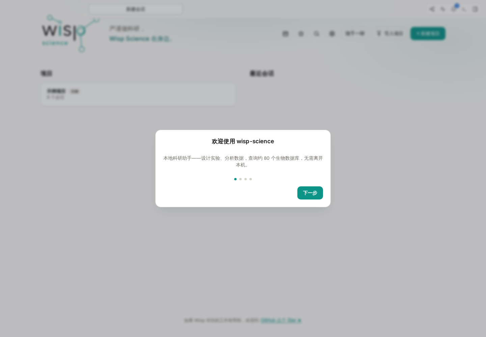
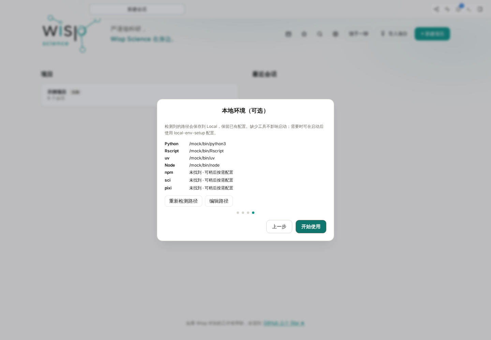
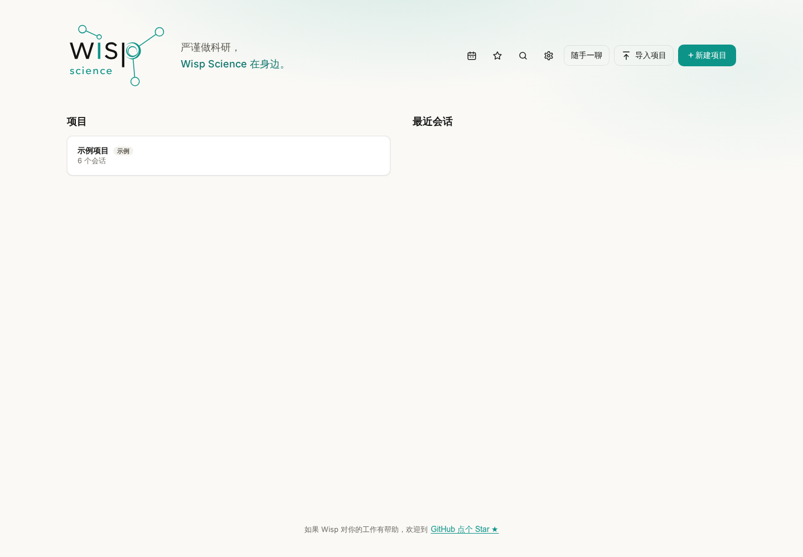
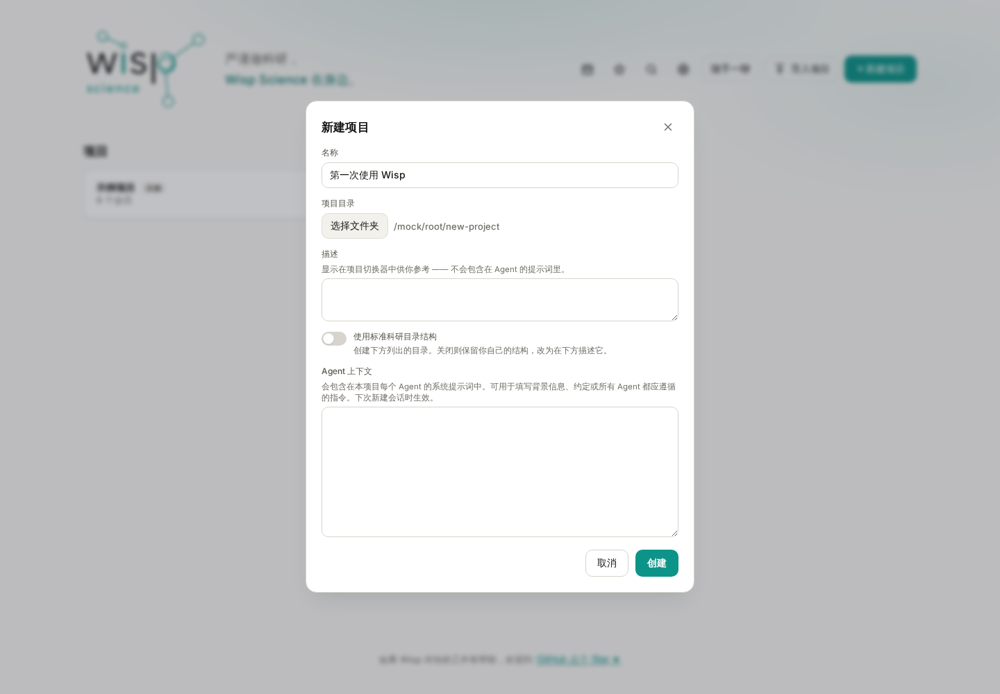
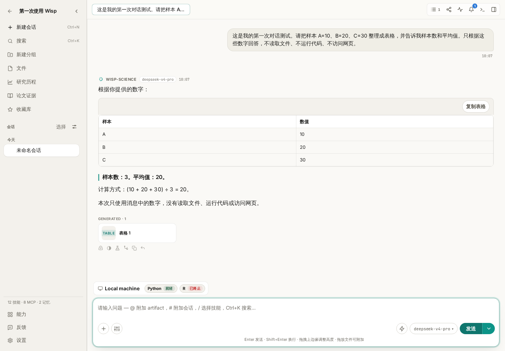

# Wisp Science基础入门：快速开始

第一次使用 Wisp Science，不必一开始就配置服务器、浏览器和各种科研工具。先下载安装，走完首次引导，创建一个练习项目，再发送一条能核对结果的小问题，就能确认最基本的使用流程是否畅通。

这篇教程带你完成从下载到第一次对话的过程。你只需要一台电脑，以及一个可以使用的模型 API 接入；暂时没有 API Key，也可以先安装应用、浏览界面和内置演示。

> 本文截图来自 Wisp Science 实际前端，使用模拟配置和教学回复。图中的路径、项目及回答用于说明操作，不代表已验证真实 API 账号。不同版本的界面文字可能略有差异。

**第一步：选择适合电脑的安装包。**

打开 [Wisp Science 下载页](https://wispscience.com/#download)，选择操作系统、芯片和安装格式，再点击“从 Cloudflare 下载”。页面会显示版本号、文件大小与安装方法；Mac 用户请在“关于本机”中确认是 Apple Silicon 还是 Intel。下载不可用时，可使用页面上的 GitHub 备用入口。

安装包名称中的版本号会变化，使用 GitHub 备用下载时，在 Assets 中主要看文件末尾的架构与格式：

| 电脑类型 | 在 Assets 中寻找 | 下载后怎样安装 |
| --- | --- | --- |
| Windows，Intel／AMD 64 位电脑 | `…_x64-setup.exe` 或 `…_x64_en-US.msi` | 选择其中一种，双击后按安装向导完成安装 |
| Mac，Apple Silicon（M 系列芯片） | `…_aarch64.dmg` | 打开 DMG，将应用拖入“应用程序”，再从“应用程序”启动 |
| Mac，Intel 芯片 | `…_x64.dmg` | 同样通过 DMG 安装到“应用程序” |
| Linux，Intel／AMD 64 位 | `…_amd64.deb` 或 `…_amd64.AppImage` | Debian／Ubuntu 系发行版可用软件安装器打开 DEB；AppImage 需设为可执行后运行 |
| Linux，ARM64 | `…_arm64.deb` 或 `…_aarch64.AppImage` | 选择与发行版和架构匹配的格式安装或运行 |

Mac 不确定芯片类型时，可以打开苹果菜单中的“关于本机”查看。其他系统也应先确认自己的系统架构，再选择对应文件；实际可下载的构建以发布页为准。

第一次安装不需要下载 `Source code (zip)`、`Source code (tar.gz)`、`.sig`、`latest.json` 或 `.app.tar.gz`：这些是源码、签名或更新相关文件。选择上表中的桌面安装包即可。

安装完成后打开 **Wisp Science**。第一次纯文字对话不需要你先安装 Rust、Python 或 R。

**第二步：跟着四页首次引导了解应用。**

第一次启动会显示引导窗口，按底部按钮逐步继续。

*图 1：欢迎页是起点。点击“下一步”继续；底部圆点显示当前所在步骤。*

第二页介绍 Wisp 能做什么：围绕项目与模型对话，运行分析、使用科研工具，以及查看文件和结果。先知道这些入口存在即可，不需要此时全部配置。

*图 2：功能介绍帮助你认识工作台。第一次练习先完成普通对话，之后再逐步使用分析和检索能力。*

第三页是 **配置模型**。当前引导提供 DeepSeek 的快捷配置：使用自己的 API Key，按页面提示保存并继续。API Key 需要从模型服务商的控制台获取，不是网页登录密码。

*图 3：在自己的电脑上填写真实有效的 API Key，截图不展示密钥。当前引导中的快捷入口面向 DeepSeek，其他模型可稍后在设置中添加。*

如果准备使用其他服务商或实验室网关，点击 **稍后配置**。进入应用后，前往 **设置 → 模型 → 添加 API 接入**，填写对应地址、协议、模型 ID 和密钥。详细字段见[模型配置教程](wisp-science-models.md)。

**继续下面的对话测试前，请确保至少配置了一个可用模型。** 跳过引导中的密钥配置，可以浏览应用和内置演示，但不会自动获得模型 API 访问权限。网页聊天账号是否包含 API 权限，需要以服务商说明为准。

第四页是 **本地环境（可选）**，用于检查这台电脑上的 Python、R 等工具路径。

*图 4：工具路径会显示检测结果。这里的路径来自演示环境，不要照抄到自己的电脑上；缺少工具不影响完成本篇的纯文字测试。*

已经安装的工具可以自动检测；路径不对时，可以点 **编辑路径**。如果暂时没有安装 Python 或 R，也可以先点击 **开始使用**，等真正需要运行分析时再配置。引导页不会自动替你安装所有工具。

想重新查看引导时，按 **Ctrl+P**（macOS 为 **Cmd+P**），搜索 **快速配置**。重新打开不会清空已有项目。

**第三步：创建一个练习项目。**

完成引导后，你会看到项目首页。项目用来组织这一项工作的会话、文件与结果；可以把第一次练习单独放在一个项目中。

*图 5：截图中的项目是演示数据。新安装时，你的项目列表可能为空，也可能先看到内置示例入口。点击“新建项目”创建自己的练习空间。*

点击 **新建项目**，填写名称，例如 **第一次使用 Wisp**，再选择一个准备存放练习内容的本地文件夹。建议使用专门的空文件夹，方便找到后续生成的文件。

*图 6：名称方便你在 Wisp 中识别项目，目录决定文件实际存放的位置。截图中的 `/mock/root/new-project` 是模拟路径，请选择自己电脑上的文件夹。*

其他字段和目录结构选项可以先保持默认。确认名称和目录后点击 **创建**。进入项目后，左侧是会话列表，中央是对话区，底部是输入框。需要开始一段新的讨论时，点击左侧 **新建会话**。

如果暂时没有 API Key，也可以先打开项目首页提供的内置演示，阅读已有记录；继续发送自己的问题仍需要配置可用模型。

**第四步：选择模型，发送第一条测试消息。**

在输入框附近的模型选择器中，确认当前选择的是自己配置的可用模型。如果没有可用项，先回到 **设置 → 模型** 完成配置，再返回会话。

把下面这段话复制到输入框，点击 **发送**：

> 这是我的第一次对话测试。请把样本 A=10、B=20、C=30 整理成表格，并告诉我样本数和平均值。只根据这些数字回答，不读取文件、不运行代码、不访问网页。

这个例子不依赖额外的数据文件或科研工具，能帮助你先确认消息发送、模型响应和表格显示是否正常。

*图 7：这是模拟模型回复的界面示例，用于展示成功回答应出现在哪里。你实际收到的措辞可以不同，但数值应能核对。*

检查下面几项：

- 对话区出现了你刚发送的问题。
- 助手给出了完整回复，而不是一直停留在运行状态或错误提示。
- 表格对应 A、B、C 三个样本，数值分别为 10、20、30。
- 样本数为 **3**，平均值为 **20**，即 `(10 + 20 + 30) ÷ 3`。

回复不必与截图逐字一致。如果算错或漏了样本，可以继续要求它核对原始数字。模型能返回文字与结果正确，是需要分别检查的两件事。

这次测试只验证基本对话流程，还没有验证文件读取、Python／R、网页检索或服务器计算。后续可以打开[轨迹教程](wisp-science-trajectory.md)，学习怎样检查工具是否实际执行。

**遇到问题，先检查最靠近当前步骤的配置。**

| 现象 | 优先检查 |
| --- | --- |
| 下载后找不到可安装的应用 | 是否误下了源码或更新文件；安装包是否与系统架构匹配 |
| 引导里没有自己的模型服务商 | 选择“稍后配置”，再到“设置 → 模型”添加接入 |
| 输入框附近没有可用模型 | 模型配置是否保存，当前会话是否已选中它 |
| 返回 401／403 | API Key、模型访问权限和账号状态是否有效 |
| 返回 404 或网页内容 | API 地址、协议和模型 ID 是否配套 |
| 一直连接失败或超时 | 网络是否能访问模型服务；检查“设置 → 常规 → 网络”中的模型 API 代理 |
| 本地环境提示缺少 Python／R | 可以先完成本篇纯文字对话；运行代码时再配置相应环境 |

完成第一条对话后，就可以根据自己的任务继续学习：[模型配置](wisp-science-models.md)用于补充接入，[浏览器使用](wisp-science-browser.md)用于读取网页，[MCP](wisp-science-mcp.md)和 [Skills](wisp-science-skills.md)用于连接科研工具与复用工作方法。希望在其他机器上分析时，再阅读[服务器环境配置](wisp-science-servers-cli.md)。

> 安装包以 [官方发布页](https://github.com/xuzhougeng/wisp-science/releases/latest) 为准；引导与设置细节参见 [Wisp 基础配置](../basic-configuration.md)。本文示例用于练习操作，不代表已经完成的真实模型测试或科研分析。
