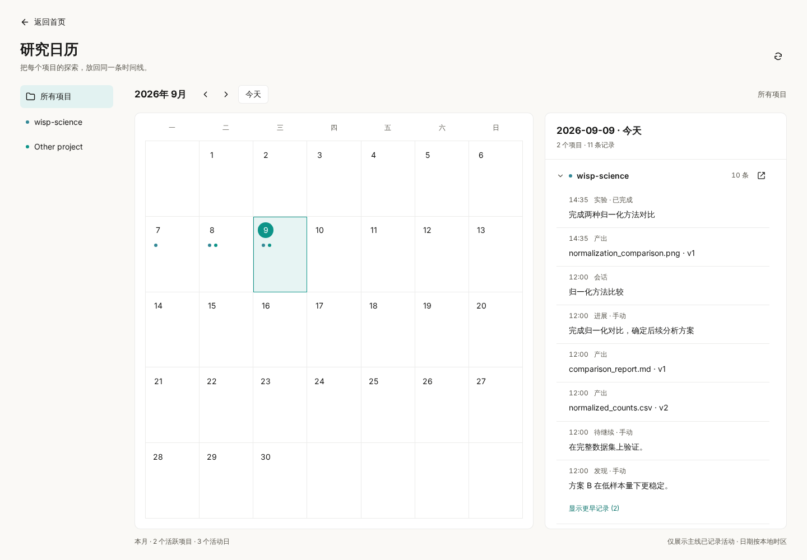
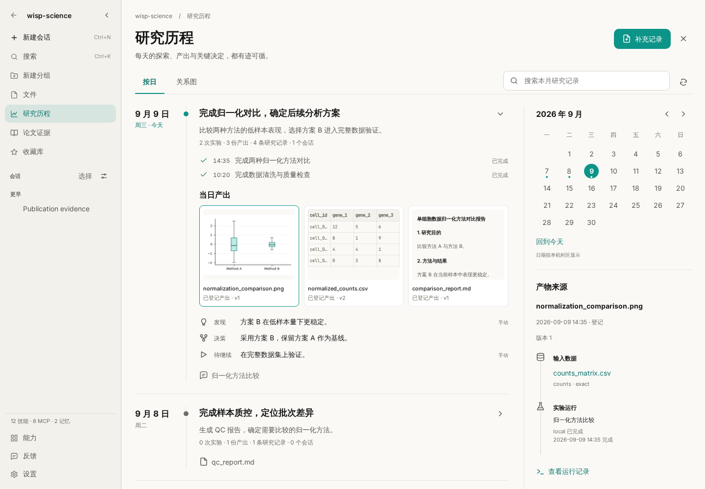
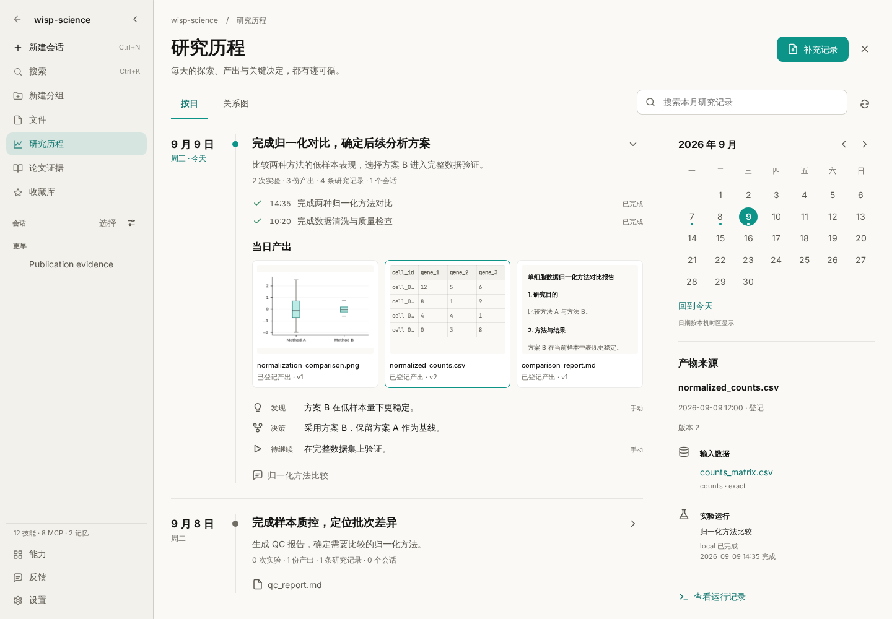
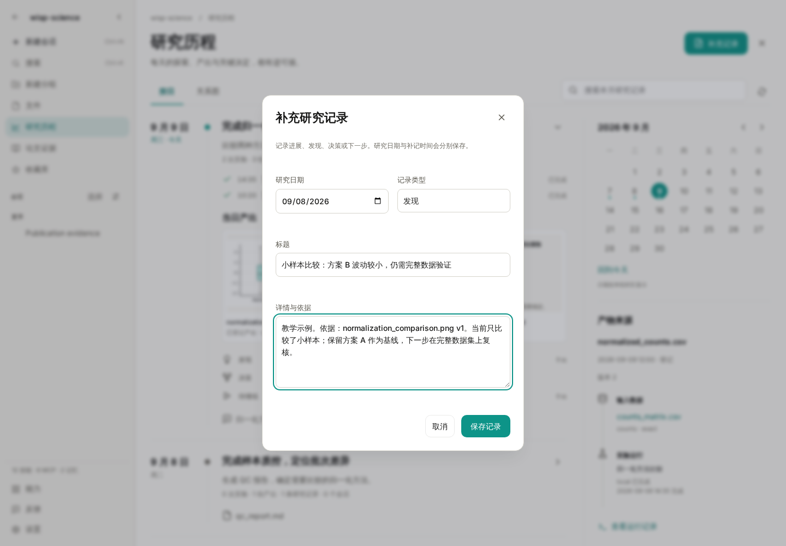
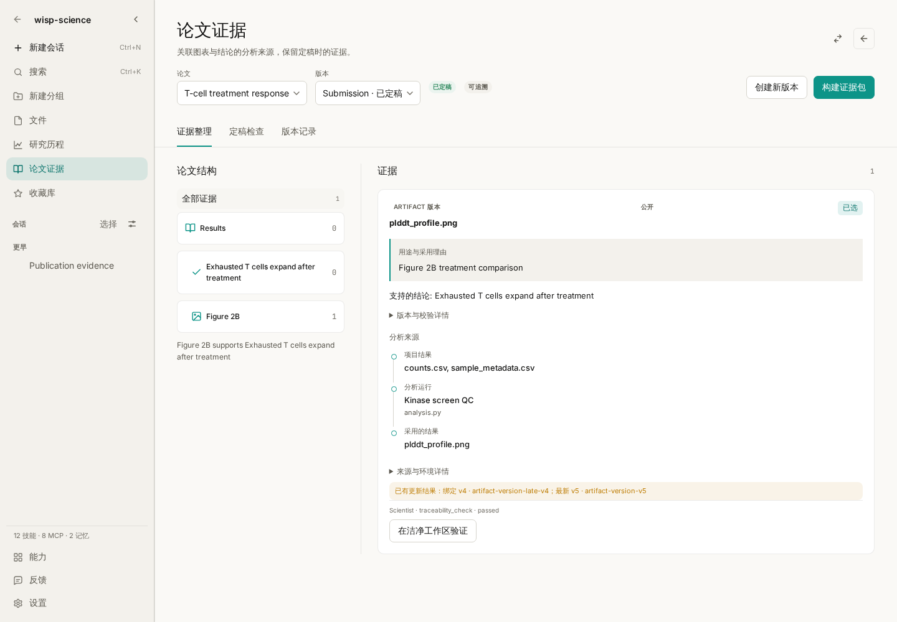

# Wisp Science使用技巧：研究历程，让每一天的探索都有迹可循

上周那张图是怎么得到的？当时为什么选择方案 B？昨天的实验没有成功，今天应该从哪一步继续？

研究往往同时发生在几段对话、几次运行和不同版本的文件里。到了组会或写论文的时候，我们需要把它们重新接起来：哪天做了什么，留下了哪份结果，依据是什么，还有哪些问题没有验证。

Wisp Science v1.11.0 的主题是 **Research Journey · 研究历程**。这一篇从首页研究日历出发，带你回到项目中的一天，查看成果来源、补充研究记录，再把选中的证据放进论文工作区。

> 本文适用于 v1.11.0。截图来自 Wisp Science 实际前端，使用固定日期和模拟数据演示操作，无需连接模型或服务器。文件、实验与结论均为教学示例；论文页面使用另一组独立的演示证据，不表示前面的结果已自动转入论文。

## 先分清三个入口

| 入口 | 适合回答的问题 |
| --- | --- |
| 首页「研究日历」 | 这一天，哪些项目留下了研究记录？ |
| 项目侧栏「研究历程」 | 这个项目最近做了什么？产物对应哪次运行？ |
| 对话中的「轨迹」 | 这一段对话具体调用了什么工具、执行了哪一步？ |

如果需要检查一次工具调用的参数或报错，继续看 [轨迹教程](wisp-science-trajectory.md)。研究历程把视角放到项目和日期，帮助你回顾跨对话的工作。

## 第一步：从日历找到当天的工作

打开 Wisp 的项目首页，点击右上角、收藏图标左侧的**日历图标**。

研究日历默认显示本月和今天。左侧可以选择所有项目或单个项目，中间按日期显示活动标记，右侧按项目列出当天记录；窄窗口会把详情放在日历下方。

可以按这个顺序试一遍：

1. 点击一个有活动标记的日期，查看当天涉及哪些项目。
2. 点击左侧项目，缩小到自己要回顾的研究。
3. 记录较多时，在当天详情中展开项目、点击「显示更早记录」。
4. 点击详情中**项目标题右侧的打开图标**，进入该项目所选日期的研究历程。

月份箭头可以查看过去，「今天」回到当前日期。日历记录的是已经发生并登记的活动，不是未来任务排期；活动日数也不代表研究完成度。隐私模式隐藏的项目不会出现在汇总里。

## 第二步：在项目里读懂一天的研究

也可以直接打开项目，点击左侧**研究历程**。从侧栏进入时，默认显示本月，最近有活动的一天展开；从首页日历进入时，则定位到刚才选择的日期。

示例中，三天的工作依次是导入原始数据、完成质控、比较归一化方法。当天卡片把实验、产物、人工记录和对话放在一起，便于回顾前后关系。

这里的记录来自项目已有内容：会话、运行、登记过的产物、文献、数据资产、决策，以及手动补充的笔记。失败或取消的运行也可以留下记录，因为“这条路为什么没有走通”同样有价值。

点击右侧日历查看某一天，点击「显示整月」恢复月视图。搜索框只搜索**当前已经载入的范围**，不会自动遍历所有月份。找不到旧记录时，先切到对应月份或日期；页面提示读取不完整时，可以缩小到某一天。

## 第三步：从一份结果追到它的来源

假设组会上要使用 `normalized_counts.csv`。仅凭文件名，还不能确定它对应的是哪一次分析。

点击当天产物中的这个文件，右侧来源栏会显示所选历史版本、对应的生成运行，以及已登记的输入。

重点核对三件事：

- **版本**：这里是当天登记的具体版本；文件后来更新，不会把历史卡片悄悄换成新版。
- **输入和运行**：确认是否使用了预期数据。点击「查看运行记录」，可查看状态、命令、执行环境和日志尾部。
- **实际内容**：点击「打开产物」，查看该版本的内容，而不只依赖标题或说明。

来源信息取决于已有登记。页面显示“未记录”时，就不能据此推断输入或生成过程完整。今天才登记的历史文件，也不会自动变成几天前的实验产出。

按 Escape 会先关闭最上层的产物预览或运行详情，之后才退出研究历程。

## 第四步：把判断和下一步写下来

运行日志能说明执行了什么，但“为什么选择这个方法”“哪些结论还不确定”通常需要研究者补充。

点击右上角**补充记录**，选择研究日期和记录类型，再填写标题与详情。

四种类型分别是进展、发现、决策和待继续。可以参考下面这条发现记录：

> **标题**：小样本比较：方案 B 波动较小，仍需完整数据验证
>
> **详情与依据**：教学示例。依据：normalization_comparison.png v1。当前只比较了小样本；保留方案 A 作为基线，下一步在完整数据集上复核。

一条有用的记录，最好写清**观察到了什么、依据在哪、还有什么没验证**。保存后，它会出现在所选研究日期下；如果是补记，系统还会保留实际保存时间。

人工记录不会自动获得科学验证。目前也没有记录编辑或删除入口，保存前检查日期与表述。

## 第五步：写论文时，挑选真正支撑论点的证据

需要把研究成果用于论文时，关闭研究历程，进入项目侧栏的**论文证据**。

这里按论文组织证据：左侧是章节、论点或图表等条目，右侧展示选中的结果、分析来源，以及用途和选择理由。页面另有「定稿检查」和「版本记录」。

对一份可编辑的草稿，可以这样开始：

1. 创建或选择论文及草稿版本，添加需要支持的章节、论点或图表条目。
2. 点击「添加证据」，从已登记结果、分析运行或已保存的研究对话中选择来源。
3. 写明证据用途、选择状态，以及必要的选择理由。对话来源可以选取一段原文，文件来源绑定所选准确版本。
4. 在「定稿检查」中先检查当前版本，处理提示。通过后，再明确确认锁定证据。

**检查通过不会自动锁定草稿**；锁定需要单独操作。查看旧版本时打开的是已保存的历史修订；继续修改时克隆一个新版本。前面的日历和笔记，也不会自动替你选好论文证据。

更详细的版本、证据包和验证规则，见 [论文证据工作区说明](../publication-evidence.md)。

## 一个可以每天重复的小习惯

开始工作时，从日历回顾昨天，找到尚未验证的问题。结束工作前，打开今天的研究历程，核对关键产物的版本和来源，再补一条包含依据与下一步的记录。

准备组会或论文时，就可以沿着日期回到原始成果，查看当时的运行与判断。它能保留的上下文，仍取决于你实际登记了哪些结果、输入和笔记；它不会自动生成每日科学总结，也不会把目录里的所有文件都当作研究成果。

**让每一天的探索，都有迹可循。**

项目与下载：[Wisp Science](https://github.com/xuzhougeng/wisp-science) · [v1.11.0](https://github.com/xuzhougeng/wisp-science/releases/tag/v1.11.0)

继续阅读：[快速开始](wisp-science-quick-start.md) · [对话轨迹](wisp-science-trajectory.md) · [导入、导出与分享](wisp-science-transfer.md)
