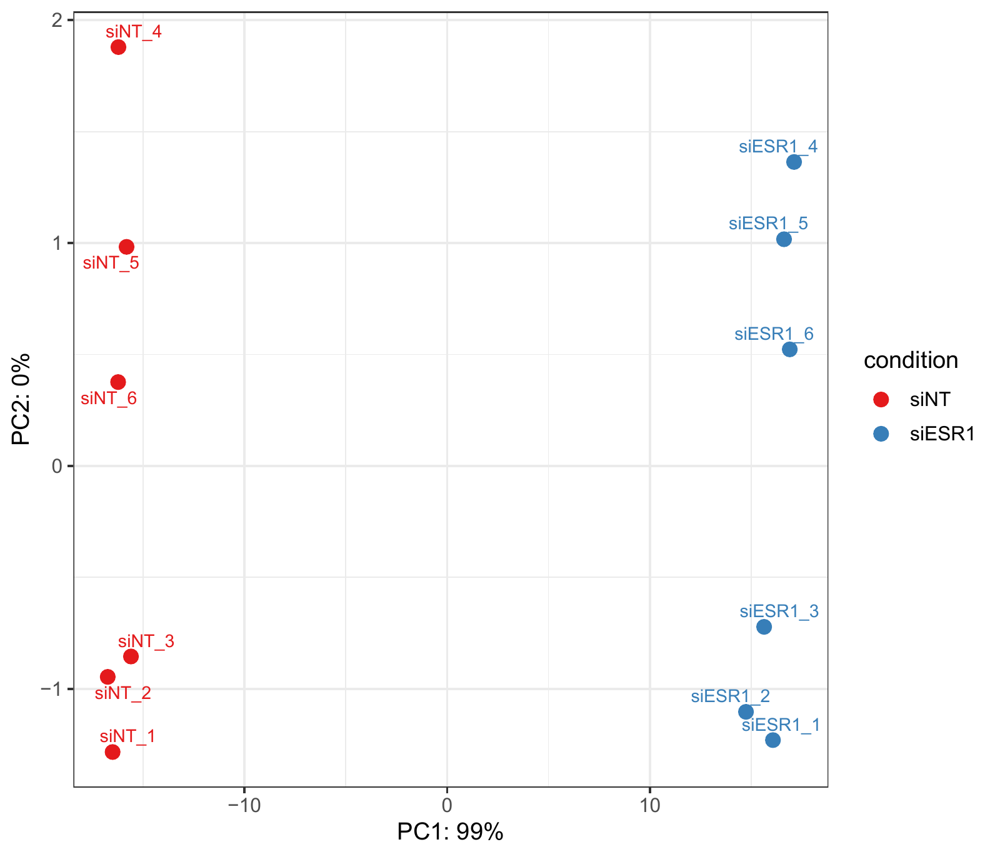
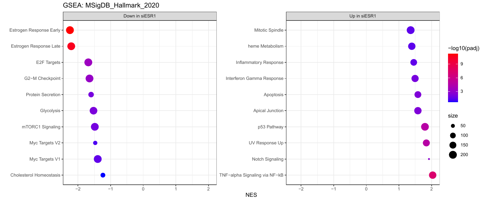

# Wisp Science实战：完成转录组下游分析

如果我们想知道 ESR1 敲低以后，乳腺癌细胞中的基因表达和信号通路发生了什么变化，应该从哪里开始？

这一篇，我们用 Wisp Science 完成一次 **MCF7 细胞 ESR1 敲低的转录组分析**：先寻找公开数据，确认样本和分组，再从原始测序数据得到 Counts，随后完成差异表达、功能富集和 GSEA，最后把结果发展成可以检验的研究问题。

整条流程围绕同一个数据集 **GSE153250** 展开。下面给出实际使用的提示词，保留英文原文，可以直接复制到对话中。

## 一、准备项目与计算环境

先按照 [快速开始](wisp-science-quick-start.md) 完成模型配置，新建一个项目，例如 `ESR1`，选择一个用于保存数据、脚本和结果的工作区。

这次分析把上游测序数据处理和 R 分析放在远程 Linux 服务器上执行，本地项目用于组织对话、查看结果和保存取回的文件。开始前，按 [服务器教程](wisp-science-servers-cli.md) 在设置中添加自己的 SSH 服务器，并确认连接可用。

模型配置决定 Wisp 如何理解任务，服务器配置决定代码在哪里执行。服务器上的 R、STAR、featureCounts 等工具是否可用，需要在执行时检查，不能因为 SSH 连通就认为所有依赖已经准备好。

如果已经有自己的 Counts 和分组表，可以从第四节开始。Counts 下游分析本身不要求 GPU，也可以在依赖齐全的本地 CPU 环境执行；本文的远程路径适合同时处理原始测序数据的场景。

## 二、先找到适合研究问题的数据

我们关注的是 ESR1 及其共调控因子，而不是泛泛地搜索所有乳腺癌 RNA-seq 数据。先向 Wisp 提出一个带有细胞类型、干预方式和优先条件的问题：

```text
Help me find RNA-seq knockdown datasets involving ESR1 and its coregulatory factors in MCF7 cells. Prefer datasets that include multiple knockdown conditions within the same study.
```

这段提示词限定了三个条件：MCF7 细胞、ESR1 及共调控因子的敲低实验，以及优先选择同一研究中包含多个敲低条件的数据集。

在候选数据集中，我们选择 **GSE153250**。它包含 siNT、siESR1、siGATA3 和 siTET2 四组，既可以分析 ESR1 敲低，也为后续比较其他调控因子留下空间。

接下来，先把样本情况问清楚：

```text
What specific samples are included in GSE153250? Please organize them by treatment group.
```

整理样本以后，还要确认下载到的文件能否直接用于差异分析：

```text
Can this dataset be used directly for differential expression analysis? First, check the file format and any limitations that might affect the analysis.
```

这里关注的不是文件能否打开，而是它代表什么。DESeq2 的常规基因计数流程需要原始 Counts；TPM、FPKM 或已经取过对数的表达矩阵，不能直接当作原始整数计数使用。

为了从原始测序数据重新处理，我们继续询问下载规模和分析步骤：

```text
If I reanalyze the raw sequencing data, approximately how much data would I need to download, and what steps would be required for the analysis?
```

这一步需要区分 **测序 run** 和 **生物学样本**。本数据集中，每个样本分布在多个 lane/run 中；这些是技术数据，需要在上游按样本整理，不能把每个 run 都当成一个独立重复。分组、GSM 与 run 的对应关系应以元数据为准，不能只靠文件名猜测。

## 三、限定分析范围，生成 Counts

本次先回答一个明确的问题：**siESR1 相对于 siNT 发生了什么变化？** 因此只保留 ESR1 敲低组和对照组，暂不纳入 siGATA3、siTET2。

向 Wisp 发送：

```text
Connect to the remote compute host, locate the FASTQ data for GSE153250, keep only the siESR1 and siNT groups, and exclude all other groups. Perform transcriptome upstream analysis to obtain the Counts data.
```

这段任务把执行地点、数据集、保留分组、排除分组和目标产物都说清楚了。Wisp 随后检查远程环境、定位或准备数据，并完成上游处理。

这次采用的路线是：按样本合并测序 lane，使用 FastQC 检查质量，经过 cutadapt 处理后，用 STAR 比对至 GRCh38，再用 featureCounts 生成基因层面的计数。

上游完成后，首先确认三份关键文件：

| 文件 | 用途 |
| --- | --- |
| `data/processed/GSE153250_counts_matrix.tsv` | 基因 Counts 矩阵 |
| `data/processed/GSE153250_sample_groups.txt` | 样本与分组对应表 |
| `data/processed/GSE153250_featureCounts_summary.txt` | 计数分配情况汇总 |

不同工作区的目录可能不同，应以本次实际输出为准。进入下游分析时，要让 Wisp 确认这三份文件的位置，而不是沿用另一台机器的绝对路径。

本次 Counts 矩阵包含 **38,606 个基因、12 个样本**，第一列为 `Geneid`，使用 Ensembl gene ID。两组样本如下：

| 分组 | 样本 | 分析角色 |
| --- | --- | --- |
| siNT | `siNT_1` 至 `siNT_6` | 对照组、参考水平 |
| siESR1 | `siESR1_1` 至 `siESR1_6` | ESR1 敲低组 |

分组表是以制表符分隔的文本，列名为 `sample` 和 `group`。需要检查矩阵列名与分组表一一对应，且顺序正确；同时检查计数是否为非负整数，有无缺失值、重复基因 ID 或异常样本总计数。

样本编号相同并不自动意味着配对。若元数据提示批次或配对关系，应将其纳入统计设计；缺少这些信息时，也应把限制记录下来。

## 四、一次提出完整的下游分析任务

Counts 准备好以后，我们把差异表达、富集分析和 GSEA 放在同一个任务中：

```text
Based on the upstream Counts data from GSE153250, perform transcriptome downstream analysis: differential expression, enrichment analysis, and GSEA. Download Enrichr libraries for human gene sets as needed and use them as GMT files for enrichment.
```

这就是本次下游分析使用的完整提示词。它没有要求用户提前写出 R 脚本，而是明确指定分析目标，并说明可以从 Enrichr 获取人类基因集，保存为 GMT 后使用。

Wisp 接下来需要把任务落实为几个可检查的步骤：确认执行环境和输入，检查 R 包，准备基因集，运行 DEG、ORA 和 GSEA，生成图表，整理方法与结果文件。

这次分析使用的主要工具包括：

| 分析内容 | 主要工具 | 重点检查 |
| --- | --- | --- |
| 差异表达 | DESeq2 | 原始计数、设计公式、参考组和比较方向 |
| 基因注释 | org.Hs.eg.db | Ensembl 与 Symbol 的对应关系 |
| 过度代表分析（ORA） | clusterProfiler | 前景、背景及 GMT 的 ID 类型 |
| 排序基因集富集（GSEA） | fgsea | 有方向的完整排序、重复基因和基因集大小 |
| 绘图 | ggplot2 等 | 图中的数值、阈值、标签和结果表是否一致 |

如果 Wisp 报告没有可用的 SSH 环境，回到设置检查服务器配置，再继续对话。如果缺少 R 包，应先完成安装并验证能够加载。依赖安装和基因集下载失败，都应该在运行记录中明确呈现。

Enrichr 中的库可能更新或暂时不可用，GMT 文件要记录库名、来源、获取日期和校验值。本文主要展示 `MSigDB_Hallmark_2020` 的结果；不需要为了入门分析把所有可见数据库都下载一遍。

## 五、先看差异表达，再检查样本关系

本次分析的比较方向是 **siESR1 相对于 siNT**。正的 `log2FoldChange` 表示敲低组表达更高，负值表示敲低组表达更低。

差异表达采用以下口径：

| 参数 | 本次设置 |
| --- | --- |
| 设计公式 | `~ condition`，siNT 为参考水平 |
| 比较 | `siESR1` vs `siNT` |
| 低表达过滤 | 所有样本 Counts 总和 ≥10 |
| 多重检验校正 | BH，`alpha=0.05` |
| 差异基因筛选 | `padj < 0.05` 且 `abs(log2FoldChange) > 0.5` |
| PCA 数据 | DESeq2 VST，`blind=FALSE` |

这里的 `condition` 是脚本中的分组变量，来自样本分组信息。“总和 ≥10”不是“至少六个样本中各有 ≥10 个 Counts”；这个过滤规则用于本次分析，换到其他实验时仍需判断是否合适。

LFC 阈值是结果筛选条件，不等同于设置 `lfcThreshold` 进行另一种假设检验。保存结果时，也要说明是否进行了 LFC shrinkage，避免把不同口径的数字放在一起。

完成分析后，得到以下结果：

| 指标 | 结果 |
| --- | --- |
| 过滤后保留基因 | 19,885 |
| 上调差异基因 | 3,761 |
| 下调差异基因 | 4,314 |
| ESR1 `log2FoldChange` | 约 −3.14 |

ESR1 自身表达降低，是与敲低处理预期一致的观察。对于全部差异基因，还需要结合效应量、表达水平和后续功能分析来理解。

接着看 PCA：



两组样本沿 PC1 明显分离。图中解释方差以整数显示，`PC2: 0%` 不代表第二主成分的方差严格等于零。PCA 可以帮助发现样本关系和异常，但不能仅凭分离明显就排除批次效应，也不能因为某个点偏离就自动删除样本。

火山图和 MA 图则用于查看效应量、显著性与表达水平的关系。无论图画得多漂亮，差异基因数都应该从完整结果表按相同阈值计算；`padj` 为 NA 的行应保留并解释，在显著性统计中排除不可判定项。

## 六、ORA：哪些功能集合包含更多差异基因？

ORA 回答的是：与本次实验可分析的背景相比，差异基因是否更集中地出现在某些功能集合中？

本次将上调、下调基因分开分析。这样能区分两种方向，避免把相反变化的基因混为一个列表。上调基因的 Hallmark ORA 中，有 **15 个条目满足 `p.adjust < 0.05`**，其中 TNFα/NF-κB 相关基因集值得进一步关注。

在解释结果以前，先核对两个细节。

第一，**ID 类型必须一致**。如果 GMT 使用 Gene Symbol，前景和背景也要转换到相同的 ID 空间，不能直接传入 Ensembl 或 Entrez ID。映射失败和一对多映射的处理需要记录。

第二，**背景应来自本次实验可检测、可检验并能够映射的基因集合**，而不是不加区分地使用所有人类基因。还应保存实际前景与背景列表，说明 NA 的处理，并报告与 GMT 相交后的有效背景规模。

ORA 中的“富集”表示统计上的过度代表，不等于整条通路已经被实验证明激活，也不表示每个成员基因都同向变化。

## 七、GSEA：查看整组基因的变化方向

差异基因筛选依赖阈值，而 GSEA 可以进一步利用完整的、有方向的基因排序，寻找集中在列表顶部或底部的基因集。

本次 GSEA 使用 DESeq2 的 **Wald stat** 排序，不仅使用显著 DEG。同一个 Symbol 对应多行时，保留绝对统计量最大的一行，然后按有符号 stat 从大到小排列。这个选择可能偏向较强信号，需要在方法中说明；缺失和非有限统计量也应先处理。

本次主要参数为 `minSize=10`、`maxSize=500`、`nPermSimple=10000`，随机种子为 `123`。重新分析时，还应记录 fgsea 版本、实际算法及并行配置；只固定随机种子，不能保证跨环境结果完全一致。

在当前比较方向下，正 NES 表示基因集偏向敲低组较高表达的一端，负 NES 表示偏向敲低组较低表达的一端。



这张图展示的是部分条目，并非每个点都满足 `padj < 0.05`。是否显著，要结合完整结果表判断。

Hallmark GSEA 共检验 50 个基因集，其中 **25 个满足 `padj < 0.05`**。几个与研究问题有关的结果如下：

| 基因集 | NES | padj | 变化方向 |
| --- | --- | --- | --- |
| Estrogen Response Early | −2.247 | 5.66 × 10⁻¹² | 偏向下调端 |
| Estrogen Response Late | −2.208 | 2.55 × 10⁻¹¹ | 偏向下调端 |
| TNF-alpha Signaling via NF-kB | +2.035 | 5.10 × 10⁻⁸ | 偏向上调端 |
| E2F Targets | −1.684 | 3.28 × 10⁻⁴ | 偏向下调端 |
| G2-M Checkpoint | −1.647 | 6.12 × 10⁻⁴ | 偏向下调端 |

把单基因和基因集结果连起来看：ESR1 表达降低，雌激素响应相关基因集负向富集，同时出现细胞周期及炎症相关转录程序的变化。这些结果为进一步研究提供了线索。

但要从“相关基因表达发生变化”走到“某个机制导致了耐药或疾病进展”，还需要检查 leading-edge 基因，结合独立数据和实验验证。一次 MCF7 敲低分析不能直接证明患者获益或治疗方案有效。

## 八、检查产物，让分析可以继续使用

分析结束后，不只看对话中的总结，还要打开实际文件。

| 目录或文件 | 应检查的内容 |
| --- | --- |
| `data/raw/GSE153250_counts_matrix.tsv` | 下游分析使用的输入副本 |
| `results/tables/DESeq2_full_results.csv` | 完整差异表达结果及注释 |
| `results/tables/ranked_genes.tsv` | GSEA 使用的基因排序 |
| `results/tables/ORA_up_MSigDB_Hallmark_2020.csv` | 上调基因 ORA 结果 |
| `results/tables/ORA_down_MSigDB_Hallmark_2020.csv` | 下调基因 ORA 结果 |
| `results/tables/GSEA_MSigDB_Hallmark_2020.csv` | Hallmark GSEA 完整结果 |
| `figures/` | PCA、火山图、MA、ORA 和 GSEA 图 |
| `analysis/DEG/README.md` | 差异分析输入、参数和方法 |
| `analysis/enrichment/README.md` | 富集库、背景和 ORA 方法 |
| `analysis/GSEA/README.md` | 排名、参数和 GSEA 方法 |
| `results/reports/sessionInfo.txt` | R 环境与包版本 |

把表里的 DEG 数量、ESR1 效应方向和通路统计值，与图和总结逐项核对。GMT 文件、运行脚本、日志和版本信息也要保留；远程计算完成后，应确认需要的表和图已经取回本地。

这次过程也遇到了绘图修正：统计表已经生成，并不代表全部图都已成功写出。出现类似问题时，可以通过 [轨迹](wisp-science-trajectory.md) 查看工具输入与报错，区分计算失败和绘图失败，复用已经验证的结果表继续完成绘图。

## 九、从分析结果走向研究问题

有了 Counts、差异表达和通路结果，我们还可以进一步让 Wisp 帮助整理后续研究方向：

```text
Based on the Counts data from our study, along with the differential expression analysis and pathway enrichment analysis results, design 10 research projects. For each project, clearly state the core findings/evidence basis, scientific question, clinical significance, study design, and key highlights/novelty. Use literature retrieval if necessary to support your hypotheses.
```

这段提示词要求每个项目说明证据基础、科学问题、临床意义、研究设计和创新点，并允许通过文献检索补充依据。

这次得到的方向包括 TNFα/NF-κB、p53、Notch–EMT、EPHA2、代谢重编程、ECM/FAK、转录调控网络和 GREB1 等。它们适合进一步筛选和讨论，但“生成了十个研究方案”不等于十个机制都得到了验证。

真正值得继续的方向，应能回答三个问题：它对应哪一行数据或哪组基因？最关键的解释还缺什么证据？什么实验结果能够支持或否定这个假设？

做完这次分析，你可以把数据集替换成自己的实验，继续使用同样的工作方式：先明确问题和样本，再运行统计分析，最后把图表、方法和判断依据一起留下。
