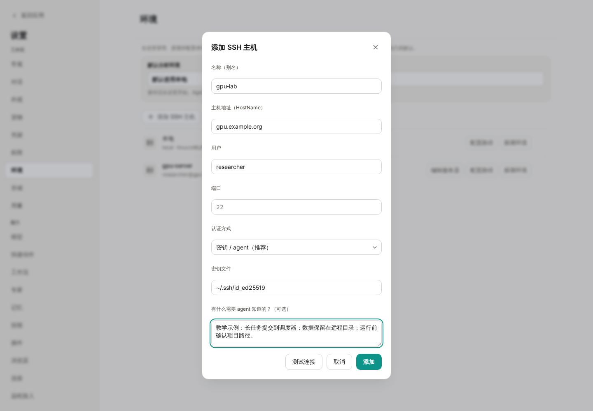
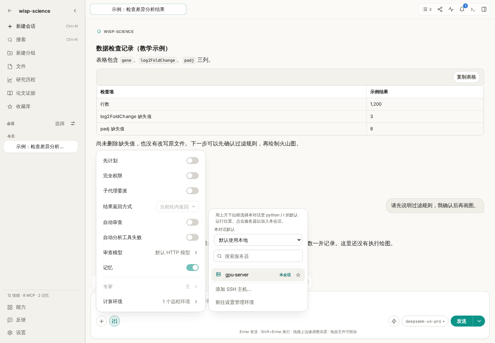
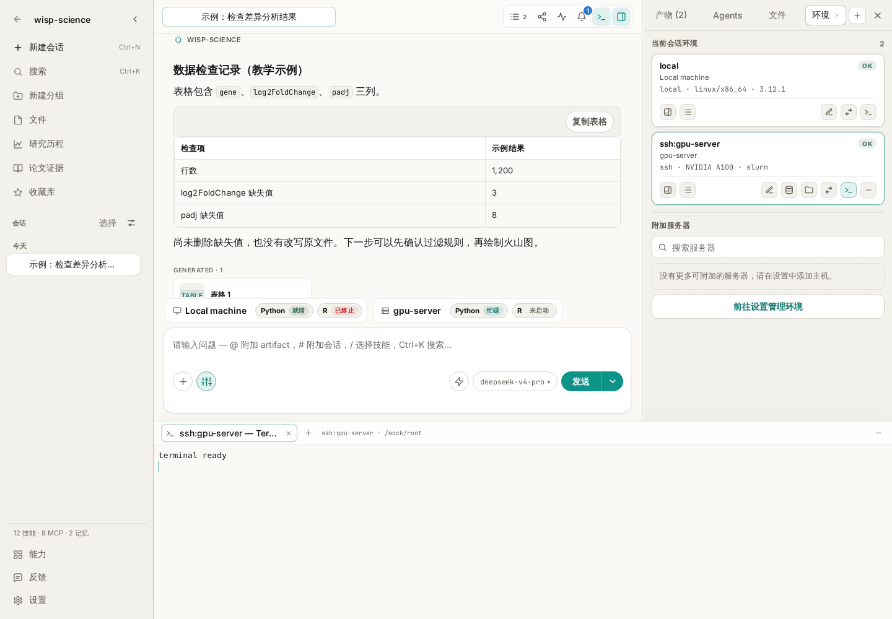

# Wisp Science基础入门：服务器环境配置

做科研时，文件和计算往往不在同一台电脑上：日常在笔记本里读文献，数据放在实验室服务器，分析需要远程的 Python、R 或 GPU。切换机器时，最容易弄混的是“我现在在哪台机器上”和“这条路径属于哪里”。

Wisp Science 可以登记服务器，把计算环境附加到对话，也能打开交互终端，让你亲自检查目录和命令。这篇文章从添加一台 SSH 主机开始，再介绍怎样为会话选择计算环境，以及使用应用里的交互终端。

> 本文配图来自实际前端，服务器、GPU 信息和终端状态使用演示数据。示例主机 `gpu.example.org` 不能当作真实服务器连接；截图不代表已经访问了某台远程主机。

**先分清两个入口，避免把它们当成同一件事。**

| 入口 | 谁来操作 | 适合做什么 |
| --- | --- | --- |
| 对话中的计算环境 | 你描述任务，Wisp 在指定环境调用工具 | 读取远程数据、运行分析、提交结构化任务 |
| Wisp 内的交互终端 | 你输入命令，终端直接执行 | 检查目录、调试环境、查看程序输出 |

服务器配置解决“Wisp 可以使用哪台机器”，交互终端让你亲自输入命令。希望在系统终端中直接使用 Wisp Agent，可以继续阅读 [Wisp 命令行](wisp-science-cli.md)。

**添加服务器前，先准备连接信息。**

向管理员确认主机地址、账号、SSH 端口和认证方式。如果需要 VPN、跳板机或特定 SSH 配置，也先按实验室要求准备好。

一个示例对应关系是：

| 信息 | 示例 | 说明 |
| --- | --- | --- |
| 名称／别名 | `gpu-lab` | 在 Wisp 中识别服务器的名称 |
| 主机地址 | `gpu.example.org` | 换成管理员提供的真实地址 |
| 用户 | `researcher` | 远程账号，不一定与本机用户名相同 |
| 端口 | `22` | 以服务器实际配置为准 |
| 私钥文件 | `~/.ssh/id_ed25519` | 填本机文件路径，不粘贴私钥正文 |

如果你已经能在系统终端通过 `ssh` 登录，会更容易确认这些字段。首次出现主机密钥提示时，按管理员提供的指纹核对；不要把关闭主机校验作为常规配置步骤。

**进入设置，把服务器登记为一个环境。**

打开 **设置 → 环境 → 添加 SSH 主机**，填写连接信息。认证方式按服务器要求选择“密钥 / agent”或密码。



*图 1：这里的地址与账号都是教学占位值。“给 Agent 的说明”适合记录使用约定，不适合保存密码或密钥。*

“给 Agent 的说明”可以写成一段具体规则：

> 这台服务器用于本项目分析。运行前先确认远程目录；大型原始数据保留在服务器。耗时计算按管理员要求提交到调度器，记录脚本、参数、任务编号和结果路径，不在登录节点长时间计算。

点击 **测试连接**，确认成功后添加。回到环境列表，再使用 **探测环境** 检查操作系统、Python、R、GPU 和调度器等信息。

“能登录”和“分析环境已准备好”是两项检查。测试连接通过后，如果探测不到 Python 或 R，先确认解释器是否安装、是否在远程 PATH 中。需要指定位置时，使用 **配置运行时解释器** 填写远端可执行文件路径。

已经维护 `~/.ssh/config` 时，也可以使用导入入口登记其中的主机，再逐台测试与探测。密钥文件内容不会被复制进 Wisp 的 SQLite；密码类敏感值走系统密钥环。

**把环境加入当前会话，再说明数据在哪里。**

回到对话，打开输入框左下角 **Agent 选项 → 计算环境**，将目标服务器加入当前会话。右侧 **环境** 面板也提供附加服务器的入口。



*图 2：示例中的 `gpu-server` 是预置演示主机。服务器是否加入本会话，与它是否被选作默认分析环境，是两个需要分别检查的状态。*

默认环境有两层：

- **设置 → 环境** 中的全局默认，为新对话提供起点。
- 当前对话的 **计算环境** 菜单，可以单独指定这段对话的默认环境。

修改全局默认不会改写已经创建的对话。刚开始使用时，在任务里明确写出服务器名称和远程路径，比仅依赖默认值更容易核对：

> 请在已附加的 gpu-lab 上检查 /data/project-a/counts.csv 是否存在，报告文件大小和前五行。先告诉我实际使用的执行环境，不下载完整文件，也不修改它。

这里的 `/data/project-a/counts.csv` 是远程路径。本机项目中的 `data/counts.csv` 不会因为附加了服务器就自动变成同一个文件。需要传输时，明确源机器、源路径和目标位置；大数据也可以一直保留在远端，只取回小型结果或元数据。

**想亲自检查目录，可以打开交互终端。**

打开右侧 **环境** 面板，在目标环境卡片上点击 **打开终端**。终端会显示在会话下方，标签上可以看到它对应的环境。



*图 3：终端与对话保留在同一个窗口中。这里的“terminal ready”来自测试替身，用于展示位置，不代表真实 SSH 登录结果。*

在 Linux/macOS 或远程 Linux shell 中，可以先执行只读检查：

```bash
hostname
pwd
ls -lh
```

它们分别帮助确认机器名称、当前目录和目录内容。SSH 终端初始位置通常是远程用户的主目录，不是本机项目目录；需要分析项目文件时，先进入对应的远程目录。

Windows 本地终端默认使用 PowerShell，可以用：

```powershell
hostname
Get-Location
Get-ChildItem
```

一个环境可以打开多个终端标签。切换标签或折叠终端面板，会保留运行中的终端；关闭某个标签会终止对应终端进程。终端标签和滚动记录不会随应用重启恢复，也不作为项目同步内容保存。

**耗时计算，要留下可以继续检查的任务记录。**

交互终端适合调试，但一项需要跑几小时的分析，还需要状态、取消入口、日志和产物位置。可以让 Wisp 使用结构化 Run 管理任务，而不是在普通 shell 调用里一直等待：

> 请先检查 gpu-lab 上的运行环境，并为 analysis/run_qc.py 准备运行方案。列出输入路径、输出目录和资源要求，等我确认后，通过结构化 Run 提交；如果这台机器要求使用调度器，请遵守它的提交方式，并记录任务编号。

只有环境和任务方式都匹配时再提交。登记了一台 GPU 主机，并不意味着每个脚本会自动使用 GPU；附加服务器也不会自动把任意命令转换成调度器作业。

需要复盘时，结合 Run 状态、日志、输出文件和[轨迹](wisp-science-trajectory.md)判断结果。仅有终端中的“命令已发送”不能证明计算成功结束。

**遇到问题，先确认机器，再确认命令。**

| 现象 | 优先检查 |
| --- | --- |
| SSH 连接失败 | 地址、端口、账号、VPN／跳板机与认证方式 |
| 系统终端能登录，Wisp 探测失败 | 远程登录脚本、受限 shell，以及非交互命令能否执行 |
| 已添加服务器，对话用的还是本机 | 是否加入当前会话、当前会话的默认环境与任务指定是否一致 |
| 文件不存在 | 路径属于本机还是远程；终端当前目录是否正确 |
| Python／R 找不到包 | 实际调用的是哪个解释器，包是否装在同一环境 |

第一次练习可以只完成四件事：测试连接、探测环境、把服务器加入对话、检查一个小文件。确认每一步都能说清“在哪台机器、读哪个路径、得到什么结果”，再开始真正的计算任务。

> 功能细节参见 [Wisp 基础配置](../basic-configuration.md)和[交互终端说明](../terminal-sessions.md)。本文依据撰写时的项目实现整理，不同版本的界面文字可能略有差异；示例命令和提示词不代表已经执行的远程操作。
