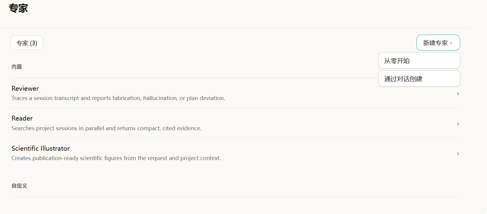

# Wisp Science使用技巧：专家

整理文献时，希望 AI 像一位细心的阅读助手；检查分析过程时，希望它像一位严格的审查员；准备组会配图时，又希望它熟悉科研图形的表达方式。

这些要求可以保存在 Wisp Science 的 **专家** 中。以后开始同类任务时，选好专家，再提供这次的材料和目标，就不必反复粘贴整套工作要求。

前面介绍过 [Skills](wisp-science-skills.md) 和 [轨迹](wisp-science-trajectory.md)。这一篇结合专家设置页，介绍三个内置专家、两种创建方式，以及保存之后怎样真正用起来。

**先认识专家：为一类工作保存角色、指令和配置。**

一个专家可以有自己的名称、描述、工作指令、模型绑定和技能选择。例如，“论文阅读助手”可以固定要求：区分作者结论与读者推测，为关键结果标注原文位置，材料不足时明确说明。

| 配置 | 解决什么问题 |
| --- | --- |
| 专家 | 这次由什么角色工作，长期遵循哪些要求 |
| Skill | 某项具体任务按什么步骤和模板完成 |
| 模型 | 由哪个已配置的模型执行工作 |
| 本轮消息与附件 | 这次处理什么材料，交付什么结果 |

专家的指令会追加到 Wisp 的基础提示词之后。保存专家不会训练出一个新模型；它让已有模型带着这套要求工作。技能和工具是否可用，仍取决于实际配置与执行环境。

**打开“设置 → 专家”，先读懂这张列表。**



*图 1：用户提供的专家设置截图。此时共有三个专家，自定义区域尚为空；右上角展开了“新建专家”菜单。*

页面分为 **内置** 和 **自定义** 两组。左上角“专家 (3)”表示当前列表共有三个专家；点击某一行，可以进入详情查看配置。右上角 **新建专家** 提供两条路径：已经想好规则，就选 **从零开始**；想让 Wisp 帮忙梳理需求，就选 **通过对话创建**。

截图中的三个内置专家各有明确用途：

| 专家 | 适合做什么 | 常用入口 |
| --- | --- | --- |
| Reviewer | 检查会话记录中的编造、无依据陈述与偏离计划的情况 | 在已有对话中使用 `/review` 发起审查 |
| Reader | 从已保存的项目会话中检索与当前问题有关的内容，返回带出处的证据 | 在消息中引用项目或历史会话 |
| Scientific Illustrator | 根据任务和项目材料制作科研图形 | 新会话中通过 Agent 菜单选择专家 |

内置专家的工作指令不可编辑，也不能删除，但可以进入详情调整模型等可配置项。希望采用自己的工作规范时，可以创建自定义专家。

**Reviewer：分析完成后，再检查“说的”和“做的”是否一致。**

例如，助手说“已完成缺失值处理并保存结果”，你可以在这段对话中输入 `/review` 并发送，发起一次审查。Reviewer 会根据会话记录检查这类声明是否有操作记录支持，以及执行是否偏离用户要求。

它适合帮助发现问题线索。审查结果仍需要结合 [轨迹](wisp-science-trajectory.md)、原始文件和实际输出核对；一次审查通过不能替代科研结果验证。

进入 **设置 → 专家 → Reviewer**，可以选择审查使用的模型或后端。Reviewer 还支持跟随会话以及已配置的 ACP Agent 等选项。这里的 **测试 Reviewer** 会执行一次真实模型调用，适合在保存前检查配置是否能正常返回审查结果。

**Reader：让历史会话成为这一次回答的材料。**

假设同一个项目里已经讨论过样本排除标准和分析阈值，新开会话时不想重新解释，可以在输入框输入 `@`，选择相关项目或历史会话作为引用，再发送：

> 请根据我引用的历史记录，整理我们已经确认的样本排除标准。列出每条标准的出处，把尚未确认的建议单独列出。

Wisp 会让 Reader 从这些已保存的会话中寻找相关证据，再供主 Agent 回答当前问题。Reader 的工作范围是被引用的会话记录；如果要阅读一篇新论文，仍要提供 PDF、正文或可访问的材料。

**Reviewer 和 Reader 不出现在普通会话的专家选择菜单中。** 它们通过各自的审查与引用流程工作。在设置里看到它们，并不意味着需要先把当前对话切换成 Reviewer 或 Reader。

**Scientific Illustrator：把图的用途、依据和交付格式说清楚。**

新建会话，在输入框的 **Agent 菜单 → 专家** 中选择 **Scientific Illustrator**，再发送绘图需求。例如：

> 请为组会制作一张可编辑的 SVG 流程图，保存到 figures/sample-workflow.svg。内容依次为：样本采集、RNA 提取、文库构建、测序、数据分析。使用中文标签，横向排版。这是一张方法示意图，不添加样本量或实验结论。完成后检查预览中的文字和箭头是否清楚。

这个内置专家预设了 `figure-style` 和 `figure-composer` 技能。明确要求 SVG、矢量或可编辑图时，会按直接生成 SVG 的方式工作，并通过 PNG 预览检查效果；明确要求 PNG 或图像模型生成时，需要配置可用的图像生成模型。

未指定格式时，有可用的图像生成工具会优先走 PNG 图像模型方式，否则采用 SVG 方式。希望后续修改文字和布局，就在任务里明确写“可编辑 SVG”。如果要画数据图，还应附上真实数据，并说明列名、单位、分组和统计要求。

**创建自己的专家，第一种方式是“从零开始”。**

进入 **设置 → 专家 → 新建专家 → 从零开始**。以“论文阅读助手”为例，可以这样填写：

| 字段 | 示例 |
| --- | --- |
| 名称 | 论文阅读助手 |
| 描述 | 根据已提供的论文材料整理阅读笔记，保留证据位置 |
| 模型 | 先使用“跟随当前模型”，也可以绑定已配置的对话模型 |
| 技能 | 初次使用保留“继承项目设置”；需要固定范围时再选择具体技能 |

名称必填。指令虽然可以留空，但把要求写具体，才更便于复用和检查。下面这段可以直接放入 **指令**：

```text
你是我的论文阅读助手，帮助我为组会整理可核对的阅读笔记。

开始前确认我提供的是全文、摘要还是部分摘录，并在笔记中说明材料范围。
按照“研究问题、材料与方法、关键结果、局限性、对当前课题的启发”组织内容。
为关键结果标注可核对的页码、章节或图表编号；没有定位信息时明确说明。
分开表述作者报告的结果和你的推测，不补写材料中没有的数据或结论。
遇到缺失的实验条件、样本量或统计方法，标为“材料未提供”。
需要保存文件时，使用我指定的位置；未指定时保存到 notes/papers/ 下的新文件。
最后列出仍需回到原文核对的问题，并报告保存路径。
```

点击 **保存** 后，新专家会出现在 **自定义** 区域。以后点击它的名称即可修改配置；自定义专家也可以从列表中删除。

**技能选择最容易漏掉的一点：取消继承后，需要主动勾选。**

勾选 **继承项目设置** 时，专家沿用项目的技能配置。取消勾选后，可以在搜索框输入关键词，选择希望这个专家使用的技能；已选技能会显示在上方，也可以移除。

**取消继承却一个技能都不选，表示不带任何技能。** 它不表示自动选择所有技能。

例如，你已经按 [Skills 教程](wisp-science-skills.md) 创建并导入了 `lab-paper-note`，就可以搜索并选中它，把阅读笔记模板与“论文阅读助手”配合使用。技能需要先安装并能被项目发现；填写专家指令不会自动安装依赖。

**第二种方式是“通过对话创建”，让 Wisp 帮你梳理要求。**

点击 **新建专家 → 通过对话创建** 后，Wisp 会打开一段新会话，自动发送创建专家的访谈请求，了解用途、语气、工作风格、所需技能与数据源，以及适合的模型档次。这一步会使用模型，需要先完成模型配置。

你可以这样回答：

> 我想创建一个“组会准备助手”。主要根据我提供的论文和实验记录整理组会提纲，语气简洁。每次先问清汇报时长和听众背景，再组织研究问题、方法、主要结果与待讨论问题。所有数据和结论都要有材料出处；没有提供的数据不要补写。暂时继承项目技能，模型跟随当前配置。请把这些要求保存成专家。

对话创建流程会引导 Agent 调用 `save_specialist` 保存配置。看到回复后，再回到 **设置 → 专家 → 自定义**，确认专家确实出现，并打开检查指令、模型和技能是否符合预期。

如果它只是给出了一段角色介绍，列表中还没有新专家，可以继续要求“请将这个配置保存为专家”。创建完成的对话用于梳理配置；试用这个专家时，再开一段新会话。

**保存之后，还需要在新会话里选中它。**

完整流程是：

1. 回到项目，新建一段会话。
2. 在发送首条消息前，打开输入框的 **Agent 菜单 → 专家**。
3. 选择“论文阅读助手”，确认会话顶部出现专家名称。
4. 附上一篇论文或一段摘录，再说明本次任务。

例如：

> 请根据我附加的论文摘要整理阅读笔记，重点关注研究问题和关键结果。只使用这份摘要能够支持的信息，把笔记保存到 notes/papers/ 下。

**首条消息发送后，当前会话的专家选择会锁定。** 想更换专家或回到普通对话，需要新建会话，再选择其他专家或“无”。设置页中的保存操作本身不会把已有对话切换到新专家。

普通专家角色用于 Wisp 内置 Agent。Reviewer 单独支持 ACP 审查后端；不要据此假定所有自定义专家的指令和技能配置都会传递给外部 ACP Agent。

**用一份熟悉的材料，检查专家是否真的帮你省下重复工作。**

第一次试用时，可以挑一段你已经读过的摘要，检查三个地方：结构是否符合要求，关键结果是否有出处，是否把材料缺失的信息写成了确定事实。发现问题后，回到专家指令中补充具体规则，再开新会话验证。

| 现象 | 优先检查 |
| --- | --- |
| 已保存专家，但当前对话没有使用 | 是否新建会话，并在首条消息前选中它 |
| 专家菜单变灰 | 当前会话是否已经发送过消息 |
| 找不到 Reviewer 或 Reader | 使用审查或项目／会话引用入口，它们不在普通专家选择列表中 |
| 专家没有使用预期技能 | 是否取消继承但未勾选；技能是否已安装并可被发现 |
| 对话创建后列表没有新增 | 是否实际完成保存；回到设置检查，必要时继续要求保存 |
| 科研绘图没有得到想要的格式 | 是否明确指定 SVG 或 PNG；图像模型方式是否已经配置 |

可以先保存一个你每周都会用到的角色：论文阅读助手、组会准备助手，或者实验记录整理助手。把稳定的要求放进专家，把每次变化的材料和目标留在消息里，再用实际结果逐步修订指令。

> 本文依据撰写时的 Wisp Science 实现整理。截图展示专家设置界面；文中的提示词与文件路径用于教学，不代表已经执行的科研任务。不同版本的界面文字可能略有差异。
