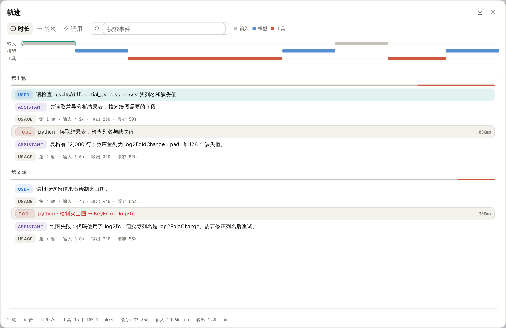
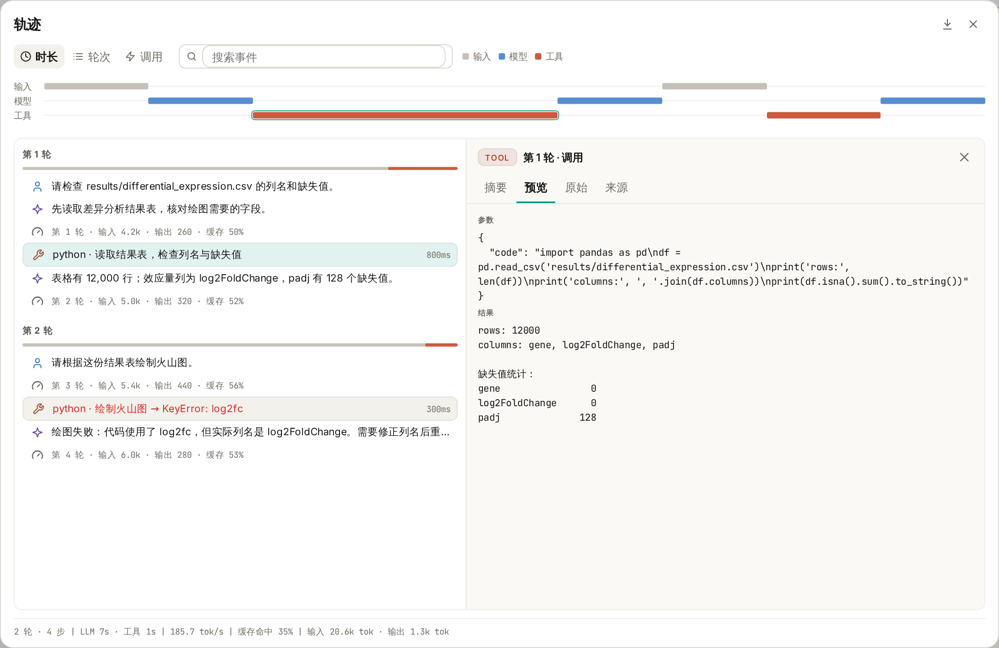
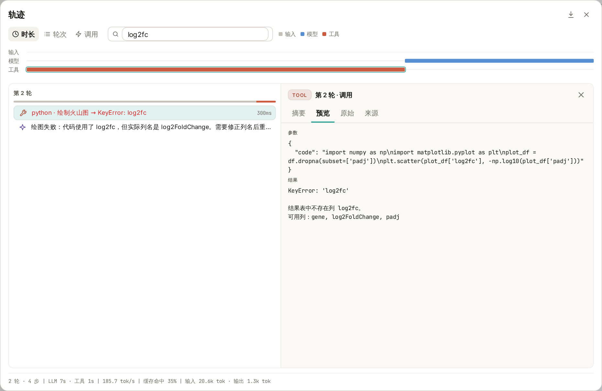
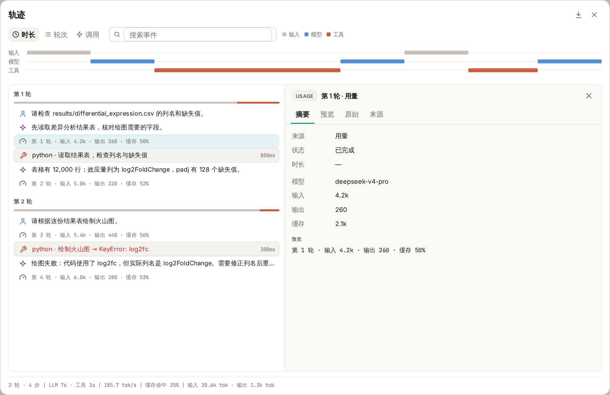

# Wisp Science使用技巧：轨迹

让 AI 帮忙分析一份数据，最后收到一句“分析完成”，往往还不够。我们还想知道：它读的是哪个文件？执行了什么代码？绘图失败时，报错来自哪里？过几天再回头看，能不能找回当时的操作过程？

Wisp Science 的 **轨迹** 功能，就是用来查看这些过程的。它把一段对话中的用户输入、助手回复、工具调用和模型用量按顺序组织起来，让你可以从结果往前追，找到具体做过的那一步。

前两篇介绍了 [MCP](wisp-science-mcp.md) 和 [Skills](wisp-science-skills.md)。这一篇介绍如何打开轨迹、读懂记录，以及怎样用它核对分析和排查问题。

> 本文配图来自 Wisp Science 实际前端界面，使用演示数据展示一段“检查差异分析结果表，再尝试绘图”的会话。文件名、代码、报错与用量均为教学示例，不代表已完成的科研分析。

**先认识轨迹：把一次任务的执行过程展开来看。**

假设你让 Wisp 检查一份差异分析结果表，再根据它绘制火山图。这个任务中可能发生多次工具调用：读取表格、检查列名、处理缺失值、执行绘图代码。如果中间报错，还会有检查和重试。

轨迹会把这些记录按“轮”分组。你发送一条消息，就开始一轮；这一轮下面列出 Wisp 为回应它而产生的记录。

*图 1：演示会话分为两轮，先检查数据，再尝试绘图。关闭右侧详情后，可以更宽地浏览事件列表。*

常见记录可以这样读：

| 记录 | 表示什么 | 适合核对什么 |
| --- | --- | --- |
| USER／用户 | 你发送的任务要求 | 当时指定了哪个文件、哪些条件 |
| ASSISTANT／助手 | 模型给出的回复 | 它如何解释结果、准备怎样继续 |
| TOOL／工具 | 一次工具调用及其返回结果 | 实际参数、代码、输出与报错 |
| USAGE／用量 | 一次模型调用的用量记录 | 输入、输出和缓存 Token |

一轮对话中，模型可能多次调用工具、读取结果，再继续处理，所以同一轮下面出现多条工具和用量记录很正常。列表较窄时，记录类型会以小图标显示；展开列表后，可以看到文字标记。

**打开轨迹，不需要额外配置。**

进入一段对话，点击顶部工具栏中的 **轨迹** 图标，位置在分享按钮与收件箱铃铛之间。也可以在输入框输入 `/trajectory` 并发送，打开同一个窗口。

第一次使用时，建议等一个小任务完成后再打开，这样比较容易把任务要求与执行记录对应起来。新会话还没有消息时，会显示“暂无轨迹”。

窗口可以分成四块来看：

- **顶部时间线**：按输入、模型和工具展示过程，可切换“时长”“轮次”“调用”刻度。
- **左侧事件列表**：按轮次浏览每一步，已完成的工具调用会显示耗时，失败调用用红色突出显示。
- **右侧详情**：点击一条记录，查看它的内容。
- **底部统计**：查看整个会话的轮数、步数、模型与工具耗时，以及 Token 用量等。

点击时间线中的一段，也可以定位到对应事件，并把它滚动到列表上方。只想浏览列表时，点击右侧详情区域的关闭按钮即可；再次点击事件，详情会重新打开。按 Escape 或点击整个窗口右上角的关闭按钮，就会返回原来的对话。

**第一个用途：核对 AI 实际用了什么文件和参数。**

在演示会话中，第一条要求是：

> 请检查 results/differential_expression.csv 的列名和缺失值。

Wisp 随后调用 Python 读取表格。点击这条工具记录，再切换到右侧的 **预览**，就能看到“参数”和“结果”。

*图 2：左边选择一次 Python 调用，右边查看提交给工具的代码和工具返回的内容。较长的内容可以在详情区域内滚动阅读。*

这里最值得核对的，是任务要求与实际操作是否一致：读取路径是否正确，使用了哪些列，有没有过滤数据，以及输出是否支持助手的描述。

例如，演示结果表的列名是 `gene`、`log2FoldChange` 和 `padj`，其中 `padj` 有 128 个缺失值。后续绘图时，就可以继续检查代码有没有处理这些缺失值，效应量列有没有选对。

同样的方法也适用于文献检索：查看工具实际提交的检索词和返回记录，再核对助手整理的论文是否来自这些结果。使用 Skill 时，也可以查找相关工具调用，确认这次任务是否读取了对应的技能说明。

右侧还有几个标签，不必第一次就全部使用：

| 标签 | 主要内容 |
| --- | --- |
| 摘要 | 记录来源、状态、耗时与简短预览；用量事件还会显示模型和 Token 信息 |
| 预览 | 消息全文，或工具的完整参数与结果 |
| 原始 | 当前事件的 JSON 数据，适合需要检查具体字段时使用 |
| 来源 | 原始消息文本、工具参数或用量记录等来源内容 |

对多数科研用户来说，先用“摘要”了解状态，再用“预览”核对内容，就可以完成常见检查。

**第二个用途：报错时，找到出问题的那一步。**

演示中的第二轮要求绘制火山图，但绘图代码使用了 `log2fc`。结果表实际提供的是 `log2FoldChange`，于是工具返回 `KeyError: 'log2fc'`。

打开轨迹，点击红色的工具记录，就能同时看到出错代码和返回结果。记录较多时，可以在顶部“搜索事件”中输入 `log2fc`，缩小范围。

*图 3：搜索会匹配事件摘要及详细内容。这个例子中，错误来自代码引用了不存在的列名。*

看清原因后，可以回到对话继续提出具体要求：

> 刚才的绘图调用使用了 log2fc，但表格里的列名是 log2FoldChange。请先确认列名，修正后重新运行，并说明缺失值和零值如何处理。成功后告诉我图和脚本保存在哪里。

这样，后续处理就有了明确依据。重试后再打开轨迹，还可以检查新的调用是否成功、修改是否落实，以及输出是否符合预期。

排查其他问题时也可以从实际报错入手：文件不存在就核对路径，缺少依赖就核对运行环境，检索失败就查看工具返回的信息。搜索文件名、工具名或错误关键词，通常比从头翻阅整段对话更方便。

**第三个用途：了解一次任务的耗时和用量。**

有时任务没有报错，但等待时间很长。轨迹顶部的时间线与底部统计，可以帮助你初步判断时间主要花在模型响应还是工具执行上，再定位到具体调用。

*图 4：右侧显示选中那次模型调用的用量；底部汇总整个会话。图中数字仅为演示。*

Token 可以粗略理解为模型处理文本等内容时使用的计量单位。用量记录会展示输入、输出和缓存信息；底部还汇总模型与工具耗时、输出速度和缓存命中率等。

这些信息适合辅助复盘，例如观察长文档输入、反复重试或多次工具调用带来的用量变化。实际费用仍要结合所用服务商的计价方式核对，不能仅凭一个 Token 总数直接换算。

运行中的轨迹会先展示即时记录，任务结束后再以已保存的记录更新。旧会话如果缺少时间或用量信息，相应指标可能无法显示，不能把缺失值理解成“没有耗时”或“没有消耗”。

**需要留档或与同事复盘，可以导出 HTML。**

点击轨迹窗口右上角的下载图标，也就是 **导出 HTML**，选择保存位置，即可得到一个独立的 HTML 文件，用浏览器打开阅读。

导出内容包括会话标识、模型、汇总统计、时间线，以及各轮的用户输入、助手回复、工具参数与结果、状态、耗时和用量记录。它适合与分析笔记一起归档，也方便同事了解你是怎样得到结果、在哪一步遇到了问题。

有两个细节很实用：

- **搜索不会缩小导出范围。** 即使界面中只筛出了 `log2fc` 相关记录，导出的仍是整个会话已保存的轨迹。
- **导出以已保存记录为准。** 如果任务还在运行，尚未保存的即时内容可能不在文件中；需要完整留档时，等任务结束后再导出。

轨迹能帮助检查和追溯过程。要复现一次分析，还需要一起保留输入数据或来源、脚本、参数和运行环境；HTML 本身不会把这些文件全部打包，也不会自动重跑任务。分享前，可以检查其中完整的输入、路径和工具结果是否适合提供给对方。

**第一次尝试，可以用一份熟悉的小表格。**

在项目中准备一个 CSV 文件，发送下面这条要求，并把路径换成自己的文件：

> 请检查 data/example.csv，报告行数、列名和各列缺失值。先不要修改原文件；如果读取失败，请说明实际报错。

完成后打开轨迹，找到读取文件的工具调用，切换到“预览”，把参数、结果和最后的回答对照起来，再试着搜索文件名、导出 HTML。

熟悉这几个操作后，轨迹就可以成为日常分析的一部分：拿到结果时核对依据，遇到报错时查找原因，任务完成后保留过程，下一次接着做时也有记录可查。

> 功能细节参见 [Wisp 轨迹文档](../trajectory-view.md)。本文依据撰写时的项目实现整理，不同版本的界面文字可能略有差异。
